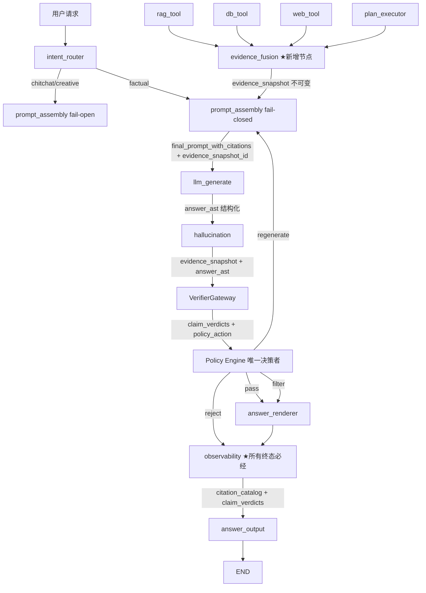

# Claim 级可追溯幻觉检测设计

> **文档定位**：将幻觉检测从"答案级分数打分"升级为"Claim 级强制可追溯"，做到每个事实句绑定来源、不可引用不输出、检索不足必拒答、引用质量可度量
> **受众**：架构师、后端开发工程师
> **基线**：`docs/rag_enhancement_integration_design.md` 已完成三层验证（规则+NLI+LLM）+ 四级处置
> **目标**：实现 claim-level citation、hard filter、拒答质量评估、citation 指标度量
> **版本**：v2.1（根据二次评审 P0 问题逐项核验与修正）
> **修订要点**：增加 Step 0 图拓扑改造；区分 declared/verified/contradicting citation；结构化 Answer AST；fail-closed 运行模式；单一 Policy Engine；稳定 Evidence ID；审计节点必经；端到端引用响应契约
>
> **v2.1 修订说明（二次评审核验结果）**：
> - **P0-1（图拓扑）**：v2.0 已修复，本次补充拓扑对比图与约束说明，明确保留 hybrid 串行与 quality_check 条件路由
> - **P0-2（Evidence 重试旧数据）**：v2.0 已引入 tool_run_id，本次修正 `_merge_with_replacement` 替换规则——原实现 `uri_prefix` 取前 3 段对 RAG/Web 过于激进（同 KB/同域名全部被替换），改为基于 `(source_type, tool_run_id)` 精确替换本轮重试工具的旧证据
> - **P0-3（fail-closed 逃逸口）**：v2.0 仍存在逃逸口——ENFORCED 模式下 AST 解析失败且 `ast_retry_exhausted=False` 时会 fall through 到"降级纯文本"。本次修正为：ENFORCED 模式下 AST 解析失败必须走重试或 reject，禁止 fall through 到降级
> - **P0-4 ~ P0-8**：v2.0 已修复，本次仅补充说明
> - **任务二建议**：采纳强类型 schema 版本号、整轮验证预算、HTTP verifier 协议、扩展验收标准

---

## 1. 背景与问题

### 1.1 现状

当前幻觉检测链路（[hallucination.py](file:///Users/renwk/workspace/data-knowledge-api/agent/langgraph/nodes/hallucination.py) + [hallucination_detector.py](file:///Users/renwk/workspace/data-knowledge-api/agent/component/hallucination_detector.py)）已实现：

- 三层验证（规则层 0.4 + NLI 层 0.4 + LLM 层 0.2）
- 加权投票计算 `faithfulness_score`
- 四级处置（pass ≥0.85 / filter 0.6~0.85 / regenerate 0.3~0.6 / reject <0.3）

### 1.2 五项生产级缺口

| # | 生产级要求 | 当前实现 | 严重程度 |
|---|----------|---------|---------|
| 1 | **Claim 级引用绑定**：每个事实句绑定 chunk/doc_id/页码/段落/时间戳 | ❌ 无。`llm_generate` 生成纯文本 | 🔴 严重 |
| 2 | **先抽 claim 再逐条验证 → 只允许 supported 进入最终答案** | ⚠️ 部分。有 claim 拆解+三层验证，但只算分数不过滤；`final_answer` 的 `filter` 是 TODO | 🔴 严重 |
| 3 | **检索不足必须拒答或降级** | ⚠️ 部分。`reject` 阈值是全局 0.3，非基于 claim 级统计 | 🟡 中度 |
| 4 | **Citation Precision & Coverage 指标** | ❌ 完全没有 | 🟡 中度 |
| 5 | **综合 dbtool + webtool + ragtool 的幻觉检测** | ⚠️ 部分。`evidence_fusion` 已标准化三源 Evidence，但 `hallucination_node` 只读 `merged_context` 字符串 | 🔴 严重 |

### 1.3 v1 评审发现的架构级问题（v2 修订根因）

| 编号 | 问题 | 根因 | 修订方向 |
|------|------|------|---------|
| P0-A | **目标链路在现有 LangGraph 中不存在** | [graph.py](file:///Users/renwk/workspace/data-knowledge-api/agent/langgraph/graph.py#L85) 未注册 `evidence_fusion`/`answerability_check`；`prompt_assembly` 直接读 `rag_docs/db_result/web_docs` 而非 `evidence` | 增加 Step 0：改造图拓扑，统一工具输出为 Evidence |
| P0-B | **"不可引用不输出"与 fail-open 冲突** | [hallucination.py:79](file:///Users/renwk/workspace/data-knowledge-api/agent/langgraph/nodes/hallucination.py#L79) 空上下文/空答案/关开关/兜底失败都直接 `pass` | 区分运行模式：闲聊 fail-open，事实问答 fail-closed |
| P0-C | **Citation Precision 无法检测虚引** | v1 按全局去重 evidence_id 计算，同一 Evidence 对 A 有效对 B 无效仍得 1.0 | 改为基于 (claim_id, evidence_id) 对的指标体系 |
| P0-D | **绑定逻辑无可信闭环** | `_find_supporting_evidences` 未定义；规则层只返回字符串 `matched_evidence` | 区分 declared_citation_ids / verified_support_ids / contradicting_ids；禁止 verifier 替模型补引用 |
| P0-E | **Claim 文本重组破坏语义** | `_decompose_claims` 切连词/截断/去重，不生成 span；`" ".join(parts)` 丢标题/列表/表格 | 生成阶段输出结构化 Answer AST，过滤后由渲染器重建 |
| P1-A | **三层全票 supported 不兼容 detector** | 规则层命中实体时跳过 LLM；规则无实体不等价反证 | 可配置判定矩阵 + verifier_error/unknown 状态 |
| P1-B | **权威性处理不成立** | contradiction 已是 0，继续乘无效；DB 不天然 0.95，Web 可能为官方源 | 权威度由来源策略+查询正确性+时间适用性+数据版本共同决定；冲突先确认同实体同字段同单位同 as_of |
| P1-C | **处置决策两个 owner** | Gateway 返回 action，节点忽略后按全局分数重算；regenerate 回到同一上下文 | 单一 Policy Engine；regenerate 携带失败 Claim + 允许/禁止 Evidence ID |
| P1-D | **Claim 数量比例可被操纵** | `insufficient >= 60%` 让琐碎 Claim 淹没关键矛盾 | claim_type/importance/risk_level/required 分级；关键 Claim 一票否决 |
| P1-E | **Evidence ID 不稳定** | DB source_uri 用 `hash(sql)` 进程随机化；多行合成一个 Evidence | 稳定 SHA-256 + query_id + sql_fingerprint + snapshot/as_of + row key |
| P1-F | **拒答样本绕过 observability** | reject/exhausted 直接进 answer_output，不进 observability；report_artifacts 优先返回 | 审计节点做成所有终态必经节点 |
| P1-G | **缺端到端引用响应契约** | 文本 `[1]` 不足以让客户端展示来源；message.py 已有 `references` 字段；前端有 citation-utils.ts | 返回 answer + citation_catalog + claim_verdicts；租户授权复核 + 脱敏 + Prompt Injection 隔离 |

---

## 2. 设计目标

### 2.1 业务目标

1. **可追溯**：每个事实句都能回答"这个结论来自哪个数据库/哪张表/哪次查询/哪个 chunk"
2. **不可引用不输出**：未在证据中出现的 claim 不得进入最终答案（事实问答 fail-closed）
3. **拒答有质量**：低容忍场景下明确拒答，拒答理由基于 claim 级统计 + 关键 Claim 一票否决
4. **引用可度量**：Citation Validity / Correctness / Completeness / Faithfulness 分别度量

### 2.2 技术目标

1. 改造图拓扑：统一所有工具输出为 Evidence，Prompt/verifier/references 使用同一不可变 `evidence_snapshot_id`
2. 建立 Claim 级引用绑定模型：区分 declared_citation_ids / verified_support_ids / contradicting_ids
3. 结构化 Answer AST：生成阶段输出 section/paragraph/claim/citations，过滤后由渲染器重建
4. 单一 Policy Engine：处置决策只有一个 owner，regenerate 携带失败上下文
5. 稳定 Evidence ID：SHA-256 + query_id + sql_fingerprint + snapshot/as_of + row key
6. 审计节点必经：所有终态（含 reject/exhausted/report）都经过 observability
7. 端到端引用响应契约：answer + citation_catalog + claim_verdicts

### 2.3 硬约束（评审采纳）

1. 事实问答中，最终事实 Claim 必须至少有一个经过验证且用户有权访问的 Evidence
2. `declared_citation_ids`、`verified_support_ids`、`contradicting_ids` 必须分开保存
3. 被 `max_claims` 截掉的 Claim 不允许未经验证进入答案；超限应缩短答案或分批验证
4. Prompt、verifier、最终 references 必须引用同一个不可变 `evidence_snapshot_id`
5. 关键 Claim（金额/日期/身份/合规/最终结论）不使用简单数量比例；关键矛盾直接阻断
6. verifier 超时、协议错误、模型不可用必须有独立状态 `verifier_error` 和指标，不能映射成 supported
7. 线上指标不能用同一个 verifier 的判定自证准确性；Citation Precision 和拒答质量需要离线人工标注集
8. 灰度应先 shadow 记录差异，再启用 hard filter；Step 1-4 不可独立启用（只开引用 Prompt 会产生未验证引用）

---

## 3. 总体架构

### 3.1 目标架构（v2 修订）



### 3.2 图拓扑改造（Step 0，P0-A + v2 评审 P0-1 修复）

**当前图拓扑问题**（[graph.py:85-100](file:///Users/renwk/workspace/data-knowledge-api/agent/langgraph/graph.py#L85-L100)）：
- 未注册 `evidence_fusion` 节点
- `prompt_assembly` 直接读 `rag_docs/db_result/web_docs`（[prompt_assembly.py:62-66](file:///Users/renwk/workspace/data-knowledge-api/agent/langgraph/nodes/prompt_assembly.py#L62-L66)）
- `hallucination` 只读 `merged_context: str`
- reject/exhausted 直接进 `answer_output`，绕过 `observability`（[graph.py:166-175](file:///Users/renwk/workspace/data-knowledge-api/agent/langgraph/graph.py#L166-L175)）

**v2 评审 P0-1 约束**（必须保留的现有拓扑）：
- `rag_tool` 在 hybrid 模式下必须先进入 `db_tool`（[graph.py:126-134](file:///Users/renwk/workspace/data-knowledge-api/agent/langgraph/graph.py#L126-L134)）
- `quality_check` 必须按条件返回 RAG/DB/Web 重试（[graph.py:148-158](file:///Users/renwk/workspace/data-knowledge-api/agent/langgraph/graph.py#L148-L158)）
- 不能增加无条件 `quality_check → prompt_assembly` 边，否则会和条件边并行执行

**v2.1 核验结论**：v2.0 已遵守上述约束，本次补充拓扑对比说明以消除歧义。

**改造前 vs 改造后拓扑对比**：

```
【改造前（当前 graph.py）】
  rag_tool --hybrid--> db_tool --> reflection
          --other----> reflection
  plan_executor/web_tool --> reflection
  reflection --> quality_check --条件--> {prompt_assembly, rag_tool, db_tool, web_tool}
  prompt_assembly --> llm_generate --> hallucination --条件--> {observability, prompt_assembly, final_answer}
  ★ 问题：prompt_assembly 读 rag_docs/db_result/web_docs（非 evidence）；hallucination 读 merged_context（非 evidence）；reject/exhausted 绕过 observability

【改造后（v2.1）】
  rag_tool --hybrid--> db_tool --> evidence_fusion --> reflection
          --other-------------> evidence_fusion --> reflection
  plan_executor/web_tool --> evidence_fusion --> reflection
  reflection --> quality_check --条件--> {prompt_assembly, rag_tool, db_tool, web_tool}
                                      ★ 保留条件路由，不增加无条件 quality_check → prompt_assembly 边
  prompt_assembly --> llm_generate --> hallucination --条件--> {answer_renderer, prompt_assembly, observability}
  answer_renderer --> observability --> answer_output --> END
                                      ★ 所有终态必经 observability

【重试路径证据重建】
  quality_check --retry rag_tool--> rag_tool --> evidence_fusion（重建 snapshot）
  quality_check --retry db_tool---> db_tool --> evidence_fusion（重建 snapshot）
  quality_check --fallback web----> web_tool --> evidence_fusion（重建 snapshot）
  ★ 每次重试后 evidence_fusion 根据 tool_run_id 重建候选集（见 §4.1.4）
```

**改造后图拓扑**（保留 hybrid 串行和质量重试条件路由）：

```python
# graph.py 改造
def build_agent_graph() -> StateGraph:
    graph = StateGraph(AgentState)

    # ★ 新增节点
    graph.add_node("evidence_fusion", evidence_fusion_node)  # 统一工具输出为 Evidence
    graph.add_node("answer_renderer", answer_renderer_node)   # 结构化答案渲染

    # ★ 改造边：保留 hybrid 串行，所有工具最终汇入 evidence_fusion
    # rag_tool → hybrid 串行 db_tool，否则 evidence_fusion
    graph.add_conditional_edges(
        "rag_tool",
        after_rag_tool,
        {
            "db_tool": "db_tool",            # hybrid 串行（保留）
            "evidence_fusion": "evidence_fusion",  # ★ 非 hybrid 直接融合
        },
    )

    # db_tool / web_tool / plan_executor → evidence_fusion
    graph.add_edge("db_tool", "evidence_fusion")       # ★ 替代 db_tool → reflection
    graph.add_edge("web_tool", "evidence_fusion")      # ★ 替代 web_tool → reflection
    graph.add_edge("plan_executor", "evidence_fusion") # ★ 替代 plan_executor → reflection

    # evidence_fusion → reflection → quality_check
    graph.add_edge("evidence_fusion", "reflection")
    graph.add_edge("reflection", "quality_check")

    # ★ quality_check → 条件路由（保留重试逻辑，不增加无条件边）
    graph.add_conditional_edges(
        "quality_check",
        quality_check_decision,
        {
            "prompt_assembly": "prompt_assembly",  # pass → 生成
            "rag_tool": "rag_tool",                # retry RAG
            "db_tool": "db_tool",                  # retry DB
            "web_tool": "web_tool",                # fallback Web
        },
    )

    # prompt_assembly → llm_generate → hallucination
    graph.add_edge("prompt_assembly", "llm_generate")
    graph.add_edge("llm_generate", "hallucination")

    # ★ hallucination → 条件路由（所有终态必经 observability）
    graph.add_conditional_edges(
        "hallucination",
        hallucination_decision,
        {
            "answer_renderer": "answer_renderer",   # pass/filter → 渲染 → observability
            "prompt_assembly": "prompt_assembly",   # regenerate
            "observability": "observability",       # reject/exhausted → 直接到 observability
        },
    )
    graph.add_edge("answer_renderer", "observability")  # ★ 渲染必经 observability
    graph.add_edge("observability", "answer_output")
    graph.add_edge("answer_output", END)
```

**关键改造点**：
1. 新增 `evidence_fusion` 节点：所有工具输出统一为 `Evidence` 列表，生成不可变 `evidence_snapshot_id`
2. **保留 hybrid 串行**：`rag_tool` 在 hybrid 模式仍先到 `db_tool`，`after_rag_tool` 条件路由不变
3. **保留 quality_check 条件路由**：重试路径（rag_tool/db_tool/web_tool）不变，不增加无条件边
4. 重试时 `evidence_fusion` 根据本轮 `tool_run_id` 重建候选集（见 §4.1.4）
5. `prompt_assembly` 改为读 `evidence: list[Evidence]`（替代 `rag_docs/db_result/web_docs`）
6. `hallucination` 改为读 `evidence: list[Evidence]`（替代 `merged_context: str`）
7. 新增 `answer_renderer` 节点：结构化 Answer AST → 最终文本
8. **所有终态必经 `observability`**：reject/exhausted 不再直接进 answer_output

---

## 4. 详细设计

### 4.0 运行模式与 fail-closed 策略（P0-B + v2 评审 P0-3 修复）

#### 4.0.1 运行模式定义

```python
# agent/langgraph/config.py 新增
class EnforcementMode(str, Enum):
    """幻觉检测强制级别（v2 评审 P0-3 修复）。

    - DISABLED: legacy 模式，明确不提供 Claim 可追溯保证
      响应返回 enforcement_mode=disabled，不保证引用可追溯
    - SHADOW: 影子模式，只记录差异不影响输出（灰度阶段使用）
    - ENFORCED: 强制模式，AST 解析失败重试后必须拒答，不输出未验证纯文本
      filter_soft 只能用于 shadow 内部比对，不能把"不支持"内容展示给最终用户
    """

    DISABLED = "disabled"   # legacy，不提供保证
    SHADOW = "shadow"       # 影子，只记录差异
    ENFORCED = "enforced"   # 强制，fail-closed


class RunMode(str, Enum):
    """业务运行模式（与 EnforcementMode 正交）。"""

    CHITCHAT = "chitchat"   # 闲聊/创作
    FACTUAL = "factual"     # 事实问答
    REPORT = "report"       # 报告生成


def resolve_enforcement(
    state: AgentState,
    run_mode: RunMode,
) -> EnforcementMode:
    """解析强制级别。

    解析规则：
    - CHITCHAT → DISABLED（闲聊不需要可追溯）
    - FACTUAL/REPORT + citation_enhancement.enabled=false → DISABLED（明确告知无保证）
    - FACTUAL/REPORT + enabled=true + rollout_phase=shadow → SHADOW
    - FACTUAL/REPORT + enabled=true + rollout_phase=full → ENFORCED
    """
    if run_mode == RunMode.CHITCHAT:
        return EnforcementMode.DISABLED

    config = state.get("citation_enhancement_config", {})
    if not config.get("enabled", False):
        return EnforcementMode.DISABLED  # 明确不提供保证

    phase = config.get("rollout_phase", "shadow")
    if phase == "shadow":
        return EnforcementMode.SHADOW
    return EnforcementMode.ENFORCED
```

#### 4.0.2 fail-closed 行为矩阵（v2 修复：消除逃逸口）

| 场景 | DISABLED | SHADOW | ENFORCED |
|------|----------|--------|----------|
| 空答案 | pass | pass | **reject** |
| 无 Evidence | pass | pass | **reject** |
| feature flag 关闭 | pass（响应标注 `enforcement_mode=disabled`）| pass | pass（但不应到达此分支）|
| VerifierGateway 失败 | 降级字符重叠度 | 降级 + 记录差异 | **reject**（不降级）|
| 兜底也失败 | pass | pass | **reject** |
| verifier 超时 | pass | pass | **verifier_error → reject** |
| AST 解析失败（首次）| 降级纯文本 | 降级纯文本 + 记录 | **regenerate**（触发重试，不降级）|
| AST 解析失败（重试 1 次后）| 降级纯文本 | 降级纯文本 + 记录 | **reject**（不输出未验证纯文本）|

**v2 评审 P0-3 关键修复**：
1. **feature flag 关闭不再是逃逸口**：DISABLED 模式在响应中返回 `enforcement_mode=disabled`，明确告知不提供保证；ENFORCED 模式不会到达此分支
2. **AST 解析失败不再是逃逸口**：ENFORCED 模式下 AST 解析失败首次 → regenerate（触发重试），重试 1 次后仍失败 → reject；**禁止 fall through 到降级纯文本**（v2.1 修正 v2.0 的真实逃逸口）
3. **filter_soft 只用于 shadow**：不能把"不支持"内容展示给最终用户

```python
# hallucination.py 改造
async def hallucination_node(state: AgentState) -> dict[str, Any]:
    run_mode = resolve_run_mode(state)
    enforcement = resolve_enforcement(state, run_mode)

    # 响应中标注强制级别（供客户端感知）
    base_result = {"enforcement_mode": enforcement.value}

    # 空答案
    if not generated_answer:
        if enforcement == EnforcementMode.ENFORCED:
            return {**base_result, "hallucination_action": "reject",
                    "reject_reason": "无法生成答案", "verifier_status": "empty_answer"}
        return {**base_result, "hallucination_action": "pass"}  # DISABLED/SHADOW

    # 无 Evidence
    if not evidences:
        if enforcement == EnforcementMode.ENFORCED:
            return {**base_result, "hallucination_action": "reject",
                    "reject_reason": "当前资料不足以确认", "verifier_status": "no_evidence"}
        return {**base_result, "hallucination_action": "pass"}

    # VerifierGateway 调用
    try:
        result = await verifier.verify_faithfulness(...)
    except VerifierTimeoutError:
        if enforcement == EnforcementMode.ENFORCED:
            return {**base_result, "hallucination_action": "reject",
                    "reject_reason": "验证超时", "verifier_status": "verifier_timeout"}
        # DISABLED/SHADOW 降级字符重叠度
        ...
    except Exception:
        if enforcement == EnforcementMode.ENFORCED:
            return {**base_result, "hallucination_action": "reject",
                    "reject_reason": "验证系统暂不可用", "verifier_status": "verifier_error"}
        # DISABLED/SHADOW 降级
        ...

    # AST 解析失败处理（v2.1 修正 P0-3：消除 ENFORCED 模式逃逸口）
    if result.get("ast_parse_error"):
        if enforcement == EnforcementMode.ENFORCED:
            # ★ ENFORCED 模式：AST 解析失败必须走重试或 reject，
            #   禁止 fall through 到"降级纯文本"（v2.0 的逃逸口）
            if result.get("ast_retry_exhausted"):
                # 重试 1 次后仍失败 → reject（不输出未验证纯文本）
                return {**base_result, "hallucination_action": "reject",
                        "reject_reason": "答案结构解析失败，无法验证 Claim",
                        "verifier_status": "ast_parse_error"}
            # 还没重试完 → 触发 regenerate 重试（不是降级为纯文本）
            return {**base_result, "hallucination_action": "regenerate",
                    "regenerate_reason": "AST 解析失败，触发重试",
                    "verifier_status": "ast_parse_error"}
        # 只有 DISABLED/SHADOW 才允许降级为纯文本
        ...
```

---

### 4.1 Evidence Snapshot 不可变性（P0-A + P1-E 修复）

#### 4.1.1 不可变 Evidence Snapshot

```python
# agent/langgraph/evidence/snapshot.py 新增
@dataclass(frozen=True)
class EvidenceSnapshot:
    """不可变证据快照。

    设计要点（评审硬约束 #4）：
    - Prompt、verifier、最终 references 必须引用同一个 evidence_snapshot_id
    - 一旦创建不可修改，regenerate 时重新生成新 snapshot
    - evidence_snapshot_id = SHA-256(tenant_id + sorted(evidence_ids) + created_at)
    """

    snapshot_id: str               # 不可变 ID（SHA-256）
    tenant_id: str
    evidences: tuple[Evidence, ...]  # 不可变元组
    created_at: str                # ISO 时间戳
    source_tool_runs: tuple[str, ...]  # 来源工具执行 ID（溯源用）


def create_evidence_snapshot(
    evidences: list[Evidence],
    tenant_id: str,
    tool_run_ids: list[str],
) -> EvidenceSnapshot:
    """创建不可变证据快照。"""
    sorted_evs = sorted(evidences, key=lambda e: e.get("evidence_id", ""))
    ev_ids = "|".join(e.get("evidence_id", "") for e in sorted_evs)
    raw = f"{tenant_id}|{ev_ids}|{datetime.utcnow().isoformat()}"
    snapshot_id = "es_" + hashlib.sha256(raw.encode("utf-8")).hexdigest()[:16]
    
    return EvidenceSnapshot(
        snapshot_id=snapshot_id,
        tenant_id=tenant_id,
        evidences=tuple(sorted_evs),
        created_at=datetime.utcnow().isoformat() + "Z",
        source_tool_runs=tuple(tool_run_ids),
    )
```

#### 4.1.2 稳定 Evidence ID（P1-E 修复）

**当前问题**（[models.py:241](file:///Users/renwk/workspace/data-knowledge-api/agent/langgraph/evidence/models.py#L241)）：
```python
# ❌ 进程随机化，重启后不稳定
source_uri = f"db://{'/'.join(tables) if tables else 'unknown'}/{hash(sql) & 0xffffffff:x}"
```

**修复后**：
```python
# models.py 改造
def _make_stable_db_source_uri(db_result: dict) -> str:
    """生成稳定的 DB source_uri。

    稳定性保障：
    - sql_fingerprint: SHA-256(sql_normalized)，SQL 格式化后哈希，不受空格/大小写影响
    - query_id: DBTool 生成的唯一查询 ID（持久化）
    - as_of: 查询时间戳（数据版本）
    """
    sql = db_result.get("sql", "")
    sql_fingerprint = "sqlfp_" + hashlib.sha256(
        _normalize_sql(sql).encode("utf-8")
    ).hexdigest()[:16]
    query_id = db_result.get("query_id", sql_fingerprint)
    tables = db_result.get("tables", [])
    as_of = db_result.get("as_of", datetime.utcnow().isoformat())
    
    table_path = "/".join(tables) if tables else "unknown"
    return f"db://{table_path}/{query_id}/{sql_fingerprint}?as_of={as_of}"


def _make_stable_evidence_id(source_uri: str, content: str, row_key: str = "") -> str:
    """生成稳定 Evidence ID（SHA-256，替代进程随机 hash）。"""
    raw = f"{source_uri}|{content[:500]}|{row_key}"
    return "ev_" + hashlib.sha256(raw.encode("utf-8")).hexdigest()[:16]
```

#### 4.1.3 DB Evidence 行级粒度

**当前问题**：一次 SQL 的多行被合成一个 Evidence，无法证明具体 Claim 来自哪一行。

**修复后**：按行拆分 Evidence（保留查询级 provenance）：

```python
def normalize_db_evidence(db_result: dict, tenant_id: str, query: str) -> list[Evidence]:
    """将 DB 查询结果按行拆分为 Evidence 列表。

    设计要点：
    - 每行一个 Evidence，evidence_id 含 row_key（如 exception_id=EX001）
    - 共享 query_id / sql_fingerprint / as_of（同一查询的血缘）
    - structured_data 保留单行数据
    """
    evidences = []
    query_id = db_result.get("query_id", "")
    sql_fingerprint = _make_sql_fingerprint(db_result.get("sql", ""))
    as_of = db_result.get("as_of", datetime.utcnow().isoformat())
    rows = db_result.get("rows", [])

    # ★ v2.1 验收项 21：零行 DB 结果处理
    # DB 查询返回 0 行时，不生成 DB Evidence，但记录 query 级 provenance
    # 避免误判为"无证据"——可能是"数据库中确实没有匹配记录"
    if not rows:
        # 生成一个"空结果"Evidence，标记 zero_rows=true
        # verifier 可据此判断"资料不足以确认"而非"无证据"
        source_uri = f"db://{table_path}/{query_id}/{sql_fingerprint}?as_of={as_of}&zero_rows=true"
        return [Evidence(
            evidence_id=_make_stable_evidence_id(source_uri, "ZERO_ROWS", ""),
            source_type="db",
            source_uri=source_uri,
            content="",
            structured_data={"row_count": 0},
            metadata={
                "query_id": query_id,
                "sql_fingerprint": sql_fingerprint,
                "as_of": as_of,
                "sql": db_result.get("sql", ""),
                "zero_rows": True,  # ★ 标记零行结果
            },
        )]

    # ★ v2.1 验收项 22：聚合 SQL 结果处理
    # 聚合 SQL（COUNT/SUM/AVG/MAX/MIN）的结果作为整体 Evidence
    # 不按行拆分，因为聚合值是一个事实声明
    sql_upper = db_result.get("sql", "").upper().strip()
    is_aggregate = any(
        kw in sql_upper for kw in ["COUNT(", "SUM(", "AVG(", "MAX(", "MIN(", "GROUP BY"]
    )
    if is_aggregate and len(rows) <= 5:
        # 聚合结果行数少（如 COUNT 返回 1 行），作为整体 Evidence
        for row in rows:
            row_key = "aggregate_" + "_".join(f"{k}={v}" for k, v in row.items())
            source_uri = f"db://{table_path}/{query_id}/{sql_fingerprint}/{row_key}?as_of={as_of}"
            evidence_id = _make_stable_evidence_id(source_uri, str(row), row_key)
            evidences.append(Evidence(
                evidence_id=evidence_id,
                source_type="db",
                source_uri=source_uri,
                structured_data=row,
                content=str(row),
                metadata={
                    "query_id": query_id,
                    "sql_fingerprint": sql_fingerprint,
                    "as_of": as_of,
                    "row_key": row_key,
                    "sql": db_result.get("sql", ""),
                    "is_aggregate": True,  # ★ 标记聚合结果
                },
            ))
        return evidences

    for row in rows:
        # 行键：主键列值（如 exception_id=EX001）
        row_key = _extract_row_key(row)

        source_uri = f"db://{table_path}/{query_id}/{sql_fingerprint}/{row_key}?as_of={as_of}"
        evidence_id = _make_stable_evidence_id(source_uri, content, row_key)

        evidences.append(Evidence(
            evidence_id=evidence_id,
            source_type="db",
            source_uri=source_uri,
            structured_data=row,  # 单行数据
            metadata={
                "query_id": query_id,
                "sql_fingerprint": sql_fingerprint,
                "as_of": as_of,
                "row_key": row_key,
                "sql": db_result.get("sql", ""),
            },
            # ... 其他字段 ...
        ))
    return evidences
```

#### 4.1.4 重试时证据重建（v2 评审 P0-2 修复）

**当前问题**（[evidence_fusion.py:56](file:///Users/renwk/workspace/data-knowledge-api/agent/langgraph/nodes/evidence_fusion.py#L56)）：
```python
# ❌ 只在 state.evidence 为空时才从工具结果重新标准化
if not evidences:
    # 从工具结果补充...
```
一旦第一次融合完成，RAG/DB/Web 重试得到的新结果不会进入 snapshot。

**修复方案**：引入 `tool_run_id`/`attempt_id`，每次 fusion 根据本轮工具输出重建候选集。

```python
# agent/langgraph/evidence/fusion.py 改造
async def evidence_fusion_node(state: AgentState) -> dict[str, Any]:
    """Evidence 融合节点（v2 修复 P0-2）。

    修复要点：
    - 每次调用都根据本轮工具输出重建候选集（而非仅在 evidence 为空时）
    - 引入 tool_run_id 区分不同轮次的工具输出
    - 明确旧证据的替换策略：同 source_type 同 query 的旧证据被替换
    - 不能仅依靠 evidence ID 去重（同 ID 可能内容已更新）
    """
    tenant_id = state.get("tenant_id", "")
    current_attempt = state.get("attempt_id", 0)

    # ★ 每次都从工具结果重新标准化（不再判断 evidence 是否为空）
    new_evidences = []

    # RAG 结果（本轮）
    rag_docs = state.get("rag_docs", []) or []
    if rag_docs:
        new_evidences.extend(normalize_tool_result(
            tool_name="rag_search",
            result={"docs": rag_docs, "tool_run_id": f"rag_{current_attempt}"},
            tenant_id=tenant_id,
        ))

    # DB 结果（本轮）
    db_result = state.get("db_result") or {}
    if db_result:
        db_result_with_run = {**db_result, "tool_run_id": f"db_{current_attempt}"}
        new_evidences.extend(normalize_tool_result(
            tool_name="db_query",
            result=db_result_with_run,
            tenant_id=tenant_id,
        ))

    # Web 结果（本轮）
    web_docs = state.get("web_docs", []) or []
    if web_docs:
        new_evidences.extend(normalize_tool_result(
            tool_name="web_search",
            result={"docs": web_docs, "tool_run_id": f"web_{current_attempt}"},
            tenant_id=tenant_id,
        ))

    # ★ 合并策略：本轮新证据替换同 source_type 的旧证据
    old_evidences = state.get("evidence", []) or []
    merged = _merge_with_replacement(old_evidences, new_evidences)

    # 融合 + 生成新 snapshot
    fused = fuse_evidences(merged)
    snapshot = create_evidence_snapshot(fused, tenant_id, [f"attempt_{current_attempt}"])

    return {
        "evidence": fused,
        "evidence_snapshot": snapshot,
        "evidence_snapshot_id": snapshot.snapshot_id,
        "attempt_id": current_attempt,
    }


def _merge_with_replacement(
    old: list[Evidence],
    new: list[Evidence],
) -> list[Evidence]:
    """合并新旧证据：本轮重试工具的旧证据被替换，其他工具的旧证据保留。

    v2.1 修正（P0-2 真实问题修复）：
    - v2.0 原实现用 `uri_prefix = "/".join(source_uri.split("/")[:3])` 做替换键，
      对 RAG（kb://kb1/doc1/chunk3 → kb://kb1）和 Web（web://example.com/page → web://example.com）
      过于激进，会导致同 KB / 同域名的所有旧证据被错误替换，丢失其他查询的反证。
    - v2.1 改为基于 `(source_type, tool_run_id)` 精确替换：
      本轮重试的工具产出新证据 → 该工具上一轮的旧证据整体失效；
      未参与本轮重试的工具 → 旧证据完整保留。

    替换规则（明确旧证据失效边界）：
    - 同 source_type + 同 tool_run_id 前缀 → 旧证据被替换（本轮重试同一工具）
    - 不同 source_type → 累积（RAG + DB + Web 可共存）
    - 同 source_type 不同 tool_run_id → 累积（多次 RAG 检索不同 query 的结果共存）
    """
    result = []
    replaced_keys = set()  # (source_type, tool_run_id_prefix)

    # 新证据优先
    for ev in new:
        result.append(ev)
        source_type = ev.get("source_type", "")
        # tool_run_id 形如 "rag_3"、"db_3"、"web_3"，取工具名前缀作为替换键
        tool_run_id = ev.get("metadata", {}).get("tool_run_id", "")
        tool_name = tool_run_id.rsplit("_", 1)[0] if tool_run_id else ""
        # ★ 替换键：(source_type, tool_name) —— 本轮该工具的旧证据整体失效
        replaced_keys.add((source_type, tool_name))

    # 保留未被替换的旧证据
    for ev in old:
        source_type = ev.get("source_type", "")
        tool_run_id = ev.get("metadata", {}).get("tool_run_id", "")
        tool_name = tool_run_id.rsplit("_", 1)[0] if tool_run_id else ""
        if (source_type, tool_name) not in replaced_keys:
            result.append(ev)

    return result
```

#### 4.1.5 来源配额（v2 评审建议采纳）

**问题**：DB 行级 Evidence 可能挤掉 RAG/Web 的反证证据。

```python
# agent/langgraph/evidence/fusion.py 新增
def _apply_source_quota(
    evidences: list[Evidence],
    quota_config: dict[str, int],
) -> list[Evidence]:
    """按来源类型配额截断，避免单一来源挤掉反证。

    配额示例：
    - db: 10   # DB 最多 10 条（行级 Evidence 可能很多）
    - rag: 15  # RAG 最多 15 条
    - web: 5   # Web 最多 5 条

    截断策略：按 authority_score * relevance_score 降序取 top N
    """
    by_type: dict[str, list[Evidence]] = {}
    for ev in evidences:
        st = ev.get("source_type", "web")
        by_type.setdefault(st, []).append(ev)

    result = []
    for source_type, evs in by_type.items():
        quota = quota_config.get(source_type, 10)
        # 按权威性 * 相关性降序
        evs.sort(
            key=lambda e: e.get("authority_score", 0) * e.get("relevance_score", 0),
            reverse=True,
        )
        result.extend(evs[:quota])

    return result
```

#### 4.1.6 Snapshot 存储与保留策略（v2 评审建议采纳）

```yaml
# conf/evidence_storage.yaml
evidence_storage:
  # 存储位置
  backend: "postgresql"        # 主存储
  table: "evidence_snapshots"  # 表名

  # 保留周期
  retention:
    online_days: 30             # 在线保留 30 天（支持审计查询）
    archive_days: 365           # 归档保留 1 年（冷存储）
    delete_after_days: 365      # 超过 1 年删除

  # PII 脱敏
  pii_scrubbing:
    enabled: true
    fields: ["sql", "content", "structured_data"]
    patterns:
      - phone: "1[3-9]\\d{9}"
      - email: "[\\w.-]+@[\\w.-]+\\.\\w+"
      - id_card: "\\d{17}[\\dXx]"

  # 审计访问
  audit:
    log_access: true            # 记录 snapshot 访问日志
    require_justification: true # 查询需说明理由
```

---

### 4.2 Claim 数据结构与引用绑定（P0-C + P0-D + v2 评审 P0-4/P0-5/P0-8 修复）

#### 4.2.1 Claim 数据结构（v2 修订）

```python
# agent/langgraph/evidence/claim.py
@dataclass
class PairVerdict:
    """单个 Claim-Evidence pair 的验证裁决（v2 评审 P0-5 修复）。

    每个 pair 有独立状态，Claim 状态按 pair 聚合。
    v2.1 补充：强类型 schema + 显式版本号（任务二建议 1）。
    """
    schema_version: str = "1.0"  # 强类型 schema 版本号

    evidence_id: str
    pair_status: str        # supported / contradicted / insufficient / verifier_error
    verifier_status: str    # ok / timeout / error / unknown
    rule_result: str = "unknown"
    nli_result: str = "unknown"
    llm_result: str = "unknown"
    attempt_id: str = ""    # 幂等 attempt ID（任务二建议 4，用于 HTTP verifier 幂等）


@dataclass
class Claim:
    """原子事实声明 + 引用绑定（v2 修订，P0-4/P0-5/P0-8 修复）。

    v2 评审关键修复：
    - raw_declared_indices: 模型声明的原始编号（含非法编号，不覆盖）
    - resolved_declared_ids: 能映射到 Evidence 的合法 ID
    - invalid_indices: 不存在的编号（如 [999]）
    - unauthorized_ids: 存在但越权的 ID
    - verified_support_ids: 验证支持的 ID
    - contradicting_ids: 验证矛盾的 ID（含反证扫描发现）
    - pair_verdicts: 每个 pair 的独立裁决
    - 禁止覆盖原始声明（P0-4 修复）
    """
    schema_version: str = "1.0"  # 强类型 schema 版本号

    claim_id: str
    text: str
    span: tuple[int, int]       # 在原始答案中的字符位置

    # ★ 分离的引用绑定（v2 评审 P0-4 修复：禁止覆盖原始声明）
    raw_declared_indices: list[int] = field(default_factory=list)     # 模型声明的原始编号 [1, 3, 999]
    resolved_declared_ids: list[str] = field(default_factory=list)    # 能映射到 Evidence 的合法 ID
    invalid_indices: list[int] = field(default_factory=list)          # 不存在的编号 [999]
    unauthorized_ids: list[str] = field(default_factory=list)         # 存在但越权的 ID
    verified_support_ids: list[str] = field(default_factory=list)     # 验证支持的 Evidence ID
    contradicting_ids: list[str] = field(default_factory=list)        # 验证矛盾的 ID（含反证扫描）

    # ★ Pair 级裁决（v2 评审 P0-5 修复：每个 pair 独立状态）
    pair_verdicts: list[PairVerdict] = field(default_factory=list)

    # 三层验证结果（聚合值，来自 pair_verdicts）
    rule_result: str = "unknown"
    nli_result: str = "unknown"
    llm_result: str = "unknown"

    # 验证器状态（按 pair 聚合，不无条件设为 ok）
    verifier_status: str = "unknown"  # ok / timeout / error / unknown / mixed

    # ★ Claim 分级（v2 评审建议：服务端重新判定，不信任模型输出）
    claim_type: str = "statement"     # 服务端规则重新计算
    importance: str = "normal"        # 服务端规则重新计算
    risk_level: str = "low"           # 服务端规则重新计算
    is_required: bool = False         # 服务端规则重新计算
    model_declared_required: bool = False  # 模型原始声明（仅供审计对比）

    # 最终状态（可配置判定矩阵计算，非三层全票）
    final_status: str = "insufficient"  # supported/contradicted/insufficient/verifier_error

    # 审计字段
    provenance_summary: dict = field(default_factory=dict)
    score: float = 0.0
```

#### 4.2.2 引用解析与绑定闭环（P0-4 + P0-5 + P0-8 修复）

```python
# agent/langgraph/evidence/citation_binder.py 新增
class CitationBinder:
    """引用绑定闭环（v2 评审 P0-4/P0-5/P0-8 全面修复）。

    核心修复：
    - P0-4: 保留 raw_declared_indices/invalid_indices/unauthorized_ids，禁止覆盖原始声明
    - P0-5: 每个 pair 有独立 PairVerdict，Claim 状态按 pair 聚合
    - P0-8: 拆成两条链：Declared-pair verification + Counter-evidence scan
    """

    def __init__(self, snapshot: EvidenceSnapshot, tenant_id: str):
        self.snapshot = snapshot
        self.tenant_id = tenant_id
        self.index_to_evidence = {
            idx: ev for idx, ev in enumerate(snapshot.evidences, start=1)
        }
        self.ev_id_to_evidence = {
            ev["evidence_id"]: ev for ev in snapshot.evidences
        }

    def parse_declared_citations(self, answer_text: str) -> dict[int, list[int]]:
        """从答案文本解析模型声明的原始编号（v2 修复 P0-4）。

        ★ 关键修复：保留所有原始编号，包括非法编号 [999]
        禁止在此阶段过滤，后续分类保存到 invalid_indices

        Returns:
            {claim_span_start: [raw_index, ...]}  原始编号列表
        """
        pattern = re.compile(r"\[(\d+)\]")
        declared = {}

        for claim_info in self._extract_claims_with_span(answer_text):
            claim_text = claim_info["text"]
            citations = pattern.findall(claim_text)
            if citations:
                # ★ 保留所有原始编号，不过滤
                raw_indices = [int(c) for c in citations]
                declared[claim_info["span"][0]] = raw_indices
        return declared

    def bind(self, claims: list[Claim], answer_text: str) -> list[Claim]:
        """完整绑定闭环（v2 修复 P0-4/P0-5/P0-8）。"""
        declared_raw = self.parse_declared_citations(answer_text)

        for claim in claims:
            raw_indices = declared_raw.get(claim.span[0], [])

            # ★ P0-4 修复：分类保存，禁止覆盖原始声明
            claim.raw_declared_indices = list(raw_indices)

            resolved_ids = []
            for idx in raw_indices:
                ev = self.index_to_evidence.get(idx)
                if ev is None:
                    claim.invalid_indices.append(idx)  # 不存在的编号
                else:
                    resolved_ids.append(ev["evidence_id"])
            claim.resolved_declared_ids = resolved_ids

            # 授权过滤（不覆盖 resolved_declared_ids，单独保存越权 ID）
            authorized_ids = []
            for ev_id in resolved_ids:
                ev = self.ev_id_to_evidence.get(ev_id)
                if ev and ev.get("tenant_id") == self.tenant_id:
                    authorized_ids.append(ev_id)
                else:
                    claim.unauthorized_ids.append(ev_id)  # 越权 ID 单独保存

            # ★ P0-5 修复：逐个验证 pair，每个 pair 有独立 PairVerdict
            claim.pair_verdicts = []
            for ev_id in authorized_ids:
                ev = self.ev_id_to_evidence.get(ev_id)
                if ev is None:
                    continue
                verdict = self._verify_pair(claim, ev)
                claim.pair_verdicts.append(verdict)

                if verdict.pair_status == "supported":
                    claim.verified_support_ids.append(ev_id)
                elif verdict.pair_status == "contradicted":
                    claim.contradicting_ids.append(ev_id)

            # ★ P0-8 修复：Counter-evidence scan（反证扫描）
            # 在整个 snapshot 中检索可能反证，只写入 contradicting_ids
            counter_evidence = self._scan_counter_evidence(claim)
            for ev_id, verdict in counter_evidence.items():
                if verdict.pair_status == "contradicted" and ev_id not in claim.contradicting_ids:
                    claim.contradicting_ids.append(ev_id)
                    claim.pair_verdicts.append(verdict)

            # ★ P0-5 修复：按 pair 聚合 verifier_status（不无条件设为 ok）
            claim.verifier_status = self._aggregate_verifier_status(claim.pair_verdicts)

            # ★ P0-8 修复：联合证据蕴含检查
            # 检查多个 Evidence 联合是否能支持该 Claim
            if not claim.verified_support_ids and len(authorized_ids) > 1:
                joint_verdict = self._verify_joint_support(claim, authorized_ids)
                if joint_verdict.pair_status == "supported":
                    claim.verified_support_ids.extend(authorized_ids)
                    claim.pair_verdicts.append(joint_verdict)

        return claims

    def _verify_pair(self, claim: Claim, evidence: Evidence) -> PairVerdict:
        """验证单个 Claim-Evidence pair（v2 修复 P0-5）。

        每个 pair 有独立状态，异常不覆盖其他 pair 的结果。
        """
        try:
            rule_result = rule_check_fact(claim.text, [evidence])
            nli_result = self._nli_verify(claim.text, evidence)
            llm_result = self._llm_verify(claim.text, evidence)
            pair_status = self._aggregate_pair_result(rule_result, nli_result, llm_result)
            return PairVerdict(
                evidence_id=evidence["evidence_id"],
                pair_status=pair_status,
                verifier_status="ok",
                rule_result=rule_result,
                nli_result=nli_result,
                llm_result=llm_result,
            )
        except VerifierTimeoutError:
            return PairVerdict(
                evidence_id=evidence["evidence_id"],
                pair_status="verifier_error",
                verifier_status="timeout",
            )
        except Exception:
            return PairVerdict(
                evidence_id=evidence["evidence_id"],
                pair_status="verifier_error",
                verifier_status="error",
            )

    def _scan_counter_evidence(self, claim: Claim) -> dict[str, PairVerdict]:
        """反证扫描：在 snapshot 中检索可能反证（v2 修复 P0-8）。

        设计要点：
        - 只扫描未声明的 Evidence（声明的已在 pair verification 中验证）
        - 只写入 contradicting_ids，不计入模型引用
        - 防止模型引用一个支持来源同时忽略更权威的冲突来源
        """
        declared_set = set(claim.resolved_declared_ids)
        counter = {}

        for ev_id, ev in self.ev_id_to_evidence.items():
            if ev_id in declared_set:
                continue  # 跳过已声明的
            if ev.get("tenant_id") != self.tenant_id:
                continue  # 跳过越权的

            # 快速预筛：实体匹配（规则层）
            if not self._has_entity_overlap(claim.text, ev):
                continue  # 无实体重叠，不可能反证

            # 深度验证
            verdict = self._verify_pair(claim, ev)
            if verdict.pair_status == "contradicted":
                counter[ev_id] = verdict

        return counter

    def _verify_joint_support(
        self, claim: Claim, evidence_ids: list[str]
    ) -> PairVerdict:
        """联合证据蕴含检查（v2 修复 P0-8）。

        支持多个 Evidence 联合蕴含一个 Claim 的场景。
        例如：Evidence A 提供"公司 X"，Evidence B 提供"营收 Y"，联合支持"公司 X 营收 Y"。
        """
        evidences = [self.ev_id_to_evidence[eid] for eid in evidence_ids
                     if eid in self.ev_id_to_evidence]
        try:
            # LLM 判断联合证据是否支持 Claim
            joint_content = "\n".join(ev.get("content", "") for ev in evidences)
            llm_result = self._llm_verify_joint(claim.text, joint_content)
            return PairVerdict(
                evidence_id=",".join(evidence_ids),  # 联合 ID
                pair_status="supported" if llm_result == "SUPPORTED" else "insufficient",
                verifier_status="ok",
                llm_result=llm_result,
            )
        except Exception:
            return PairVerdict(
                evidence_id=",".join(evidence_ids),
                pair_status="verifier_error",
                verifier_status="error",
            )

    def _aggregate_verifier_status(self, verdicts: list[PairVerdict]) -> str:
        """按 pair 聚合 verifier_status（v2 修复 P0-5）。

        聚合规则：
        - 所有 pair 均 ok → ok
        - 任一 pair timeout/error 且为 required Claim → verifier_error
        - 混合状态 → mixed
        """
        if not verdicts:
            return "unknown"

        statuses = {v.verifier_status for v in verdicts}
        if statuses == {"ok"}:
            return "ok"
        if statuses == {"timeout"}:
            return "timeout"
        if statuses == {"error"}:
            return "error"
        return "mixed"
```

#### 4.2.3 服务端 Claim 分级重新计算（v2 评审建议采纳）

```python
# agent/langgraph/evidence/claim_classifier.py 新增
class ClaimClassifier:
    """服务端重新判定 claim_type/importance/risk_level/is_required。

    v2 评审建议：不能信任模型输出的 is_required，服务端必须重新计算。
    """

    # 关键 Claim 关键词模式（服务端规则，非模型声明）
    CRITICAL_PATTERNS = {
        "amount": [r"\d+\.?\d*[%％]", r"\d+万", r"\d+亿", r"金额", r"营收", r"利润"],
        "date": [r"\d{4}年", r"\d{1,2}月", r"Q[1-4]", r"截至", r"生效日期"],
        "identity": [r"身份证", r"工号", r"员工", r"姓名"],
        "compliance": [r"合规", r"违规", r"处罚", r"监管", r"法律"],
        "conclusion": [r"因此", r"综上", r"结论", r"建议", r"应当"],
    }

    def reclassify(self, claim: Claim) -> Claim:
        """服务端重新计算 Claim 分级。"""
        text = claim.text

        # 1. 检测 claim_type
        detected_types = []
        for ctype, patterns in self.CRITICAL_PATTERNS.items():
            if any(re.search(p, text) for p in patterns):
                detected_types.append(ctype)

        if detected_types:
            claim.claim_type = detected_types[0]  # 取优先级最高的
            claim.importance = "critical"
            claim.risk_level = "high"
            claim.is_required = True  # ★ 服务端判定，非模型声明
        else:
            claim.claim_type = "statement"
            claim.importance = "normal"
            claim.risk_level = "low"
            claim.is_required = False

        # 2. 保留模型原始声明供审计对比
        claim.model_declared_required = claim.model_declared_required

        return claim
```

---

### 4.3 结构化 Answer AST（P0-E + v2 评审 P0-7 修复）

#### 4.3.1 问题根因

当前 `_decompose_claims`（[hallucination_detector.py:309](file:///Users/renwk/workspace/data-knowledge-api/agent/component/hallucination_detector.py#L309)）：
- 切连词、截断、去重，不生成 span
- 用 `" ".join(parts)` 重组会丢失标题、列表、表格、限定词、否定关系

**v2 评审 P0-7 问题**：
- v1 的 SectionNode.content 未声明可直接包含 ClaimNode，Renderer 却处理它
- ClaimNode 没有 final_status，Renderer 又读取该字段
- ParagraphNode 中的普通 str 可能包含事实但绕过验证
- TableNode 只验证整表引用，表格每个事实单元格未形成 Claim
- is_required 由生成模型自行声明，模型可把关键金额标成非关键

#### 4.3.2 Answer AST 严格 Schema（v2 修复 P0-7）

```python
# agent/langgraph/evidence/answer_ast.py 新增
from enum import Enum
from typing import Union
from pydantic import BaseModel, Field, validator

class NodeType(str, Enum):
    """AST 节点类型标识（type discriminator）。"""
    SECTION = "section"
    PARAGRAPH = "paragraph"
    CLAIM = "claim"
    TABLE = "table"
    TABLE_ROW_CLAIM = "table_row_claim"
    NARRATIVE = "narrative"  # 非事实连接文本（标题/过渡句）


class ClaimNode(BaseModel):
    """Answer AST 中的 Claim 节点（v2 修复 P0-7）。

    修复要点：
    - 含 final_status 字段（Renderer 需要读取）
    - is_required 仅记录模型声明，服务端会重新计算
    - 必须标注 citation_indices
    """
    node_type: NodeType = NodeType.CLAIM
    claim_id: str
    text: str                       # claim 文本（不含引用标记）
    citation_indices: list[int]     # 引用编号 [1, 3]
    model_claim_type: str = "statement"   # 模型声明的类型（仅供审计）
    model_is_required: bool = False      # 模型声明是否关键（仅供审计）

    # ★ 运行时填充（服务端重新计算 + verifier 验证后）
    final_status: str = "pending"   # pending/supported/contradicted/insufficient/verifier_error
    server_claim_type: str = ""     # 服务端重新计算的类型
    server_is_required: bool = False  # 服务端重新计算的关键性


class NarrativeNode(BaseModel):
    """非事实连接文本节点（v2 修复 P0-7）。

    ★ 必须保证只包含非事实连接文本，不能包含事实声明。
    渲染器原样输出，不经验证。
    服务端会校验：如果 NarrativeNode 中检测到事实关键词，升级为 ClaimNode。
    """
    node_type: NodeType = NodeType.NARRATIVE
    text: str  # 纯连接文本（如"综上所述"、"以下是分析结果"）


class TableRowClaimNode(BaseModel):
    """表格行级 Claim 节点（v2 修复 P0-7）。

    ★ 表格按行生成 Claim，不是整表引用。
    每行的关键单元格形成可验证的 Claim。
    """
    node_type: NodeType = NodeType.TABLE_ROW_CLAIM
    claim_id: str
    row_index: int                  # 行号
    row_values: dict[str, str]      # {列名: 值}
    citation_indices: list[int]     # 引用编号
    final_status: str = "pending"


class TableNode(BaseModel):
    """表格节点（v2 修复：按行生成 Claim）。"""
    node_type: NodeType = NodeType.TABLE
    headers: list[str]
    row_claims: list[TableRowClaimNode]  # ★ 每行一个 Claim，不是整表引用


class ParagraphNode(BaseModel):
    """段落节点（v2 修复 P0-7）。

    ★ 不再允许 str 类型，必须用 NarrativeNode 包装。
    防止普通 str 包含事实但绕过验证。
    """
    node_type: NodeType = NodeType.PARAGRAPH
    children: list[Union[ClaimNode, NarrativeNode]]  # 只允许 Claim 或 Narrative


class SectionNode(BaseModel):
    """章节节点（v2 修复 P0-7）。

    ★ content 明确不包含 ClaimNode，只允许 Paragraph/Table/Section。
    """
    node_type: NodeType = NodeType.SECTION
    title: str
    level: int = 1
    content: list[Union["SectionNode", ParagraphNode, TableNode]]


class AnswerAST(BaseModel):
    """结构化答案 AST（v2 修复 P0-7）。

    强类型 schema + 显式版本号。
    """
    schema_version: str = "1.0"
    sections: list[SectionNode]
    evidence_snapshot_id: str
    metadata: dict = {}

    @validator("sections")
    def validate_sections(cls, v):
        """启动时验证 schema：至少一个 section。"""
        if not v:
            raise ValueError("AnswerAST must have at least one section")
        return v


class NarrativeValidator:
    """校验 NarrativeNode 不包含事实声明（v2 修复 P0-7）。

    如果 NarrativeNode 中检测到事实关键词（数字/日期/金额），
    强制升级为 ClaimNode 参与验证。
    """
    FACT_PATTERNS = [
        r"\d+\.?\d*[%％]", r"\d{4}年", r"\d+万", r"\d+亿",
    ]

    def validate_and_upgrade(self, node: NarrativeNode) -> Union[NarrativeNode, ClaimNode]:
        """校验 NarrativeNode，必要时升级为 ClaimNode。"""
        for pattern in self.FACT_PATTERNS:
            if __import__("re").search(pattern, node.text):
                # 检测到事实关键词 → 升级为 ClaimNode
                return ClaimNode(
                    claim_id=f"upgraded_{id(node)}",
                    text=node.text,
                    citation_indices=[],  # 无引用，将标记为 insufficient
                    model_claim_type="auto_upgraded",
                )
        return node


class AnswerRenderer:
    """答案渲染器：AST → 文本/Markdown（v2 修复 P0-7）。

    过滤后重建时保留标题、列表、表格结构。
    """

    def render(self, ast: AnswerAST, filter_status: set[str] | None = None) -> str:
        """渲染 AST 为文本。

        Args:
            ast: 答案 AST
            filter_status: 允许通过的 claim final_status 集合
                           None = 不过滤；{"supported"} = 只保留 supported
        """
        if filter_status is None:
            filter_status = {"supported", "insufficient", "contradicted"}

        parts = []
        for section in ast.sections:
            parts.append(self._render_section(section, filter_status))
        return "\n\n".join(p for p in parts if p)

    def _render_section(self, section: SectionNode, filter_status: set[str]) -> str:
        parts = []
        if section.title:
            parts.append(f"{'#' * section.level} {section.title}")

        for node in section.content:
            if isinstance(node, ParagraphNode):
                rendered = self._render_paragraph(node, filter_status)
                if rendered:
                    parts.append(rendered)
            elif isinstance(node, TableNode):
                rendered = self._render_table(node, filter_status)
                if rendered:
                    parts.append(rendered)
            elif isinstance(node, SectionNode):
                parts.append(self._render_section(node, filter_status))
        return "\n\n".join(parts)

    def _render_paragraph(self, para: ParagraphNode, filter_status: set[str]) -> str:
        parts = []
        for child in para.children:
            if isinstance(child, ClaimNode):
                # ★ 只渲染 filter_status 中的 claim
                if child.final_status in filter_status:
                    citation_str = "".join(f"[{i}]" for i in child.citation_indices)
                    parts.append(f"{child.text}{citation_str}")
            elif isinstance(child, NarrativeNode):
                # Narrative 原样输出（已校验不含事实）
                parts.append(child.text)
        return " ".join(parts)

    def _render_table(self, table: TableNode, filter_status: set[str]) -> str:
        # ★ 只渲染 filter_status 中的行
        visible_rows = [
            rc for rc in table.row_claims if rc.final_status in filter_status
        ]
        if not visible_rows:
            return ""

        lines = ["| " + " | ".join(table.headers) + " |"]
        lines.append("| " + " | ".join("---" for _ in table.headers) + " |")
        for rc in visible_rows:
            row_str = " | ".join(rc.row_values.get(h, "") for h in table.headers)
            citation_str = "".join(f"[{i}]" for i in rc.citation_indices)
            lines.append(f"| {row_str} |{citation_str}")
        return "\n".join(lines)
```

#### 4.3.3 Citation-aware Prompt（要求 LLM 输出 AST）

```python
CITATION_PROMPT_TEMPLATE = """请基于以下编号资料回答问题。必须遵守：

1. 输出 JSON 格式的结构化答案，包含 sections → paragraphs → claims 层级
2. 每个 claim 必须标注 citation_indices（引用的资料编号）
3. 未在资料中出现的内容不得输出
4. 资料不足以回答时，输出 claim_type="insufficient" 的声明
5. 关键事实（金额/日期/身份/合规）标注 is_required=true

【编号资料】（evidence_snapshot_id={snapshot_id}）
{numbered_evidences}

【问题】
{user_question}

【输出格式】
{{
  "sections": [
    {{
      "title": "章节标题",
      "level": 1,
      "content": [
        {{
          "type": "paragraph",
          "paragraphs": [
            {{
              "type": "claim",
              "text": "事实声明",
              "citation_indices": [1, 3],
              "claim_type": "fact",
              "is_required": true
            }}
          ]
        }}
      ]
    }}
  ]
}}
"""
```

---

### 4.4 可配置判定矩阵（P1-A + v2 评审 P0-6 修复）

#### 4.4.1 问题根因

当前规则层命中实体时跳过 LLM（[hallucination_detector.py:487](file:///Users/renwk/workspace/data-knowledge-api/agent/component/hallucination_detector.py#L487)），规则无实体不等价反证。v1 的"三层全票 supported"规则会导致大量假拒答。

**v2 评审 P0-6 问题**：
- v1 的 `_match_rule()` 最后无条件 `return True`，导致第一条未命中 contradiction 时仍返回 true，所有 Claim 都判为 contradicted
- verifier error 的优先级应高于 contradiction，否则验证器异常产生的错误 contradiction 会被当成真实冲突

#### 4.4.2 判定矩阵设计（v2 修复 P0-6：强类型规则 DSL）

```python
# agent/langgraph/evidence/verdict_matrix.py 新增
from dataclasses import dataclass, field
from enum import Enum
from typing import Any


class VerdictResult(str, Enum):
    """判定结果枚举。"""
    SUPPORTED = "supported"
    CONTRADICTED = "contradicted"
    INSUFFICIENT = "insufficient"
    VERIFIER_ERROR = "verifier_error"


class RuleCondition(str, Enum):
    """规则条件类型枚举（强类型，不用 dict）。"""
    VERIFIER_STATUS_IN = "verifier_status_in"       # verifier 状态匹配
    ANY_LAYER_CONTRADICTED = "any_layer_contradicted"  # 任一层矛盾
    RULE_AND_NLI_SUPPORTED = "rule_and_nli_supported"  # 规则+NLI 支持
    RULE_AND_LLM_SUPPORTED = "rule_and_llm_supported"  # 规则+LLM 支持
    ALL_INSUFFICIENT = "all_insufficient"              # 三层均不足
    DEFAULT = "default"                                # 默认规则（catch-all）


@dataclass
class VerdictRule:
    """单条判定规则（强类型）。"""
    condition: RuleCondition
    verdict: VerdictResult
    params: dict[str, Any] = field(default_factory=dict)  # 条件参数


class VerdictMatrix:
    """可配置的 Claim 判定矩阵（v2 修复 P0-6）。

    v2 关键修复：
    - 强类型规则 DSL，不用 dict 条件
    - verifier_error 优先级高于 contradiction
    - _match_rule 不再无条件 return True，默认规则用 DEFAULT 条件标识
    - 启动时验证字段、枚举、默认规则唯一性
    """

    def __init__(self, rules: list[VerdictRule] | None = None):
        if rules is None:
            rules = self._default_rules()
        self._validate_rules(rules)
        self.rules = rules

    def _default_rules(self) -> list[VerdictRule]:
        """默认判定规则（按优先级，匹配即返回）。

        ★ v2 修复 P0-6：verifier_error 优先级高于 contradiction
        （验证器异常产生的错误 contradiction 不应被当成真实冲突）
        """
        return [
            # 1. verifier_error 最高优先级（不映射成 supported，也不映射成 contradicted）
            VerdictRule(
                condition=RuleCondition.VERIFIER_STATUS_IN,
                verdict=VerdictResult.VERIFIER_ERROR,
                params={"statuses": ["timeout", "error", "mixed"]},
            ),
            # 2. 任一层 contradiction → contradicted（verifier 正常时才判定）
            VerdictRule(
                condition=RuleCondition.ANY_LAYER_CONTRADICTED,
                verdict=VerdictResult.CONTRADICTED,
            ),
            # 3. 规则 SUPPORTED + NLI entailment → supported
            VerdictRule(
                condition=RuleCondition.RULE_AND_NLI_SUPPORTED,
                verdict=VerdictResult.SUPPORTED,
            ),
            # 4. 规则 SUPPORTED + LLM SUPPORTED → supported（无 NLI 时）
            VerdictRule(
                condition=RuleCondition.RULE_AND_LLM_SUPPORTED,
                verdict=VerdictResult.SUPPORTED,
            ),
            # 5. 三层均不足 → insufficient
            VerdictRule(
                condition=RuleCondition.ALL_INSUFFICIENT,
                verdict=VerdictResult.INSUFFICIENT,
            ),
            # 6. 默认规则（catch-all，必须唯一且在最后）
            VerdictRule(
                condition=RuleCondition.DEFAULT,
                verdict=VerdictResult.INSUFFICIENT,
            ),
        ]

    def _validate_rules(self, rules: list[VerdictRule]) -> None:
        """启动时验证规则合法性（v2 修复 P0-6）。"""
        # 1. 默认规则必须唯一且在最后
        default_count = sum(1 for r in rules if r.condition == RuleCondition.DEFAULT)
        if default_count != 1:
            raise ValueError(f"必须有且仅有一个 DEFAULT 规则，实际 {default_count} 个")
        if rules[-1].condition != RuleCondition.DEFAULT:
            raise ValueError("DEFAULT 规则必须在最后")

        # 2. 枚举值校验
        for rule in rules:
            if not isinstance(rule.condition, RuleCondition):
                raise ValueError(f"非法条件类型: {rule.condition}")
            if not isinstance(rule.verdict, VerdictResult):
                raise ValueError(f"非法判定结果: {rule.verdict}")

    def judge(self, claim: "Claim") -> str:
        """根据判定矩阵计算 final_status（v2 修复 P0-6）。"""
        for rule in self.rules:
            if self._match_rule(claim, rule):
                return rule.verdict.value
        # 理论上不会到达（DEFAULT 规则 catch-all）
        return VerdictResult.INSUFFICIENT.value

    def _match_rule(self, claim: "Claim", rule: VerdictRule) -> bool:
        """检查 claim 是否匹配规则条件（v2 修复 P0-6）。

        ★ 关键修复：不再无条件 return True，每个条件类型独立判断
        """
        if rule.condition == RuleCondition.DEFAULT:
            return True  # DEFAULT 规则匹配所有

        if rule.condition == RuleCondition.VERIFIER_STATUS_IN:
            statuses = rule.params.get("statuses", [])
            return claim.verifier_status in statuses

        if rule.condition == RuleCondition.ANY_LAYER_CONTRADICTED:
            values = {claim.rule_result, claim.nli_result, claim.llm_result}
            return "CONTRADICTED" in values or "contradiction" in values

        if rule.condition == RuleCondition.RULE_AND_NLI_SUPPORTED:
            return (claim.rule_result == "SUPPORTED"
                    and claim.nli_result == "entailment")

        if rule.condition == RuleCondition.RULE_AND_LLM_SUPPORTED:
            return (claim.rule_result == "SUPPORTED"
                    and claim.llm_result == "SUPPORTED")

        if rule.condition == RuleCondition.ALL_INSUFFICIENT:
            return (claim.rule_result == "NOT_SUPPORTED"
                    and claim.nli_result == "neutral"
                    and claim.llm_result == "NOT_SUPPORTED")

        return False  # ★ 不匹配任何已知条件，返回 False（不是 True）
```

#### 4.4.3 矩阵规则独立测试（v2 评审建议）

```python
# test/agent/langgraph/evidence/test_verdict_matrix.py
class TestVerdictMatrix:
    """每条矩阵规则必须提供独立测试（v2 评审建议）。"""

    def test_verifier_error_priority_over_contradiction(self):
        """P0-6 修复：verifier_error 优先级高于 contradiction。"""
        matrix = VerdictMatrix()
        claim = Claim(
            verifier_status="error",
            rule_result="CONTRADICTED",  # 验证器异常产生的错误 contradiction
            # ...
        )
        assert matrix.judge(claim) == "verifier_error"  # 不是 contradicted

    def test_default_rule_catch_all(self):
        """DEFAULT 规则匹配所有未命中其他规则的 claim。"""
        matrix = VerdictMatrix()
        claim = Claim(
            verifier_status="ok",
            rule_result="unknown",
            nli_result="unknown",
            llm_result="unknown",
            # ...
        )
        assert matrix.judge(claim) == "insufficient"

    def test_rule_and_nli_supported(self):
        """规则 + NLI 支持 → supported。"""
        matrix = VerdictMatrix()
        claim = Claim(
            verifier_status="ok",
            rule_result="SUPPORTED",
            nli_result="entailment",
            llm_result="unknown",  # LLM 跳过
            # ...
        )
        assert matrix.judge(claim) == "supported"

    def test_validation_rejects_multiple_defaults(self):
        """启动时验证：不允许多个 DEFAULT 规则。"""
        with pytest.raises(ValueError, match="必须有且仅有一个 DEFAULT 规则"):
            VerdictMatrix(rules=[
                VerdictRule(RuleCondition.DEFAULT, VerdictResult.INSUFFICIENT),
                VerdictRule(RuleCondition.DEFAULT, VerdictResult.INSUFFICIENT),
            ])
```

#### 4.4.3 阈值校准要求

```yaml
# conf/verdict_calibration.yaml
# 阈值必须基于离线标注集校准，不能直接沿用答案级 0.85
calibration:
  dataset: "annotated_claims_v1.jsonl"  # 人工标注集
  metrics:
    - false_reject_rate: 0.05  # 假拒答率 ≤ 5%
    - false_accept_rate: 0.02  # 假通过率 ≤ 2%
  
  # 按语言/来源/Claim 类型分组校准
  groups:
    - language: "zh_CN"
      source_type: "db"
      claim_type: "amount"
      thresholds:
        supported_score: 0.75  # 金额类 DB claim 阈值
    - language: "zh_CN"
      source_type: "web"
      claim_type: "fact"
      thresholds:
        supported_score: 0.65  # 事实类 Web claim 阈值（更严格）
```

---

### 4.5 来源权威性与冲突决胜（P1-B 修复）

#### 4.5.1 问题根因

v1 在 contradiction 后乘 score，但 contradiction 已是 0，继续乘无效。DB 不天然 0.95（SQL 可能查错表），Web 可能为官方源。

#### 4.5.2 权威度动态计算

```python
# agent/langgraph/evidence/authority.py 新增
def compute_authority(
    evidence: Evidence,
    query_correctness: float = 1.0,
) -> float:
    """动态计算 Evidence 权威度。

    v2 修复（P1-B）：
    - 不用 source_type 硬编码
    - 由来源策略 + 查询正确性 + 时间适用性 + 数据版本共同决定
    """
    source_type = evidence.get("source_type", "web")
    base_authority = DEFAULT_AUTHORITY_SCORE.get(source_type, 0.5)

    # 1. 来源策略修正
    metadata = evidence.get("metadata", {})
    source_policy = metadata.get("source_policy", "default")
    if source_policy == "official":  # 官方权威源
        base_authority = max(base_authority, 0.9)
    elif source_policy == "user_uploaded":  # 用户上传（可信度视来源）
        base_authority = min(base_authority, 0.7)

    # 2. 查询正确性修正（DB 专用）
    if source_type == "db":
        base_authority *= query_correctness
        # SQL 可能查错表/漏过滤条件 → 降低权威度

    # 3. 时间适用性修正
    as_of = metadata.get("as_of", "")
    if as_of:
        age_days = _compute_age_days(as_of)
        if age_days > 365:  # 数据超过 1 年
            base_authority *= 0.8

    # 4. 数据版本修正
    version = metadata.get("data_version", "")
    if version and version != metadata.get("latest_version", ""):
        base_authority *= 0.7  # 非最新版本

    return max(0.0, min(1.0, base_authority))


def resolve_conflict(
    claim: Claim,
    supporting: list[Evidence],
    contradicting: list[Evidence],
) -> str:
    """冲突决胜策略。

    v2 修复（P1-B）：
    - 先确认双方讨论的是同一实体、字段、单位、as_of 时间
    - 再按策略决胜，不能用 source type 硬编码
    """
    # 1. 实体对齐确认
    if not _is_same_entity(supporting, contradicting):
        return "insufficient"  # 讨论不同实体，无法判定冲突

    # 2. 字段对齐确认
    if not _is_same_field(supporting, contradicting):
        return "insufficient"

    # 3. 单位对齐确认
    if not _is_same_unit(supporting, contradicting):
        return "insufficient"  # 单位不同需换算后再判定

    # 4. as_of 时间对齐
    if not _is_same_as_of(supporting, contradicting):
        # 时间不同 → 取最新数据
        latest = _select_latest([*supporting, *contradicting])
        if latest in supporting:
            return "supported"
        return "contradicted"

    # 5. 同实体同字段同单位同时间 → 按权威度决胜
    max_support_auth = max(compute_authority(e) for e in supporting)
    max_contradict_auth = max(compute_authority(e) for e in contradicting)
    
    if max_support_auth > max_contradict_auth + 0.1:  # 显著更权威
        return "supported"
    elif max_contradict_auth > max_support_auth + 0.1:
        return "contradicted"
    else:
        return "insufficient"  # 权威度相当，无法决胜
```

---

### 4.6 单一 Policy Engine（P1-C 修复）

#### 4.6.1 问题根因

当前 Gateway 返回 action，但节点忽略后按全局分数重算（[hallucination.py:115](file:///Users/renwk/workspace/data-knowledge-api/agent/langgraph/nodes/hallucination.py#L115)）。regenerate 回到同一上下文，只是重复抽样。

#### 4.6.2 Policy Engine 设计

```python
# agent/langgraph/policy/policy_engine.py 新增
class PolicyEngine:
    """唯一的处置决策者。

    v2 修复（P1-C）：
    - Gateway 不再返回 action，只返回 claim_verdicts
    - PolicyEngine 是唯一决策者
    - regenerate 携带失败 Claim + 允许/禁止 Evidence ID
    """

    def decide(
        self,
        claims: list[Claim],
        run_mode: RunMode,
        regenerate_count: int,
        evidence_snapshot: EvidenceSnapshot,
    ) -> PolicyDecision:
        """基于 Claim 统计 + 关键 Claim 一票否决做决策。"""

        # 1. 关键 Claim 一票否决（P1-D 修复 + v2.1 验收项 17 补充）
        critical_claims = [c for c in claims if c.is_required]
        critical_contradicted = [c for c in critical_claims if c.final_status == "contradicted"]
        if critical_contradicted:
            return PolicyDecision(
                action="reject",
                reason=f"关键 Claim 矛盾: {[c.claim_id for c in critical_contradicted]}",
                failed_claims=critical_contradicted,
            )

        # ★ v2.1 验收项 17：required insufficient 阻断
        # 关键 Claim 不足时，ENFORCED 模式必须 reject（不能"尽量回答"）
        critical_insufficient = [c for c in critical_claims if c.final_status == "insufficient"]
        if critical_insufficient and run_mode == RunMode.FACTUAL:
            return PolicyDecision(
                action="reject",
                reason=f"关键 Claim 资料不足: {[c.claim_id for c in critical_insufficient]}",
                failed_claims=critical_insufficient,
            )

        # 2. verifier_error 处理（不映射成 supported）
        verifier_errors = [c for c in claims if c.final_status == "verifier_error"]
        if len(verifier_errors) / len(claims) >= 0.3:
            if run_mode == RunMode.FACTUAL:
                return PolicyDecision(
                    action="reject",
                    reason="验证器错误率过高",
                    verifier_status="verifier_error",
                )

        # 3. Claim 级统计（按 importance 加权，不被拆分粒度操纵）
        weighted_scores = self._compute_weighted_scores(claims)
        faithfulness_score = weighted_scores["overall"]

        # 4. 处置决策
        if faithfulness_score >= PASS_THRESHOLD:
            return PolicyDecision(action="pass", faithfulness_score=faithfulness_score)
        elif faithfulness_score >= FILTER_THRESHOLD:
            return PolicyDecision(action="filter", faithfulness_score=faithfulness_score)
        elif faithfulness_score >= REGENERATE_THRESHOLD and regenerate_count < MAX_REGENERATES:
            # ★ regenerate 携带失败上下文（修复"重复抽样"问题）
            return PolicyDecision(
                action="regenerate",
                failed_claims=[c for c in claims if c.final_status != "supported"],
                forbidden_claim_texts=[c.text for c in claims if c.final_status == "contradicted"],
                allowed_evidence_ids=list(evidence_snapshot.evidence_ids),
                regenerate_instruction=self._build_regenerate_instruction(claims),
            )
        else:
            return PolicyDecision(action="reject", reason="faithfulness_score 过低")

    def _compute_weighted_scores(self, claims: list[Claim]) -> dict:
        """按 importance 加权计算分数（P1-D 修复）。

        关键 Claim 权重 > 普通 Claim，防止琐碎 Claim 淹没关键矛盾。
        """
        importance_weights = {"critical": 3.0, "important": 2.0, "normal": 1.0}
        
        total_weight = 0.0
        supported_weight = 0.0
        
        for claim in claims:
            weight = importance_weights.get(claim.importance, 1.0)
            total_weight += weight
            if claim.final_status == "supported":
                supported_weight += weight
        
        return {
            "overall": supported_weight / total_weight if total_weight > 0 else 0.0,
            "supported_count": sum(1 for c in claims if c.final_status == "supported"),
            "contradicted_count": sum(1 for c in claims if c.final_status == "contradicted"),
            "insufficient_count": sum(1 for c in claims if c.final_status == "insufficient"),
        }

    def _build_regenerate_instruction(self, claims: list[Claim]) -> str:
        """构建 regenerate 指令（携带失败 Claim 信息）。"""
        failed = [c for c in claims if c.final_status != "supported"]
        instructions = ["请基于以下反馈重新生成答案："]
        for claim in failed:
            if claim.final_status == "contradicted":
                instructions.append(f"- 以下内容与资料矛盾，不得输出：{claim.text}")
            elif claim.final_status == "insufficient":
                instructions.append(f"- 以下内容资料不足，需补充证据或删除：{claim.text}")
        return "\n".join(instructions)


@dataclass
class PolicyDecision:
    """Policy Engine 决策结果（v2.1 补充：强类型 schema + 显式版本号，任务二建议 1）。"""
    schema_version: str = "1.0"  # 强类型 schema 版本号

    action: str  # pass/filter/regenerate/reject
    reason: str = ""
    faithfulness_score: float = 0.0
    failed_claims: list[Claim] = field(default_factory=list)
    forbidden_claim_texts: list[str] = field(default_factory=list)
    allowed_evidence_ids: list[str] = field(default_factory=list)
    regenerate_instruction: str = ""
    verifier_status: str = "ok"
```

#### 4.6.3 regenerate 携带失败上下文

```python
# prompt_assembly.py 改造
def prompt_assembly_node(state: AgentState) -> dict[str, Any]:
    # ★ regenerate 时携带失败 Claim 信息
    regenerate_instruction = state.get("regenerate_instruction", "")
    forbidden_claims = state.get("forbidden_claim_texts", [])
    
    final_prompt = _build_prompt_with_citations(
        evidences=state.get("evidence", []),
        user_question=state.get("user_question", ""),
        query_lang=state.get("query_lang", "zh_CN"),
        regenerate_instruction=regenerate_instruction,  # ★ 失败反馈
        forbidden_claims=forbidden_claims,              # ★ 禁止内容
    )
```

---

### 4.7 Citation 指标体系（P0-C 修复）

#### 4.7.1 问题根因

v1 按全局去重 evidence_id 计算 precision，同一 Evidence 对 A 有效对 B 无效仍得 1.0。无法检测虚引。

#### 4.7.2 基于 (claim_id, evidence_id) 对的指标

```python
# agent/langgraph/evidence/citation_metrics.py 新增
def evaluate_citation_validity(
    claims: list[Claim],
    snapshot: EvidenceSnapshot,
) -> float:
    """引用有效性：模型声明的引用中，合法引用的比例。

    含义：声明的引用 ID 是否真实存在、属于当前 snapshot、租户有权限。
    （不判断是否支持，只判断是否合法）

    计算：
    - 分子：declared_citation_ids 中合法的数量（存在 + 授权）
    - 分母：所有 declared_citation_ids 的数量
    """
    total_declared = sum(len(c.declared_citation_ids) for c in claims)
    if total_declared == 0:
        return 0.0
    
    valid = 0
    ev_ids = {ev["evidence_id"] for ev in snapshot.evidences}
    for claim in claims:
        for cid in claim.declared_citation_ids:
            if cid in ev_ids:  # 存在于 snapshot 即合法
                valid += 1
    return valid / total_declared


def evaluate_citation_correctness(
    claims: list[Claim],
) -> float:
    """引用正确性：合法引用中，真正支持 claim 的比例。

    含义：引用的资料是否真的支持答案（检测虚引）。

    计算：
    - 分子：verified_support_ids 的总数量
    - 分母：declared_citation_ids 的总数量
    """
    total_declared = sum(len(c.declared_citation_ids) for c in claims)
    if total_declared == 0:
        return 0.0
    
    total_verified = sum(len(c.verified_support_ids) for c in claims)
    return total_verified / total_declared


def evaluate_citation_completeness(
    claims: list[Claim],
) -> float:
    """引用完整性：关键 claim 中有引用的比例。

    含义：答案中所有关键 claim 是否都有引用。

    计算：
    - 分子：is_required=true 且有 declared_citation_ids 的 claim 数
    - 分母：is_required=true 的 claim 总数
    """
    required_claims = [c for c in claims if c.is_required]
    if not required_claims:
        return 1.0  # 无关键 claim 时视为完整
    
    cited = sum(1 for c in required_claims if c.declared_citation_ids)
    return cited / len(required_claims)


def evaluate_faithfulness(
    claims: list[Claim],
) -> float:
    """最终答案忠实度：supported claim 的加权比例。

    计算：
    - 按 importance 加权（关键 Claim 权重高）
    - 返回 supported_weight / total_weight
    """
    importance_weights = {"critical": 3.0, "important": 2.0, "normal": 1.0}
    
    total_weight = 0.0
    supported_weight = 0.0
    
    for claim in claims:
        weight = importance_weights.get(claim.importance, 1.0)
        total_weight += weight
        if claim.final_status == "supported":
            supported_weight += weight
    
    return supported_weight / total_weight if total_weight > 0 else 0.0
```

#### 4.7.3 离线人工标注集（评审硬约束 #7）

```yaml
# conf/citation_evaluation.yaml
# 线上指标不能用同一个 verifier 自证准确性
offline_evaluation:
  enabled: true
  dataset: "annotated_answers_v1.jsonl"
  
  # 人工标注维度
  annotation_dimensions:
    - claim_correctness: true/false  # claim 是否事实正确
    - citation_supports: true/false  # 引用的资料是否真的支持 claim
    - citation_complete: true/false  # claim 是否缺少必要引用
    - hallucination_type: "none/fabrication/contradiction/unsubstantiated"
  
  # 评估指标
  metrics:
    - verifier_precision: "verifier 判定为 supported 中，人工也判定为正确的比例"
    - verifier_recall: "人工判定为正确的 claim 中，verifier 也判定为 supported 的比例"
    - reject_quality: "verifier 拒答中，人工也认为应该拒答的比例"
  
  # 校准周期
  calibration_cycle: "monthly"  # 每月用新标注集校准阈值
```

---

### 4.8 端到端引用响应契约（P1-G 修复）

#### 4.8.1 响应结构

```python
# api/v1/models/message.py references 字段结构（v2.1 补充：强类型 schema + 显式版本号，任务二建议 1）
references: {
    "schema_version": "1.0",                # ★ 强类型 schema 版本号
    "evidence_snapshot_id": "es_xxx",      # 不可变快照 ID
    "enforcement_mode": "enforced",        # ★ 强制级别（供客户端感知保证边界）
    "citation_catalog": [                   # 引用目录
        {
            "index": 1,                     # 编号（★ 授权过滤不重编号，保留 snapshot 原始编号，见 §4.8.2）
            "evidence_id": "ev_xxx",
            "source_type": "rag",
            "source_uri": "kb://kb1/doc1/chunk3",  # ★ 脱敏后
            "title": "2024年Q3财报",
            "page": 2,
            "doc_id": "doc1",
            "authority_score": 0.80,
            "freshness_score": 1.0,
            "accessible": true              # ★ 用户是否有权访问
        }
    ],
    "claim_verdicts": [                     # Claim 裁决列表
        {
            "claim_id": "claim_001",
            "text": "2024年Q3营收增长15.3%",
            "final_status": "supported",
            "raw_declared_indices": [1],         # ★ 模型原始声明（含非法编号，P0-4）
            "resolved_declared_ids": ["ev_xxx"], # ★ 合法映射 ID
            "invalid_indices": [],               # ★ 不存在的编号
            "unauthorized_ids": [],              # ★ 越权 ID
            "verified_support_ids": ["ev_xxx"],
            "contradicting_ids": [],
            "claim_type": "amount",
            "is_required": true,
            "server_is_required": true           # ★ 服务端重新计算（任务二建议 2）
        }
    ],
    "metrics": {
        "citation_validity": 1.0,
        "citation_correctness": 0.95,
        "citation_completeness": 1.0,
        "faithfulness": 0.88
    }
}
```

#### 4.8.2 安全约束

```python
# agent/langgraph/evidence/response_builder.py 新增
class ResponseBuilder:
    """构建端到端引用响应，含安全约束。"""

    def build(
        self,
        answer_ast: AnswerAST,
        claims: list[Claim],
        snapshot: EvidenceSnapshot,
        tenant_id: str,
        user_permissions: list[str],
    ) -> dict:
        """构建最终响应。"""

        # 1. 租户授权复核（评审硬约束 #1）
        # ★ 授权过滤不重编号（v2.1 任务二建议 7）：
        #   保留 snapshot 中的原始编号，越权 Evidence 标记 accessible=false 而非删除，
        #   确保 claim.raw_declared_indices 与 citation_catalog.index 能对应
        citation_catalog = []
        for idx, ev in enumerate(snapshot.evidences, start=1):
            accessible = self._is_accessible(ev, tenant_id, user_permissions)
            citation_catalog.append({
                "index": idx,  # ★ 保留 snapshot 原始编号，不重编号
                "evidence_id": ev["evidence_id"],
                "source_type": ev["source_type"],
                "source_uri": self._scrub_uri(ev["source_uri"], user_permissions) if accessible else "",
                "title": ev.get("title", "") if accessible else "",
                "page": ev.get("metadata", {}).get("page", "") if accessible else "",
                "authority_score": ev.get("authority_score", 0.0) if accessible else 0.0,
                "accessible": accessible,  # ★ 越权标记 false，不删除（保留编号对应关系）
            })

        # 2. Web/RAG Prompt Injection 隔离
        # （Web 内容可能包含恶意指令，需隔离标记）
        for item in citation_catalog:
            if item["source_type"] == "web":
                item["injection_warning"] = True

        return {
            "schema_version": "1.0",
            "answer": self._render_answer(answer_ast),
            "evidence_snapshot_id": snapshot.snapshot_id,
            "enforcement_mode": self._resolve_enforcement_mode(),
            "citation_catalog": citation_catalog,
            "claim_verdicts": self._build_claim_verdicts(claims),
            "metrics": self._compute_metrics(claims, snapshot),
        }

    def _scrub_uri(self, uri: str, permissions: list[str]) -> str:
        """脱敏 source_uri（禁止暴露 SQL/内部 URI 给无权限用户）。"""
        if "db_admin" not in permissions and uri.startswith("db://"):
            # 只保留表名，移除 SQL 指纹和 query_id
            parts = uri.split("/")
            return f"db://{parts[2] if len(parts) > 2 else 'unknown'}"
        return uri
```

#### 4.8.3 SSE 流式输出安全约束（v2.1 新增，验收项 24）

**问题**：LLM 生成时通常采用 SSE 流式输出，如果未验证的 claim 在流式 chunk 中就发送给客户端，会导致未验证事实泄露，违反 fail-closed 原则。

**约束**：SSE 流式输出必须区分"已验证"和"未验证"内容，未验证 claim 不得在 chunk 中出现。

```python
# agent/langgraph/nodes/llm_generate.py 改造
class SSEStreamFilter:
    """SSE 流式输出过滤器（v2.1 验收项 24）。

    设计要点：
    - 流式生成阶段：只发送 NarrativeNode 文本（非事实连接文本）
    - Claim 文本：缓冲到 AST 解析 + verifier 验证完成后才发送
    - ENFORCED 模式：未验证 claim 不发送，验证失败的 claim 不发送
    - DISABLED 模式：可流式发送全部（无验证保证）
    """

    def __init__(self, enforcement: EnforcementMode):
        self.enforcement = enforcement
        self._claim_buffer: list[str] = []  # 缓冲 claim 文本
        self._narrative_buffer: list[str] = []  # 可立即发送的 narrative

    def on_chunk(self, chunk_type: str, text: str) -> str | None:
        """处理流式 chunk，返回可发送给客户端的内容。

        Args:
            chunk_type: "narrative" | "claim" | "citation"
            text: chunk 文本

        Returns:
            可发送的文本（None 表示不发送）
        """
        if self.enforcement == EnforcementMode.DISABLED:
            # DISABLED 模式：无验证保证，全部流式发送
            return text

        # ENFORCED/SHADOW 模式
        if chunk_type == "narrative":
            # 非事实连接文本可立即发送
            return text
        elif chunk_type == "claim":
            # ★ Claim 文本缓冲，验证完成后才发送
            self._claim_buffer.append(text)
            return None  # 不发送
        elif chunk_type == "citation":
            # 引用标记缓冲
            return None
        return None

    def on_verification_complete(
        self,
        verified_claims: list[dict],
    ) -> list[str]:
        """验证完成后返回可发送的 claim 文本。

        Args:
            verified_claims: 验证通过的 claim 列表 [{"text": "...", "final_status": "supported"}]

        Returns:
            可发送的文本列表（按原始顺序）
        """
        if self.enforcement == EnforcementMode.DISABLED:
            return self._claim_buffer

        # ENFORCED 模式：只发送 supported 的 claim
        result = []
        for claim in verified_claims:
            if claim.get("final_status") == "supported":
                result.append(claim["text"])
            # ★ contradicted/insufficient/verifier_error 的 claim 不发送
        return result
```

**SSE 事件流设计**：

```
event: narrative    # 可立即发送的非事实文本
data: {"text": "根据检索到的资料，"}

event: narrative
data: {"text": "以下是分析结果："}

# ★ Claim 文本不流式发送，等待验证完成

event: verification_complete   # 验证完成事件
data: {
    "verified_claims": [
        {"text": "2024年Q3营收增长15.3%[1]", "final_status": "supported"},
        {"text": "员工数500人[2]", "final_status": "insufficient"}  # ★ 不在 data 中发送
    ],
    "action": "pass",
    "evidence_snapshot_id": "es_xxx"
}

event: citation_catalog   # 引用目录（验证完成后发送）
data: {"citation_catalog": [...]}
```

---

### 4.9 整轮验证预算与超时控制（v2.1 新增，任务二建议 3）

#### 4.9.1 问题根因

无预算控制的验证会导致：
- Claim 数量爆炸（LLM 生成 100+ claim），验证成本不可控
- 单 Claim 引用过多（[1][2][3]...[50]），pair 验证次数爆炸
- verifier 调用超时无上限，阻塞主流程
- 重复 pair 验证浪费资源（同 claim + 同 evidence 多次验证）

#### 4.9.2 验证预算配置

```python
# agent/langgraph/config.py 新增
@dataclass
class VerificationBudget:
    """整轮验证预算（v2.1 任务二建议 3）。

    任一预算耗尽立即终止剩余验证，未验证 Claim 标记为 verifier_error。
    """
    # Claim 数量预算
    max_claims: int = 30                 # 单轮最大 Claim 数（超限缩短答案或分批验证）
    max_claims_per_section: int = 10     # 单章节最大 Claim 数

    # 引用数量预算
    max_citations_per_claim: int = 5     # 单 Claim 最大引用数（超限截断，记录 truncated）
    max_total_pairs: int = 150           # 整轮最大 pair 数（claim × citation）

    # verifier 调用预算
    max_llm_calls: int = 50              # 整轮最大 LLM verifier 调用数
    max_nli_calls: int = 100             # 整轮最大 NLI verifier 调用数
    max_db_queries: int = 0              # 整轮最大 DB 查询数（ verifier 不查 DB，默认 0）

    # 超时预算
    per_pair_timeout_ms: int = 3000      # 单 pair 验证超时
    total_verification_timeout_ms: int = 30000  # 整轮验证超时

    # 批量调用
    batch_size: int = 10                 # 批量 verifier 调用批次大小
    batch_concurrency: int = 3           # 批量并发数

    # 缓存策略
    cache_enabled: bool = true           # 启用 pair 验证结果缓存
    cache_ttl_seconds: int = 3600        # 缓存 TTL（同 claim + 同 evidence 不重复验证）
    cache_key_fields: tuple = ("claim_text_hash", "evidence_id", "verifier_type")


def check_budget(
    budget: VerificationBudget,
    claims: list[Claim],
    pair_count: int,
    llm_calls: int,
    nli_calls: int,
    elapsed_ms: int,
) -> tuple[bool, str]:
    """检查预算是否耗尽（v2.1 任务二建议 3）。

    Returns:
        (exceeded, reason): 是否超预算 + 原因
    """
    if len(claims) > budget.max_claims:
        return True, f"Claim 数量超限: {len(claims)} > {budget.max_claims}"
    if pair_count > budget.max_total_pairs:
        return True, f"pair 数量超限: {pair_count} > {budget.max_total_pairs}"
    if llm_calls > budget.max_llm_calls:
        return True, f"LLM 调用超限: {llm_calls} > {budget.max_llm_calls}"
    if nli_calls > budget.max_nli_calls:
        return True, f"NLI 调用超限: {nli_calls} > {budget.max_nli_calls}"
    if elapsed_ms > budget.total_verification_timeout_ms:
        return True, f"验证超时: {elapsed_ms}ms > {budget.total_verification_timeout_ms}ms"
    return False, ""


class PairVerificationCache:
    """pair 验证结果缓存（v2.1 任务二建议 3）。

    缓存键：(claim_text_hash, evidence_id, verifier_type)
    避免同 claim + 同 evidence 的重复验证。
    """

    def __init__(self, ttl_seconds: int = 3600):
        self._cache: dict[tuple, tuple] = {}  # key → (result, expire_at)
        self._ttl = ttl_seconds

    def get(self, claim_text: str, evidence_id: str, verifier_type: str) -> str | None:
        key = (hashlib.sha256(claim_text.encode()).hexdigest()[:16],
               evidence_id, verifier_type)
        entry = self._cache.get(key)
        if entry and entry[1] > time.time():
            return entry[0]
        return None

    def set(self, claim_text: str, evidence_id: str, verifier_type: str, result: str) -> None:
        key = (hashlib.sha256(claim_text.encode()).hexdigest()[:16],
               evidence_id, verifier_type)
        self._cache[key] = (result, time.time() + self._ttl)
```

#### 4.9.3 预算耗尽处理

```python
# agent/langgraph/evidence/citation_binder.py 改造
class CitationBinder:
    def __init__(self, snapshot, tenant_id, budget: VerificationBudget):
        self.snapshot = snapshot
        self.tenant_id = tenant_id
        self.budget = budget
        self._cache = PairVerificationCache(budget.cache_ttl_seconds)
        self._llm_calls = 0
        self._nli_calls = 0
        self._pair_count = 0
        self._start_time = time.time()

    def bind(self, claims: list[Claim], answer_text: str) -> list[Claim]:
        # ★ Claim 数量预算检查
        if len(claims) > self.budget.max_claims:
            # 超限：标记剩余 Claim 为 insufficient（不未经验证输出）
            # 优先保留 is_required=true 的 Claim
            claims.sort(key=lambda c: (not c.is_required, c.claim_id))
            truncated = claims[self.budget.max_claims:]
            claims = claims[:self.budget.max_claims]
            for c in truncated:
                c.final_status = "insufficient"
                c.verifier_status = "truncated"
            logger.warning(f"[CitationBinder] Claim 超限截断: {len(truncated)} 个 Claim 标记为 insufficient")

        for claim in claims:
            # ★ 引用数量预算检查
            if len(claim.raw_declared_indices) > self.budget.max_citations_per_claim:
                claim.truncated_citations = claim.raw_declared_indices[self.budget.max_citations_per_claim:]
                claim.raw_declared_indices = claim.raw_declared_indices[:self.budget.max_citations_per_claim]

            # ★ pair 数量预算检查
            if self._pair_count >= self.budget.max_total_pairs:
                claim.final_status = "verifier_error"
                claim.verifier_status = "budget_exhausted"
                continue

            # ... 正常验证逻辑 ...

        return claims
```

---

### 4.10 HTTP Verifier 协议设计（v2.1 新增，任务二建议 4）

#### 4.10.1 问题根因

当前 VerifierGateway 通过本地 Python 调用验证器，未来拆分为独立服务时需要 HTTP 协议：
- 缺少 schema version 导致协议升级不兼容
- 缺少 payload 上限可能导致 OOM
- 缺少幂等 attempt ID 导致重试产生重复验证
- 缺少部分失败语义导致单个 pair 失败影响整批
- 缺少 local/remote 一致性测试导致本地与远程结果不一致

#### 4.10.2 HTTP Verifier 协议

```python
# agent/langgraph/gateways/verifier_protocol.py 新增
from pydantic import BaseModel, Field, validator


class VerifierRequest(BaseModel):
    """HTTP verifier 请求 schema（v2.1 任务二建议 4）。

    强类型 schema + 显式版本号，支持协议演进。
    """
    schema_version: str = "1.0"          # ★ 协议版本号
    attempt_id: str                      # ★ 幂等 attempt ID（同 attempt_id 重复请求返回缓存结果）
    tenant_id: str

    # 验证内容
    claims: list[ClaimPayload]            # 批量验证的 claim 列表
    evidence_snapshot_id: str            # 不可变快照 ID
    evidences: list[EvidencePayload]     # Evidence 列表（或通过 snapshot_id 拉取）

    # 验证配置
    verifier_types: list[str] = ["rule", "nli", "llm"]  # 启用的验证器类型
    budget: "VerifierBudgetPayload" = None               # 验证预算

    # 上限约束（服务端强制）
    max_claims: int = 30                 # 单请求最大 claim 数
    max_pairs: int = 150                 # 单请求最大 pair 数


class ClaimPayload(BaseModel):
    """Claim 请求 payload。"""
    claim_id: str
    text: str
    citation_indices: list[int]
    claim_type: str = "statement"


class EvidencePayload(BaseModel):
    """Evidence 请求 payload。"""
    evidence_id: str
    source_type: str
    content: str
    structured_data: dict = {}
    metadata: dict = {}


class VerifierBudgetPayload(BaseModel):
    """验证预算 payload。"""
    per_pair_timeout_ms: int = 3000
    total_timeout_ms: int = 30000
    max_llm_calls: int = 50


class VerifierResponse(BaseModel):
    """HTTP verifier 响应 schema（v2.1 任务二建议 4）。"""
    schema_version: str = "1.0"
    attempt_id: str                      # ★ 回传 attempt ID（幂等确认）

    # 验证结果
    pair_verdicts: list[PairVerdictPayload]  # 每个 pair 的独立裁决

    # 部分失败语义
    partial_failure: bool = False        # ★ 是否部分失败（某些 pair 验证失败，其他成功）
    failed_pairs: list[FailedPairPayload] = []  # 失败的 pair 列表

    # 统计
    stats: "VerifierStatsPayload" = None


class PairVerdictPayload(BaseModel):
    """单个 pair 裁决 payload。"""
    claim_id: str
    evidence_id: str
    pair_status: str                     # supported/contradicted/insufficient/verifier_error
    verifier_status: str                 # ok/timeout/error
    rule_result: str = "unknown"
    nli_result: str = "unknown"
    llm_result: str = "unknown"


class FailedPairPayload(BaseModel):
    """失败 pair payload（部分失败语义）。"""
    claim_id: str
    evidence_id: str
    error_type: str                      # timeout/protocol_error/model_unavailable/payload_too_large
    error_message: str


class VerifierStatsPayload(BaseModel):
    """验证统计 payload。"""
    total_pairs: int
    successful_pairs: int
    failed_pairs: int
    llm_calls: int
    nli_calls: int
    elapsed_ms: int
    cache_hits: int


class HTTPVerifierClient:
    """HTTP verifier 客户端（v2.1 任务二建议 4）。

    设计要点：
    - schema version 协商：请求/响应都带 schema_version，不兼容时返回 protocol_error
    - payload 上限：请求 payload > 1MB 拒绝，单请求 max_pairs=150
    - 幂等 attempt ID：同 attempt_id 重复请求返回缓存结果，不重复验证
    - 部分失败语义：单个 pair 失败不影响其他 pair，返回 partial_failure=true + failed_pairs
    - 超时处理：per_pair_timeout_ms 控制单 pair，total_timeout_ms 控制整批
    """

    MAX_PAYLOAD_BYTES = 1 * 1024 * 1024  # 1MB 上限

    def __init__(self, endpoint: str, timeout_ms: int = 30000):
        self.endpoint = endpoint
        self.timeout_ms = timeout_ms

    async def verify_batch(
        self,
        request: VerifierRequest,
    ) -> VerifierResponse:
        """批量验证（v2.1 任务二建议 4）。

        Raises:
            PayloadTooLargeError: 请求 payload 超过 1MB
            ProtocolError: schema version 不兼容
            VerifierTimeoutError: 整批超时
        """
        # 1. payload 上限检查
        payload_size = len(request.json().encode("utf-8"))
        if payload_size > self.MAX_PAYLOAD_BYTES:
            raise PayloadTooLargeError(
                f"Payload 超过上限: {payload_size} bytes > {self.MAX_PAYLOAD_BYTES} bytes"
            )

        # 2. pair 数量上限检查
        total_pairs = sum(len(c.citation_indices) for c in request.claims)
        if total_pairs > request.max_pairs:
            raise PayloadTooLargeError(
                f"pair 数量超过上限: {total_pairs} > {request.max_pairs}"
            )

        # 3. HTTP 调用（携带 attempt_id 实现幂等）
        response = await self._http_post(
            url=f"{self.endpoint}/v1/verify",
            json=request.dict(),
            timeout_ms=request.budget.total_timeout_ms if request.budget else self.timeout_ms,
            headers={"X-Attempt-Id": request.attempt_id},  # ★ 幂等头
        )

        # 4. schema version 兼容性检查
        if response.get("schema_version") != "1.0":
            raise ProtocolError(
                f"schema version 不兼容: 期望 1.0, 实际 {response.get('schema_version')}"
            )

        return VerifierResponse(**response)
```

#### 4.10.3 Local/Remote 一致性测试

```python
# test/agent/langgraph/gateways/test_verifier_consistency.py
class TestVerifierConsistency:
    """local verifier 与 remote HTTP verifier 结果一致性测试（v2.1 任务二建议 4）。

    确保本地 Python 调用与远程 HTTP 调用产生相同的验证结果，
    避免服务拆分后结果漂移。
    """

    @pytest.fixture
    def test_cases(self) -> list[dict]:
        """覆盖各场景的测试用例。"""
        return [
            {"name": "supported_claim", "claim": "营收增长15%", "evidence": "营收增长15.3%"},
            {"name": "contradicted_claim", "claim": "营收下降", "evidence": "营收增长15.3%"},
            {"name": "insufficient_claim", "claim": "员工数500人", "evidence": "营收增长15.3%"},
            {"name": "amount_mismatch", "claim": "营收100万", "evidence": "营收15.3亿"},
            {"name": "date_mismatch", "claim": "2024年Q3", "evidence": "2023年Q3"},
            {"name": "negation", "claim": "不适用于X", "evidence": "适用于X"},
        ]

    @pytest.mark.parametrize("case", test_cases)
    async def test_local_remote_consistency(self, case):
        """同一 case 下 local 和 remote verifier 结果必须一致。"""
        local_result = await local_verifier.verify(case["claim"], case["evidence"])
        remote_result = await http_verifier.verify_batch(
            VerifierRequest(
                attempt_id=f"test_{case['name']}",
                tenant_id="test",
                claims=[ClaimPayload(claim_id="c1", text=case["claim"], citation_indices=[1])],
                evidence_snapshot_id="es_test",
                evidences=[EvidencePayload(evidence_id="ev1", source_type="rag", content=case["evidence"])],
            )
        )

        local_status = local_result.pair_status
        remote_status = remote_result.pair_verdicts[0].pair_status
        assert local_status == remote_status, (
            f"local/remote 不一致: case={case['name']}, "
            f"local={local_status}, remote={remote_status}"
        )
```

---

## 5. 落地路径

### 5.1 分步实施（v2 修订：增加 Step 0，禁止独立启用）

| 步骤 | 内容 | 改动范围 | 依赖 | 可独立启用 |
|------|------|---------|------|-----------|
| **Step 0** | 图拓扑改造 + Evidence Snapshot + 稳定 Evidence ID | `graph.py`、`evidence/snapshot.py`、`models.py`、新增 `evidence_fusion` 节点 | 无 | ✅ |
| **Step 1** | Claim 模型 + Citation Binder + Answer AST + Citation-aware Prompt | `evidence/claim.py`、`citation_binder.py`、`answer_ast.py`、`prompt_assembly` | Step 0 | ❌（只开 Prompt 会产生未验证引用）|
| **Step 2** | VerifierGateway 改 Evidence 列表 + 可配置判定矩阵 + 权威性动态计算 | `verifier.py`、`local_verifier.py`、`verdict_matrix.py`、`authority.py` | Step 1 | ❌ |
| **Step 3** | 单一 Policy Engine + Claim 级 hard filter + Answer Renderer | `policy_engine.py`、`answer_renderer.py`、`final_answer` | Step 2 | ❌ |
| **Step 4** | Citation 指标 + observability 必经 + 端到端响应契约 + 离线标注集 | `citation_metrics.py`、`response_builder.py`、`observability` | Step 3 | ✅（指标可独立上线）|

### 5.2 灰度策略（评审硬约束 #8）

```yaml
# conf/citation_enhancement.yaml
citation_enhancement:
  enabled: false              # 总开关（默认关）
  
  # ★ 灰度阶段（不可跳过）
  rollout_phases:
    - phase: "shadow"         # Phase 1: Shadow 模式（只记录差异，不影响输出）
      duration: "2 weeks"
      metrics: ["claim_verdicts_diff", "citation_metrics_diff"]
      
    - phase: "filter_soft"    # Phase 2: 软过滤（标记不支持的 claim，但不删除）
      duration: "1 week"
      
    - phase: "filter_hard"    # Phase 3: 硬过滤（删除不支持的 claim）
      duration: "1 week"
      
    - phase: "full"           # Phase 4: 完全启用（含 fail-closed）
  
  # ★ Step 1-3 不可独立启用（只开引用 Prompt 会产生未验证引用）
  step_dependencies:
    - step_0_required_by: ["step_1", "step_2", "step_3", "step_4"]
    - step_1_required_by: ["step_2", "step_3"]
    - step_2_required_by: ["step_3"]
    - step_3_required_by: []
    - step_4_independent: true  # 只有指标可独立上线
  
  # 运行模式
  run_mode:
    chitchat: "fail_open"     # 闲聊 fail-open
    factual: "fail_closed"    # 事实问答 fail-closed
    report: "fail_closed"     # 报告 fail-closed + 报告治理
  
  # 关键 Claim 一票否决
  critical_claim_blocking: true
  
  # verifier 错误独立状态
  verifier_error_status: true  # 不映射成 supported
  
  # 离线标注集
  offline_evaluation:
    enabled: true
    dataset: "annotated_answers_v1.jsonl"
    calibration_cycle: "monthly"
```

---

## 6. 测试策略（v2 修订：补充评审建议的测试场景）

### 6.1 单元测试

| 模块 | 测试重点 |
|------|---------|
| `EvidenceSnapshot` | 不可变性、snapshot_id 稳定性、regenerate 时重新生成 |
| `Claim` | declared/verified/contradicting 分离保存、verifier_error 状态 |
| `CitationBinder` | 引用解析、租户授权复核、禁止替模型补引用 |
| `AnswerAST` | 结构化输出、渲染器重建、过滤后保留格式 |
| `VerdictMatrix` | 可配置判定规则、verifier_error 不映射 supported |
| `AuthorityResolver` | 动态权威度计算、冲突决胜（同实体/字段/单位/as_of） |
| `PolicyEngine` | 单一决策者、关键 Claim 一票否决、regenerate 携带失败上下文 |
| `CitationMetrics` | 基于 (claim_id, evidence_id) 对的指标计算 |

### 6.2 集成测试（评审建议补充场景）

| 场景 | 预期行为 | 评审建议编号 |
|------|---------|-------------|
| **提示注入**（Web 内容含恶意指令） | injection_warning 标记，不影响验证 | #1 |
| **越权引用**（引用其他租户 Evidence） | declared_citation_ids 过滤，citation_validity < 1.0 | #2 |
| **时间冲突**（两条 Evidence as_of 不同） | 取最新数据，冲突决胜 | #3 |
| **单位换算**（1000元 vs 1万元） | 单位对齐后判定，不误报矛盾 | #4 |
| **否定句**（"不适用于 X" vs "适用于 X"） | NLI 正确识别 contradiction | #5 |
| **表格/Markdown** | TableNode 保留结构，不拆 claim | #6 |
| **重复 Claim** | 去重但不影响 span | #7 |
| **超限 Claim**（> max_claims） | 缩短答案或分批验证，不未经验证输出 | #8 |
| **HTTP 版本兼容**（verifier 协议错误） | verifier_error 状态，FACTUAL 模式 reject | #9 |
| **重试证据变化**（regenerate 后 Evidence 变化） | 重新生成 snapshot_id，不混用 | #10 |
| **验证器超时** | verifier_timeout 状态，FACTUAL 模式 reject | #11 |
| **多语言**（中英混合 claim） | NLI 正确处理，不因语言误判 | #12 |

### 6.3 离线评估

| 指标 | 说明 | 目标 |
|------|------|------|
| verifier_precision | verifier 判定 supported 中，人工也判定正确的比例 | ≥ 0.95 |
| verifier_recall | 人工判定正确中，verifier 也判定 supported 的比例 | ≥ 0.90 |
| reject_quality | verifier 拒答中，人工也认为应拒答的比例 | ≥ 0.85 |
| citation_correctness | 引用正确性（检测虚引） | ≥ 0.90 |

---

## 7. 风险与应对

| 风险 | 影响 | 应对 |
|------|------|------|
| LLM 不遵守 AST 输出格式 | AnswerAST 解析失败 | 后处理正则降级 + retry 1 次 + 最终降级为纯文本 |
| Claim 拆解粒度过细 | claim 数量爆炸，验证成本高 | max_claims=20，超限缩短答案或分批验证（不未经验证输出）|
| verifier 自证准确性 | 线上指标失真 | 离线人工标注集校准，线上指标仅供参考 |
| 灰度跳阶段 | 产生未验证引用 | Step 1-3 强依赖，不可独立启用；必须先 shadow |
| Evidence 版本漂移 | regenerate 时 Evidence 变化 | 每次 regenerate 重新生成 snapshot_id，不混用 |

---

## 8. 验收标准

| # | 验收项 | 验收方法 |
|---|--------|---------|
| 1 | 图拓扑含 evidence_fusion 节点 | 检查 `graph.py` 注册了 `evidence_fusion` |
| 2 | prompt_assembly 读 evidence 列表 | 检查 `prompt_assembly.py` 读 `state["evidence"]` |
| 3 | Evidence ID 稳定（SHA-256） | 重启后同一查询生成相同 evidence_id |
| 4 | evidence_snapshot_id 不可变 | Prompt/verifier/references 使用同一 snapshot_id |
| 5 | declared/verified/contradicting 分离 | Claim 结构含三个独立字段 |
| 6 | verifier_error 不映射 supported | verifier 超时时 final_status=verifier_error |
| 7 | 关键 Claim 一票否决 | 金额类 claim 矛盾时直接 reject |
| 8 | FACTUAL 模式 fail-closed | 无证据时 reject 而非 pass |
| 9 | 所有终态必经 observability | reject/exhausted 也进 observability |
| 10 | 响应含 citation_catalog + claim_verdicts | message.references 含完整结构 |
| 11 | Citation 指标基于 (claim_id, evidence_id) 对 | 指标计算不按全局去重 |
| 12 | 灰度先 shadow 再 hard filter | rollout_phases 配置含 shadow 阶段 |
| 13 | regenerate 携带失败上下文 | prompt 含 forbidden_claims + regenerate_instruction |
| 14 | 离线标注集校准 | conf/citation_evaluation.yaml 配置启用 |
| 15 | **非法编号不被丢失**（v2.1 任务二建议 7） | Claim 含 [999] 时 invalid_indices=[999]，raw_declared_indices 保留 999 |
| 16 | **授权过滤不重编号**（v2.1 任务二建议 7） | citation_catalog.index 保留 snapshot 原始编号，越权标记 accessible=false |
| 17 | **required insufficient 阻断**（v2.1 任务二建议 7） | is_required=true 且 final_status=insufficient 时 PolicyEngine 返回 reject |
| 18 | **空 claims 处理**（v2.1 任务二建议 7） | 答案无 claim 时：ENFORCED 模式 reject，DISABLED 模式 pass |
| 19 | **联合证据蕴含**（v2.1 任务二建议 7） | 单 pair 不足但多 pair 联合支持时，verified_support_ids 含联合 ID |
| 20 | **未声明反证检测**（v2.1 任务二建议 7） | 模型未引用的冲突 Evidence 写入 contradicting_ids，pair_verdicts 含反证 pair |
| 21 | **零行 DB 结果**（v2.1 任务二建议 7） | DB 查询返回 0 行时，不生成 DB Evidence，不误判为"无证据" |
| 22 | **聚合 SQL 结果**（v2.1 任务二建议 7） | 聚合 SQL（COUNT/SUM）结果生成 Evidence，structured_data 含聚合值 |
| 23 | **重试旧状态清理**（v2.1 任务二建议 7） | quality_check 重试后 evidence_fusion 重建 snapshot_id，不混用旧证据 |
| 24 | **SSE 不泄露未验证文本**（v2.1 任务二建议 7） | SSE 流式输出只发送 verified claim，未验证 claim 不在 chunk 中出现 |
| 25 | **ENFORCED 模式 AST 失败不降级**（v2.1 P0-3 修复） | ENFORCED 模式 AST 解析失败首次→regenerate，重试后→reject，不降级纯文本 |
| 26 | **Evidence 替换基于 tool_run_id**（v2.1 P0-2 修复） | 重试 RAG 后同 KB 的旧 RAG 证据被替换，但 DB/Web 证据保留 |
| 27 | **强类型 schema 版本号**（v2.1 任务二建议 1） | Claim/PairVerdict/PolicyDecision/ResponseReferences 含 schema_version 字段 |
| 28 | **服务端重新计算 is_required**（v2.1 任务二建议 2） | claim.server_is_required 由 ClaimClassifier 计算，与 model_is_required 可能不同 |
| 29 | **验证预算强制执行**（v2.1 任务二建议 3） | Claim 数/pair 数/LLM 调用数超限时标记 verifier_error=budget_exhausted |
| 30 | **HTTP verifier 幂等**（v2.1 任务二建议 4） | 同 attempt_id 重复请求返回缓存结果，不重复验证 |
