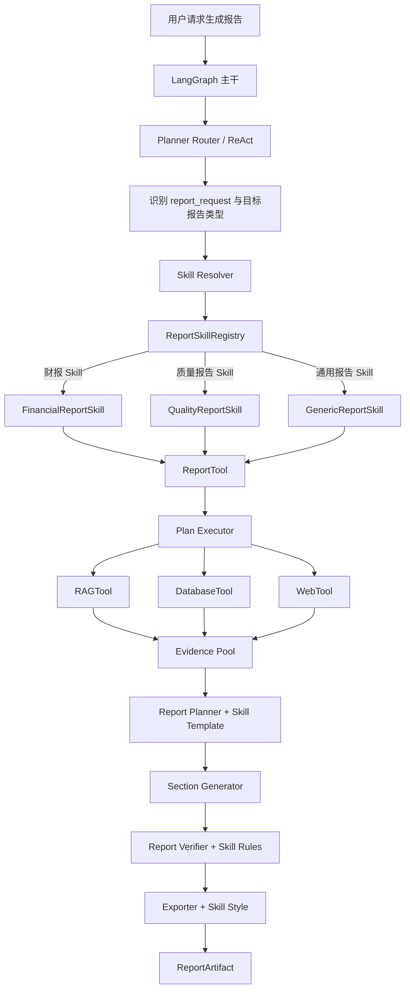
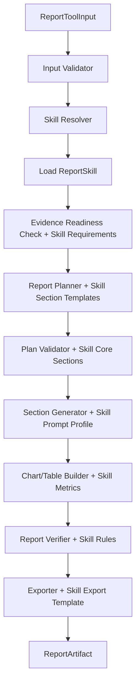

# ReportTool 整合 Skill 化设计文档

> **项目名称**：报告生成能力的 Skill 化升级  
> **设计目标**：在不推翻现有 ReportTool 实现的前提下，引入“报告 Skill”层，将财报、质量报告、趋势分析等领域模板从通用工具逻辑中解耦  
> **适用对象**：财报分析、质量报告、经营分析、管理简报、知识汇总等报告生成场景  
> **版本**：v1.0  
> **前置文档**：`docs/报告生成Tool设计.md`  

---

## 1. 背景与判断

### 1.1 问题背景

现有 ReportTool 设计已经解决了：

- 报告工具接入 Plan Executor。
- Evidence 驱动生成。
- 章节、图表、表格结构化。
- Report Verifier 校验数字、引用、敏感信息。
- Markdown / HTML 等格式导出。

但从行业通用方案和当前可维护性看，仍缺少一层“领域报告能力封装”。

财报报告、质量报告、管理简报不是简单的 `report_type` 字符串差异，它们在以下方面存在本质差异：

| 维度 | 财报 Skill | 质量报告 Skill |
|------|------------|----------------|
| 核心章节 | 收入、成本、利润、现金流、风险 | 异常趋势、异常类型、根因、责任环节、整改建议 |
| 核心指标 | 营收、毛利率、净利率、同比/环比 | 异常数、异常率、复发率、TOP 类型、关闭率 |
| 证据要求 | 财务报表 DB、会计准则 RAG、公告 Web | 质量 DB、质量规范 RAG、行业案例 Web |
| 数字校验 | 公式、同比/环比、表间勾稽 | 统计口径、时间窗口、去重规则 |
| 风险约束 | 财务口径、披露边界、敏感经营数据 | 客诉、供应商、责任部门、整改承诺 |
| 输出模板 | 管理层财报分析、季度经营分析 | 质量月报、专项异常分析、8D 报告 |

如果这些规则全部写进 ReportTool 内部，会导致：

1. ReportTool 变成“大杂烩”，包含所有行业报告的硬编码逻辑。
2. 新增报告类型需要修改核心工具代码，风险高。
3. 领域专家无法独立维护模板、指标和校验规则。
4. Verifier 无法根据报告类型执行差异化校验。
5. Prompt、章节模板、指标口径和导出样式无法版本化。

### 1.2 行业经验结论

从当前主流 Agent / RAG / Report 系统看，推荐模式不是“一个大 Report Agent”，而是：

```text
通用执行 Tool / Exporter
+ 领域 Skill / Playbook / Template
+ 中央 Orchestrator / Planner
```

典型模式包括：

- **Microsoft Copilot Studio**：Tool / Connector 负责确定性动作，Skill 或 Topic 负责业务过程、适用条件和操作步骤。
- **OpenAI Agents SDK**：Agent 可以按领域配置不同 instructions、tools、guardrails 和 structured output。
- **LangGraph 报告蓝图**：Report Planning、Research、Writing、Verification 是通用流程，具体报告结构通过用户结构、模板或配置注入。
- **Evidence-first RAG Report 研究**：报告生成前先构建可追溯 Evidence Pool，再按章节范围和模板生成，而不是自由长文本生成。

因此，本设计的判断是：

```text
ReportTool 应该保留为通用、受控、可验证的执行工具；
财报报告、质量报告等应该设计为可插拔 Report Skill；
ReportTool 根据 skill_id 加载 Skill，而不是在代码中硬编码 report_type。
```

---

## 2. 设计目标

### 2.1 业务目标

1. 支持财报报告、质量报告等领域报告快速扩展。
2. 领域专家可以通过配置或 Skill 文件维护章节、指标和证据要求。
3. ReportTool 不需要为每种报告类型修改核心代码。
4. 支持报告模板版本管理和灰度升级。
5. 支持不同租户的差异化报告模板和合规规则。

### 2.2 技术目标

1. 新增 `ReportSkillRegistry`。
2. 新增 `ReportSkill` 标准模型。
3. `ReportToolInput` 从 `report_type` 升级为 `skill_id`。
4. 保持现有 `report_type` 向后兼容。
5. Report Planner 优先使用 Skill 提供的章节模板和约束。
6. Report Verifier 使用 Skill 提供的校验规则。
7. Exporter 使用 Skill 提供的样式和模板。
8. 支持 Skill 热加载或配置化加载。
9. 支持 Skill 级权限控制。

---

## 3. 总体架构

### 3.1 目标架构



### 3.2 分层职责

| 层 | 组件 | 职责 |
|----|------|------|
| 编排层 | LangGraph / ReAct / Plan Executor | 判断任务、收集证据、调度 ReportTool |
| 技能层 | ReportSkill | 定义报告结构、指标、证据要求、校验规则、导出样式 |
| 工具层 | ReportTool | 加载 Skill、生成章节、构建图表表格、执行验证、导出文件 |
| 证据层 | Evidence Pool | 保存可追溯 Evidence、Claim 支撑关系和章节可用证据 |
| 导出层 | Exporter / Storage | Markdown、HTML、Excel、PDF 等导出与存储 |
| 治理层 | Policy Guard / Verifier | 权限、安全、敏感信息、数字一致性、Claim 支撑校验 |

---

## 4. ReportSkill 核心模型

### 4.1 ReportSkill 定义

```python
class ReportSkill(TypedDict, total=False):
    """领域报告 Skill。"""

    skill_id: str
    version: str
    name: str
    description: str
    enabled: bool

    # 路由与适用条件
    report_type: str
    intent_keywords: list[str]
    required_context: list[str]
    allowed_tenants: list[str]
    required_permissions: list[str]

    # 报告结构
    section_templates: list[dict]
    core_sections: list[str]
    optional_sections: list[str]

    # 数据与证据要求
    required_evidence_types: list[str]
    min_evidence_count: int
    min_db_evidence_count: int
    min_rag_evidence_count: int
    evidence_filters: dict

    # 指标与计算口径
    metric_definitions: list[dict]
    metric_formulas: dict
    numeric_tolerance: float
    time_granularity: str

    # 生成约束
    prompt_profile: str
    writing_style: dict
    forbidden_claims: list[str]
    required_disclaimers: list[str]

    # 校验规则
    claim_rules: list[dict]
    section_quality_thresholds: dict
    publish_policy: dict

    # 导出配置
    default_format: str
    allowed_formats: list[str]
    export_templates: dict
    style_config: dict
```

### 4.2 SectionTemplate

```python
class SectionTemplate(TypedDict, total=False):
    """报告章节模板。"""

    section_id: str
    title: str
    order: int
    required: bool
    section_type: str

    purpose: str
    required_evidence_types: list[str]
    required_metric_ids: list[str]

    min_claims: int
    max_claims: int
    allowed_claim_types: list[str]

    prompt_hint: str
    fallback_mode: Literal["drop", "summary", "placeholder", "fail"]
```

### 4.3 MetricDefinition

```python
class MetricDefinition(TypedDict, total=False):
    """报告指标定义。"""

    metric_id: str
    name: str
    description: str
    data_type: Literal["currency", "percent", "count", "ratio", "text"]
    unit: str

    source_type: Literal["db", "rag", "web", "derived"]
    source_fields: list[str]
    formula: str

    comparison_modes: list[str]
    precision: int
    verification_required: bool
```

---

## 5. Skill Registry 设计

### 5.1 Registry 职责

`ReportSkillRegistry` 负责：

1. 加载 Skill 配置。
2. 校验 Skill 配置合法性。
3. 根据 `skill_id` / `report_type` / 用户请求解析 Skill。
4. 提供 Skill 版本管理。
5. 提供默认 Skill 和降级 Skill。
6. 支持租户级 Skill 覆盖。

### 5.2 加载来源

建议优先级：

1. 数据库 Skill 配置。
2. 租户自定义 Skill 配置。
3. 本地 YAML / JSON Skill 配置。
4. 内置默认 Skill。

第一期可以直接复用 `config/report.yaml` 的思路，扩展为：

```yaml
report:
  enabled: true
  default_skill_id: generic_analysis

skills:
  financial_report:
    version: "1.0"
    name: 财报分析报告
    report_type: financial_analysis
    enabled: true
    intent_keywords:
      - 财报
      - 营收
      - 利润
      - 毛利率
      - 现金流
      - 同比
      - 环比
    required_evidence_types:
      - db
      - rag
    min_db_evidence_count: 1
    core_sections:
      - overview
      - revenue_analysis
      - profit_analysis
      - cashflow_analysis
      - risk_analysis
      - conclusion
    allowed_formats:
      - markdown
      - html
      - xlsx
    publish_policy:
      require_all_core_sections: true
      allow_partial: false

  quality_report:
    version: "1.0"
    name: 质量分析报告
    report_type: quality_analysis
    enabled: true
    intent_keywords:
      - 质量
      - 异常
      - 不良
      - 缺陷
      - 客诉
      - 根因
    required_evidence_types:
      - db
      - rag
    min_db_evidence_count: 1
    core_sections:
      - overview
      - trend
      - exception_distribution
      - root_cause
      - corrective_action
      - conclusion
    allowed_formats:
      - markdown
      - html
    publish_policy:
      require_all_core_sections: false
      allow_partial: true
```

### 5.3 Skill Resolver

Skill Resolver 根据以下顺序解析：

1. `ReportToolInput.skill_id` 显式指定。
2. `route_decision.metadata.report_type`。
3. 用户问题关键词匹配。
4. 租户默认 Skill。
5. `generic_analysis` 兜底 Skill。

示例：

```python
skill = registry.resolve(
    skill_id=input_data.get("skill_id"),
    report_type=input_data.get("report_type"),
    user_question=input_data.get("objective", ""),
    tenant_id=input_data.get("tenant_id", ""),
)
```

### 5.4 Skill 不存在时

如果解析不到 Skill：

- 不得静默使用错误领域模板。
- 返回 `REPORT_SKILL_NOT_FOUND`。
- 或降级到 `generic_analysis`，但必须在 metadata 中标记：

```json
{
  "skill_resolution": {
    "requested_skill_id": "financial_report",
    "resolved_skill_id": "generic_analysis",
    "fallback": true,
    "reason": "requested skill disabled"
  }
}
```

---

## 6. 财报 Skill 设计示例

### 6.1 适用场景

- 月度/季度/年度财报分析。
- 收入、成本、利润、现金流分析。
- 同比/环比变化解释。
- 管理层经营简报。
- 财务风险识别。

### 6.2 核心章节

```yaml
section_templates:
  - section_id: overview
    title: 一、经营概况
    required: true
    section_type: overview
    required_evidence_types: [db]
    required_metric_ids: [revenue, gross_profit, net_profit]
    fallback_mode: fail

  - section_id: revenue_analysis
    title: 二、收入分析
    required: true
    section_type: analysis
    required_evidence_types: [db]
    required_metric_ids: [revenue_yoy, revenue_mom, revenue_mix]
    fallback_mode: fail

  - section_id: profit_analysis
    title: 三、利润与成本分析
    required: true
    section_type: analysis
    required_evidence_types: [db]
    required_metric_ids: [gross_margin, net_margin, expense_ratio]
    fallback_mode: fail

  - section_id: cashflow_analysis
    title: 四、现金流分析
    required: true
    section_type: analysis
    required_evidence_types: [db]
    required_metric_ids: [operating_cashflow, cashflow_ratio]
    fallback_mode: fail

  - section_id: risk_analysis
    title: 五、风险提示
    required: false
    section_type: analysis
    required_evidence_types: [db, rag]
    fallback_mode: summary

  - section_id: conclusion
    title: 六、结论与建议
    required: true
    section_type: conclusion
    required_evidence_types: [db, rag]
    fallback_mode: fail
```

### 6.3 指标定义

```yaml
metric_definitions:
  - metric_id: revenue_yoy
    name: 营收同比增长率
    data_type: percent
    formula: "(current_revenue - previous_year_revenue) / previous_year_revenue"
    source_type: derived
    source_fields: [current_revenue, previous_year_revenue]
    precision: 2
    verification_required: true

  - metric_id: gross_margin
    name: 毛利率
    data_type: percent
    formula: "gross_profit / revenue"
    source_type: derived
    source_fields: [gross_profit, revenue]
    precision: 2
    verification_required: true
```

### 6.4 校验规则

财报 Skill 必须额外校验：

1. 同比/环比公式与 DB 原始字段一致。
2. 收入、成本、利润、现金流必须使用同一时间周期。
3. 金额单位必须统一。
4. 百分比必须标明计算基数。
5. 不得基于不完整期间数据给出年度化结论。
6. 风险提示必须有事实 Evidence 或规则 Evidence 支撑。
7. 结论不得引入报告中未出现的新数字。

---

## 7. 质量报告 Skill 设计示例

### 7.1 适用场景

- 质量月报。
- 异常趋势分析。
- 不良类型分布。
- 根因分析。
- 纠正与预防措施报告。
- 客诉专题分析。

### 7.2 核心章节

```yaml
section_templates:
  - section_id: overview
    title: 一、质量总体概况
    required: true
    section_type: overview
    required_evidence_types: [db]
    required_metric_ids: [exception_count, exception_rate]
    fallback_mode: fail

  - section_id: trend
    title: 二、异常趋势
    required: true
    section_type: trend
    required_evidence_types: [db]
    required_metric_ids: [monthly_exception_count, exception_rate_trend]
    fallback_mode: fail

  - section_id: exception_distribution
    title: 三、异常类型分布
    required: true
    section_type: data
    required_evidence_types: [db]
    required_metric_ids: [top_exception_types, exception_type_share]
    fallback_mode: fail

  - section_id: root_cause
    title: 四、根因分析
    required: true
    section_type: analysis
    required_evidence_types: [db, rag]
    required_metric_ids: [root_cause_distribution]
    fallback_mode: fail

  - section_id: corrective_action
    title: 五、纠正与预防措施
    required: true
    section_type: recommendation
    required_evidence_types: [rag, db]
    fallback_mode: summary

  - section_id: conclusion
    title: 六、结论
    required: true
    section_type: conclusion
    required_evidence_types: [db]
    fallback_mode: fail
```

### 7.3 指标定义

```yaml
metric_definitions:
  - metric_id: exception_rate
    name: 异常率
    data_type: percent
    formula: "exception_count / production_count"
    source_type: derived
    source_fields: [exception_count, production_count]
    precision: 2
    verification_required: true

  - metric_id: recurrence_rate
    name: 异常复发率
    data_type: percent
    formula: "recurrence_exception_count / closed_exception_count"
    source_type: derived
    source_fields: [recurrence_exception_count, closed_exception_count]
    precision: 2
    verification_required: true
```

### 7.4 校验规则

质量报告 Skill 必须额外校验：

1. 异常趋势必须使用统一时间粒度。
2. TOP 异常类型必须与 DB 排序结果一致。
3. 根因分布必须与实际异常分类字段一致。
4. 纠正措施必须关联至少一个根因或质量规范 Evidence。
5. 客诉数据必须脱敏。
6. 涉及供应商、责任部门时必须检查租户权限。
7. 未关闭异常不得描述为“已完成整改”。

---

## 8. 与现有 ReportTool 的整合方式

### 8.1 输入变化

当前输入主要是：

```python
class ReportToolInput(TypedDict, total=False):
    title: str
    report_type: str
    template_id: str
    style_config: dict
```

升级为：

```python
class ReportToolInput(TypedDict, total=False):
    title: str
    skill_id: str
    report_type: str  # 向后兼容
    template_id: str  # 向后兼容，映射到 skill.export_templates
    style_config: dict  # 与 Skill.style_config 合并
```

优先级：

```text
skill_id > report_type > template_id > tenant_default_skill > generic_analysis
```

### 8.2 ReportTool 内部流程调整



### 8.3 现有模板迁移

当前 `config/report.yaml` 中的：

```yaml
templates:
  quality_analysis:
    sections:
      - overview
      - trend
      - root_cause
      - conclusion
      - recommendation
```

应迁移为 Skill：

```yaml
skills:
  quality_report:
    name: 质量分析报告
    report_type: quality_analysis
    section_templates:
      - section_id: overview
      - section_id: trend
      - section_id: root_cause
      - section_id: conclusion
      - section_id: corrective_action
```

迁移原则：

1. 不删除旧 `templates` 配置，先兼容。
2. 新 Skill 配置优先。
3. 老 `report_type` 自动映射到对应 Skill。
4. 迁移完成后将 `templates` 标记为 deprecated。

---

## 9. ReportTool 内部模块调整

### 9.1 新增模块

```text
agent/langgraph/tools/report/skills/
  __init__.py
  registry.py
  models.py
  resolver.py
  validators.py
  defaults.py
```

### 9.2 模块职责

| 模块 | 职责 |
|------|------|
| `models.py` | 定义 `ReportSkill`、`SectionTemplate`、`MetricDefinition` |
| `registry.py` | 加载、缓存、查询 Skill |
| `resolver.py` | 根据 skill_id / report_type / query 解析 Skill |
| `validators.py` | 校验 Skill 配置合法性 |
| `defaults.py` | 内置 `generic_analysis` 等兜底 Skill |

### 9.3 对现有模块的侵入控制

| 现有模块 | 调整方式 |
|----------|----------|
| `report_tool.py` | 在 Input Validator 后调用 Skill Resolver |
| `planner.py` | 接收 `ReportSkill.section_templates` 生成 Plan |
| `generator.py` | 使用 Skill 的 prompt_profile / writing_style |
| `chart_builder.py` | 使用 Skill.metric_definitions 选择指标 |
| `table_builder.py` | 使用 Skill 指标和 precision 配置 |
| `verifier.py` | 合并通用规则和 Skill.claim_rules |
| `exporter.py` | 使用 Skill.export_templates 和 style_config |

---

## 10. Skill 版本与权限治理

### 10.1 版本管理

Skill 必须具备：

- `skill_id`
- `version`
- `status: draft / active / deprecated`
- `created_by`
- `created_at`
- `updated_at`

ReportArtifact 必须记录：

```json
{
  "metadata": {
    "skill_id": "quality_report",
    "skill_version": "1.0"
  }
}
```

### 10.2 灰度策略

支持按租户启用 Skill：

```yaml
quality_report:
  version: "1.1"
  status: active
  allowed_tenants:
    - tenant_a
    - tenant_b
  fallback_skill_id: quality_report@1.0
```

### 10.3 权限控制

1. 租户只能使用被授权的 Skill。
2. Skill 内声明的 `required_permissions` 必须由 Policy Guard 校验。
3. Skill 不得扩大 ReportTool 的数据访问权限。
4. Skill 只能约束报告生成方式，不得修改租户数据权限。
5. 高敏 Skill（如财报、法务、人事）可要求人工审批后导出。

---

## 11. 安全与合规约束

1. Skill 文件必须来自可信配置源，不允许用户直接上传未审核 Skill。
2. Skill 中的 prompt 不得包含系统级越权指令。
3. Skill 中的公式必须是可解释表达式，不允许执行任意代码。
4. 如果支持表达式计算，必须使用安全表达式解析器，禁止 `eval`。
5. Skill 的版本切换必须可审计。
6. Skill 不得自动新增数据源访问权限。
7. Skill 模板中的免责声明必须保留，不得被 LLM 删除。
8. 财报、法务、人事等 Skill 输出必须执行更严格的敏感信息扫描。

---

## 12. 可观测性

### 12.1 Trace 字段

新增：

- `skill_id`
- `skill_version`
- `skill_resolution_source`
- `skill_fallback`
- `core_section_count`
- `optional_section_count`
- `metric_count`
- `skill_validation_result`

### 12.2 指标

```text
agent_report_skill_used_total
agent_report_skill_fallback_total
agent_report_skill_validation_failed_total
agent_report_skill_section_quality_score
agent_report_skill_publish_mode_total
```

### 12.3 日志要求

必须记录：

- 使用了哪个 Skill。
- 使用哪个版本。
- 是否发生 fallback。
- Skill 校验是否通过。
- 核心章节覆盖情况。

不得记录：

- 完整 Skill Prompt。
- 完整报告正文。
- 未脱敏财务数据。
- 未脱敏质量异常明细。

---

## 13. 测试要求

### 13.1 Skill 配置测试

必须覆盖：

- Skill 必填字段校验。
- Skill 版本冲突。
- `section_id` 重复。
- 核心章节不存在。
- 指标公式引用未知字段。
- 导出格式不被全局配置支持。
- 租户未授权 Skill。

### 13.2 Skill Resolver 测试

必须覆盖：

1. 显式 `skill_id` 优先。
2. `report_type` 映射 Skill。
3. 用户问题关键词匹配 Skill。
4. 未授权 Skill 返回权限错误。
5. Skill 不存在时 fallback 到 `generic_analysis`。
6. fallback 结果在 metadata 中标记。

### 13.3 财报 Skill 测试

必须覆盖：

- 营收同比公式正确。
- 毛利率公式正确。
- 金额单位一致。
- 时间周期一致。
- 核心章节缺失时不发布完整报告。
- 结论中新增未验证数字时拦截。

### 13.4 质量报告 Skill 测试

必须覆盖：

- TOP 异常类型与 DB 排序一致。
- 异常趋势时间粒度一致。
- 根因分类字段一致。
- 纠正措施必须关联 Evidence。
- 未关闭异常不得写成已整改。
- 客诉数据脱敏。

---

## 14. 迁移计划

### 阶段一：Skill Registry 基础能力

目标：不影响现有 ReportTool 行为。

交付：

- `ReportSkill` 模型。
- `ReportSkillRegistry`。
- `Skill Resolver`。
- `generic_analysis` 默认 Skill。
- 老 `report_type` 到新 Skill 的兼容映射。

### 阶段二：迁移质量报告

目标：将 `quality_analysis` 迁移为 `quality_report` Skill。

交付：

- 质量章节模板。
- 质量指标定义。
- 质量校验规则。
- 质量报告导出样式。
- 质量报告测试集。

### 阶段三：新增财报 Skill

目标：支持财报分析场景。

交付：

- 财报章节模板。
- 财务指标公式。
- 财务数字一致性校验。
- Excel 导出模板。
- 财报敏感信息规则。

### 阶段四：Skill 管理后台

目标：支持配置化管理。

交付：

- Skill 列表。
- Skill 版本。
- Skill 启停。
- 租户授权。
- Skill 使用指标。
- Skill 回滚。

---

## 15. 推荐目录与配置结构

```text
agent/langgraph/tools/report/skills/
  __init__.py
  models.py
  registry.py
  resolver.py
  validators.py
  defaults.py

config/
  report.yaml
  report_skills/
    generic_analysis.yaml
    quality_report.yaml
    financial_report.yaml
```

`config/report.yaml` 保留全局配置：

```yaml
report:
  enabled: true
  default_skill_id: generic_analysis
  allowed_formats:
    - markdown
    - html
  max_sections: 10
  max_charts: 6
  max_tables: 8
```

领域 Skill 单独配置：

```yaml
# config/report_skills/quality_report.yaml
skill_id: quality_report
version: "1.0"
name: 质量分析报告
report_type: quality_analysis
enabled: true
section_templates: []
metric_definitions: []
claim_rules: []
```

---

## 16. 最终推荐方案

结论：**ReportTool 结合 Skill 使用更好，而且应尽快做。**

推荐边界：

```text
ReportTool = 通用执行器
ReportSkill = 领域报告模板 + 指标口径 + 校验规则 + 导出样式
LangGraph / Plan Executor = 编排与证据收集
Verifier = 通用验证 + Skill 专属验证
```

不要把财报、质量报告直接做成多个独立 Tool，也不要把所有领域逻辑塞进 ReportTool。最佳方案是：

```text
一个受控 ReportTool
+ 一个可插拔 ReportSkillRegistry
+ 多个领域 Skill
```

这样既能保持现有 ReportTool 的实现成果，又能支持财报 Skill、质量报告 Skill 和后续更多业务报告 Skill 的低成本扩展。

---

## 17. 验收标准

1. ReportTool 可以通过 `skill_id` 加载领域 Skill。
2. 老版本 `report_type=quality_analysis` 能自动映射到质量报告 Skill。
3. 财报 Skill 能定义独立章节、指标和校验规则。
4. 质量报告 Skill 能定义独立章节、指标和校验规则。
5. Skill 不存在时能 fallback 到 `generic_analysis` 并标记。
6. 未授权租户不能使用指定 Skill。
7. ReportArtifact metadata 必须记录 `skill_id` 和 `skill_version`。
8. Report Verifier 能执行通用规则和 Skill 专属规则。
9. 新增一个领域 Skill 不需要修改 ReportTool 核心流程代码。
10. 所有 Skill 配置必须经过静态校验后才能启用。
