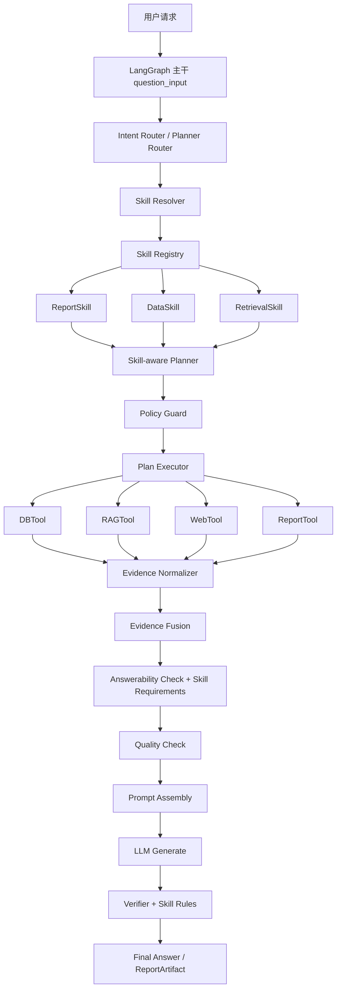

# Skill 整合落地设计文档

> **项目名称**：Agentic RAG Skill 体系整合落地  
> **设计目标**：将 ReportSkill、DataSkill、RetrievalSkill 真正接入现有 RAG / LangGraph / Plan Executor / DBTool / RAGTool / ReportTool 体系  
> **适用范围**：制造业高管报告、质量报告、运营复盘、工厂绩效、交付绩效、生产日报、成本分析及后续领域 Skill 扩展  
> **版本**：v1.0  
> **后续开发约束**：后续实现以本文档为准；历史文档仅作为背景参考  
> **关联配置**：`config/report_skills/*.yaml`、`config/report_skills/data/*.yaml`、`config/report_skills/retrieval/*.yaml`  
> **关联计划**：`docs/todo/dbtool_enhancement_plan.md`

---

## 1. 背景与目标

当前系统已经具备：

- LangGraph 主干编排。
- Planner / Intent Router / ReAct 子图。
- Plan Executor：DAG 调度、并行工具执行。
- DBTool / RAGTool / WebTool / ReportTool。
- Evidence Fusion、Answerability Check、Verification。
- 6 个 ReportSkill 配置。
- 6 个 DataSkill 配置。
- 6 个 RetrievalSkill 配置。
- DBTool 增强 TODO 计划。

但目前三类 Skill 仍主要是配置文件，还没有成为 RAG 系统中的运行时能力。要真正落地，需要让 Skill 成为：

1. Planner 的领域约束来源。
2. DBTool / RAGTool 的执行计划来源。
3. Policy Guard 的权限校验来源。
4. Evidence / Answerability 的要求来源。
5. ReportTool 的模板、指标、验证和导出来源。

本设计的目标是将 Skill 定位为 RAG 系统中的**领域能力层**，不是独立服务，也不是单纯 Prompt 模板。

---

## 2. Skill 在 RAG 系统中的定位

### 2.1 核心定位

```text
Skill = 领域任务能力描述层
```

它描述：

- 这个任务是什么类型。
- 需要哪些数据。
- 数据从哪个 DB / 表 / 字段来。
- 需要检索哪些知识库。
- 需要哪些 Evidence。
- 报告应该如何组织。
- 哪些指标口径必须使用。
- 哪些内容禁止生成。
- 哪些权限必须校验。
- 哪些验证规则必须执行。

### 2.2 与现有模块的关系

| 模块 | 职责 | 与 Skill 的关系 |
|------|------|----------------|
| LangGraph | 图编排、状态流转、节点执行 | 消费 Skill 解析结果，决定执行路径 |
| Planner | 生成 ExecutionPlan | 必须基于 Skill 生成受控计划 |
| Plan Executor | 并行执行 PlanStep | 执行由 Skill 生成的 DB / RAG / Report 步骤 |
| DBTool | 执行数据库查询 | 使用 DataSkill 约束查询范围 |
| RAGTool | 执行知识检索 | 使用 RetrievalSkill 约束检索范围 |
| ReportTool | 生成报告 | 使用 ReportSkill 约束模板、指标和验证 |
| Policy Guard | 权限、安全、预算控制 | 执行 Skill 声明的 policy_constraints |
| Evidence / Answerability | 证据检查 | 使用 Skill 声明的 evidence_requirements |
| Verifier | 输出验证 | 合并通用规则和 Skill 规则 |

### 2.3 Skill 不是什么

Skill 不是：

- 独立 Agent。
- 独立微服务。
- 独立数据库。
- 单纯 Prompt。
- 业务前端页面。
- 绕过 LangGraph 的另一套流程。

---

## 3. 总体架构

### 3.1 目标架构图



### 3.2 核心执行链路

```text
用户请求生成质量报告
  -> Intent Router 识别 report_request
  -> Skill Resolver 解析 quality_report
  -> Skill Registry 加载 quality_report
  -> ReportSkill 声明 linked DataSkill / RetrievalSkill
  -> Skill-aware Planner 生成 ExecutionPlan
  -> Policy Guard 校验 db_id / kb_id / 字段 / 权限 / 预算
  -> Plan Executor 并行执行 DB 和 RAG 查询
  -> Evidence Normalizer 将结果转 Evidence
  -> Answerability Check 校验必需 Evidence 是否齐全
  -> ReportTool 使用 ReportSkill 生成报告
  -> Report Verifier 执行通用验证 + Skill 专属验证
  -> 最终返回报告摘要和下载链接
```

---

## 4. Skill 类型模型

### 4.1 三类 Skill 职责

| Skill 类型 | 当前文件 | 职责 |
|------------|----------|------|
| ReportSkill | `config/report_skills/*.yaml` | 报告结构、章节、指标、验证、导出 |
| DataSkill | `config/report_skills/data/*.yaml` | DB 实例、表、字段、指标绑定、查询模板 |
| RetrievalSkill | `config/report_skills/retrieval/*.yaml` | 知识库、查询模板、文档过滤、章节证据绑定 |

### 4.2 关联关系

每个 ReportSkill 必须显式关联一个 DataSkill 和一个 RetrievalSkill。

```yaml
skill_id: quality_report
skill_type: report
linked_skills:
  data_skill_id: quality_data_access
  retrieval_skill_id: quality_knowledge_retrieval
```

当前已生成的 Skill 文件通过 `linked_report_skill_id` 反向关联，代码实现时需要支持双向解析：

```text
ReportSkill -> linked DataSkill / RetrievalSkill
DataSkill / RetrievalSkill -> linked_report_skill_id
```

### 4.3 统一 Skill 元模型

代码中建议定义统一基类：

```python
class SkillBase(BaseModel):
    skill_id: str
    skill_type: Literal["report", "data", "retrieval"]
    version: str
    name: str
    description: str
    enabled: bool
    linked_report_skill_id: str | None = None
```

然后分别扩展：

```python
class ReportSkill(SkillBase):
    report_type: str
    intent_keywords: list[str]
    required_context: list[str]
    section_templates: list[SectionTemplate]
    metric_definitions: list[MetricDefinition]
    claim_rules: list[dict]
    publish_policy: dict

class DataSkill(SkillBase):
    db_targets: list[dict]
    metric_bindings: dict
    query_templates: list[dict]
    evidence_requirements: list[dict]
    policy_constraints: dict

class RetrievalSkill(SkillBase):
    rag_targets: list[dict]
    web_targets: list[dict]
    evidence_requirements: list[dict]
    retrieval_policy: dict
    section_binding: dict
```

---

## 5. 代码模块设计

### 5.1 新增目录

```text
agent/langgraph/skills/
  __init__.py
  models.py
  registry.py
  resolver.py
  validator.py
  planner_adapter.py
  policy_adapter.py
  evidence_adapter.py
```

### 5.2 模块职责

| 文件 | 职责 |
|------|------|
| `models.py` | 定义 SkillBase、ReportSkill、DataSkill、RetrievalSkill、ResolvedSkillSet |
| `registry.py` | 加载、缓存、查询、校验 Skill 配置 |
| `resolver.py` | 根据用户请求、report_type、skill_id 解析 Skill 组合 |
| `validator.py` | 校验 Skill 配置完整性和一致性 |
| `planner_adapter.py` | 将 Skill 转为 Planner 可用的 PlanTemplate / PlanConstraint |
| `policy_adapter.py` | 将 Skill 转为 Policy Guard 可执行的规则 |
| `evidence_adapter.py` | 将 Skill 转为 Answerability / Evidence 校验要求 |

### 5.3 ResolvedSkillSet

Planner 不直接消费三个分散 Skill，而是消费一个解析后的组合对象：

```python
class ResolvedSkillSet(BaseModel):
    report_skill: ReportSkill
    data_skill: DataSkill
    retrieval_skill: RetrievalSkill
    resolution_source: Literal["skill_id", "report_type", "keyword", "tenant_default", "fallback"]
    fallback_used: bool = False
    warnings: list[str] = []
```

---

## 6. Skill Registry 设计

### 6.1 配置加载路径

```text
config/report_skills/*.yaml              -> ReportSkill
config/report_skills/data/*.yaml         -> DataSkill
config/report_skills/retrieval/*.yaml    -> RetrievalSkill
```

### 6.2 Registry 功能

`SkillRegistry` 必须支持：

1. 启动时加载所有 YAML。
2. 按 `skill_id` 查询。
3. 按 `report_type` 查询 ReportSkill。
4. 按 `linked_report_skill_id` 查询 DataSkill / RetrievalSkill。
5. 校验 Skill 是否 enabled。
6. 支持版本字段。
7. 支持热加载或手动 reload。
8. 支持默认 Skill：`generic_analysis`。

### 6.3 校验规则

启动时必须校验：

- `skill_id` 唯一。
- `skill_type` 正确。
- ReportSkill 的 `report_type` 唯一。
- DataSkill / RetrievalSkill 的 `linked_report_skill_id` 存在对应 ReportSkill。
- ReportSkill 的 `core_sections` 存在于 `section_templates`。
- `required_metric_ids` 存在于 `metric_definitions`。
- DataSkill 的 `metric_bindings` 引用的表存在。
- DataSkill 的 `query_templates` 引用的 target/table 存在。
- RetrievalSkill 的 `rag_targets` 不为空且包含 `kb_id`。
- EvidenceRequirement 引用的 source target 存在。

---

## 7. Skill Resolver 设计

### 7.1 解析优先级

```text
显式 skill_id
> route_decision.metadata.report_type
> 用户问题关键词 intent_keywords
> 租户默认 Skill
> generic_analysis fallback
```

### 7.2 输入

```python
class SkillResolveContext(BaseModel):
    user_question: str
    tenant_id: str
    skill_id: str | None = None
    report_type: str | None = None
    route_decision: dict | None = None
    agent_config: dict | None = None
```

### 7.3 输出

```python
class SkillResolveResult(BaseModel):
    skill_set: ResolvedSkillSet | None
    resolved: bool
    fallback_used: bool
    reason: str
    warnings: list[str]
```

### 7.4 解析失败策略

如果无法解析 Skill：

- 普通问答：不启用 Skill。
- 报告请求：使用 `generic_analysis`。
- 显式指定不存在 Skill：返回 `SKILL_NOT_FOUND`。
- 显式指定无权限 Skill：返回 `SKILL_PERMISSION_DENIED`。

---

## 8. Skill-aware Planner 设计

### 8.1 Planner 改造目标

当前 Planner 根据用户问题生成 ExecutionPlan。改造后必须优先基于 Skill 生成受控计划。

```text
自由规划 -> Skill 约束规划
```

### 8.2 Planner 输入

```python
class SkillPlanContext(BaseModel):
    user_question: str
    tenant_id: str
    time_range: dict | None
    report_date: str | None
    query_lang: str
    skill_set: ResolvedSkillSet
    agent_config: dict
```

### 8.3 计划生成规则

Planner 应按以下顺序生成 PlanStep：

1. 根据 DataSkill `query_templates` 生成 DB 步骤。
2. 根据 RetrievalSkill `query_templates` 生成 RAG 步骤。
3. 根据 ReportSkill 生成最终 `report` 步骤。
4. 如果 DataSkill 缺失必需上下文，则停止生成并返回澄清或错误。
5. 如果 RetrievalSkill 缺失可选上下文，则降级查询模板，不得编造。
6. 所有 DB / RAG 步骤必须可并行，除非有依赖。
7. `report` 步骤必须依赖所有 required Evidence 对应步骤。

### 8.4 示例：质量报告 ExecutionPlan

```json
{
  "plan_id": "quality_report_plan",
  "steps": [
    {
      "step_id": "query_quality_exception_detail",
      "tool": "database",
      "args": {
        "db_id": "qms_prod",
        "query": "查询指定时间范围内的质量异常明细",
        "extra": {
          "data_skill_id": "quality_data_access",
          "query_template_id": "quality_exception_detail",
          "table_name": "quality_exception"
        }
      },
      "depends_on": [],
      "can_parallel": true
    },
    {
      "step_id": "query_production_output_for_quality",
      "tool": "database",
      "args": {
        "db_id": "mes_prod",
        "query": "查询质量报告所需生产数量",
        "extra": {
          "data_skill_id": "quality_data_access",
          "query_template_id": "production_output_for_quality",
          "table_name": "production_output"
        }
      },
      "depends_on": [],
      "can_parallel": true
    },
    {
      "step_id": "retrieve_quality_sop",
      "tool": "rag",
      "args": {
        "kb_ids": ["quality_sop_kb"],
        "query": "质量异常处理流程 纠正预防措施",
        "extra": {
          "retrieval_skill_id": "quality_knowledge_retrieval",
          "rag_target_id": "quality_sop"
        }
      },
      "depends_on": [],
      "can_parallel": true
    },
    {
      "step_id": "generate_quality_report",
      "tool": "report",
      "args": {
        "query": "生成质量分析报告",
        "extra": {
          "skill_id": "quality_report",
          "data_skill_id": "quality_data_access",
          "retrieval_skill_id": "quality_knowledge_retrieval",
          "format": "markdown"
        }
      },
      "depends_on": [
        "query_quality_exception_detail",
        "query_production_output_for_quality",
        "retrieve_quality_sop"
      ],
      "can_parallel": false
    }
  ]
}
```

---

## 9. PlanStep 与 ToolDispatcher 改造

### 9.1 PlanStep.tool 扩展

当前需要支持：

```python
tool: Literal["rag", "database", "web", "report"]
```

其中：

- `database` 步骤可由 DataSkill 生成。
- `rag` 步骤可由 RetrievalSkill 生成。
- `report` 步骤必须由 ReportSkill 生成。

### 9.2 StepArgs.extra 约定

`extra` 中必须保留 Skill 上下文：

```json
{
  "skill_id": "quality_report",
  "data_skill_id": "quality_data_access",
  "retrieval_skill_id": "quality_knowledge_retrieval",
  "query_template_id": "quality_exception_detail",
  "table_name": "quality_exception",
  "rag_target_id": "quality_sop"
}
```

### 9.3 ToolDispatcher 改造

`ToolDispatcher` 需要识别 Skill 上下文：

```text
database + data_skill_id -> StructuredQueryExecutor
rag + retrieval_skill_id -> SkillGuidedRAGExecutor
report + skill_id -> ReportTool
```

普通 DB / RAG 查询仍保持兼容：

```text
database 无 data_skill_id -> 原 DBTool 流程
rag 无 retrieval_skill_id -> 原 RAGTool 流程
```

---

## 10. DBTool 改造设计

DBTool 改造以 `docs/todo/dbtool_enhancement_plan.md` 为准，本节定义与 Skill 落地的最小闭环。

### 10.1 新增结构化查询模型

建议在：

```text
agent/langgraph/tools/database/
```

新增：

```text
models.py
structured_query.py
executor.py
policy.py
mapper.py
```

核心模型：

```python
class StructuredQuery(BaseModel):
    db_id: str
    table_name: str
    dimensions: list[str] = []
    metrics: list[str] = []
    filters: dict[str, Any] = {}
    time_field: str | None = None
    time_range: dict[str, Any] | None = None
    time_granularity: str | None = None
    order_by: list[str] = []
    limit: int = 1000
    query_template_id: str | None = None
    data_skill_id: str | None = None
```

### 10.2 DBTool 执行路径

```text
PlanStep(database)
  -> ToolDispatcher
  -> DataSkillRegistry 加载 DataSkill
  -> DataSkillValidator 校验 query_template / table / fields
  -> Policy Guard 校验权限
  -> StructuredQueryBuilder 构建参数化查询
  -> DBTool 执行只读查询
  -> DBQueryResult
  -> Evidence Normalizer
```

### 10.3 P0 必须实现

1. `db_id` 映射。
2. 表字段白名单。
3. 参数化查询。
4. `tenant_id` 强制注入。
5. `time_range` 支持。
6. 敏感字段脱敏。
7. 标准 `DBQueryResult`。
8. 查询审计。

### 10.4 禁止行为

- 禁止 DBTool 跨库 JOIN。
- 禁止执行非只读 SQL。
- 禁止拼接未校验用户输入。
- 禁止查询 DataSkill 未声明表。
- 禁止返回未脱敏敏感字段。

---

## 11. RAGTool 改造设计

### 11.1 RetrievalSkill 驱动检索

RAGTool 需要支持 RetrievalSkill 中的：

- `kb_id`
- `query_templates`
- `document_filters`
- `metadata_filters`
- `top_k`
- `min_rag_quality_score`
- `section_binding`

### 11.2 RAG 输入扩展

```python
class SkillRAGInput(TypedDict, total=False):
    query: str
    kb_ids: list[str]
    tenant_id: str
    retrieval_skill_id: str
    rag_target_id: str
    document_filters: dict
    metadata_filters: dict
    top_k: int
    section_id: str
```

### 11.3 查询模板填充

例如：

```yaml
query_templates:
  - template_id: corrective_action_standard
    query: "质量异常纠正预防措施 {root_cause_category}"
```

Planner 或 RAGTool 执行前需要用上下文填充：

```json
{
  "query": "质量异常纠正预防措施 设备参数波动"
}
```

如果必需变量缺失：

- required target：返回错误或澄清。
- optional target：跳过该模板。

---

## 12. ReportTool 改造设计

### 12.1 ReportTool 输入

```python
class ReportToolInput(TypedDict, total=False):
    title: str
    skill_id: str
    data_skill_id: str
    retrieval_skill_id: str
    format: str
    objective: str
    tenant_id: str
    user_id: str
    time_range: dict
    report_date: str
    evidence: list[dict]
    tool_results: list[dict]
```

### 12.2 ReportTool 执行路径

```text
ReportToolInput
  -> SkillResolver 加载 ResolvedSkillSet
  -> ReportSkillValidator 校验配置
  -> Evidence Readiness Check + Skill evidence_requirements
  -> Report Planner + ReportSkill section_templates
  -> Section Generator
  -> Chart / Table Builder + metric_definitions
  -> Report Verifier + claim_rules
  -> Exporter
  -> ReportArtifact
```

### 12.3 兼容策略

- 新请求优先使用 `skill_id`。
- 旧请求使用 `report_type` 映射 Skill。
- `template_id` 作为旧格式兼容，不鼓励继续使用。
- 无 Skill 时走 `generic_analysis`。

---

## 13. Evidence 与 Answerability 改造

### 13.1 EvidenceRequirement

三类 Skill 都可以声明 Evidence 要求：

```yaml
evidence_requirements:
  - evidence_id: quality_exception_rows
    evidence_type: db_rows
    source_target_id: qms_quality
    table_name: quality_exception
    required: true
    required_for_sections:
      - overview
      - trend
```

### 13.2 Answerability 判断

Answerability Check 除了判断“是否有足够信息”，还要判断：

- required Evidence 是否存在。
- Evidence 是否来自 Skill 声明的 source target。
- Evidence 是否覆盖核心章节。
- Evidence 是否包含必要字段。
- Evidence 是否满足时间范围。
- Evidence 是否满足租户隔离。

### 13.3 结果示例

```json
{
  "answerable": false,
  "publish_mode": "summary_only",
  "missing_required_evidence": [
    "production_output_rows"
  ],
  "section_coverage": {
    "overview": false,
    "trend": false,
    "root_cause": true
  },
  "reason": "质量报告缺少生产数量 Evidence，无法计算异常率和一次通过率"
}
```

---

## 14. Policy Guard 改造

### 14.1 Skill 权限规则

Policy Guard 必须读取 Skill：

- `required_permissions`
- `allowed_tenants`
- `policy_constraints`
- `sensitive_fields`
- `allowed_formats`
- `publish_policy`

### 14.2 校验顺序

```text
用户权限
-> 租户权限
-> Skill 权限
-> DB 实例权限
-> 表权限
-> 字段权限
-> 知识库权限
-> 预算限制
-> 导出格式权限
```

### 14.3 典型拒绝场景

- 用户无 `quality:read`。
- 租户未启用 `quality_report`。
- 查询未包含 `tenant_id`。
- 查询表不在 DataSkill 白名单。
- 查询字段包含未授权 `customer_id`。
- RAG 检索未声明 `kb_id`。
- 导出格式不在 ReportSkill `allowed_formats`。

---

## 15. 状态与数据模型改造

### 15.1 AgentState 新增字段

```python
skill_set: dict | None
skill_resolution: dict | None
skill_plan: dict | None
skill_validation_result: dict | None
skill_evidence_requirements: list[dict]
```

### 15.2 ToolResult 新增字段

```python
skill_id: str
data_skill_id: str
retrieval_skill_id: str
query_template_id: str
db_id: str
table_name: str
kb_ids: list[str]
evidence_ids: list[str]
```

### 15.3 RouteDecision.metadata 新增字段

```json
{
  "request_type": "report_request",
  "report_type": "quality_analysis",
  "skill_id": "quality_report",
  "time_range": {
    "start": "2026-04-01",
    "end": "2026-06-30"
  }
}
```

---

## 16. 代码改造清单

### 16.1 新增

```text
agent/langgraph/skills/
  __init__.py
  models.py
  registry.py
  resolver.py
  validator.py
  planner_adapter.py
  policy_adapter.py
  evidence_adapter.py
```

### 16.2 修改

```text
agent/langgraph/routers/models.py
  PlanStep.tool 支持 "report"
  StepArgs.extra 增加 skill 上下文字段约定

agent/langgraph/routers/planner.py
  支持 Skill-aware Planning

agent/langgraph/nodes/intent_router.py
  识别 report_request，输出 report_type / skill_id 到 metadata

agent/langgraph/nodes/react_subgraph.py
  ReAct 生成计划前调用 Skill Resolver

agent/langgraph/executor/tool_dispatcher.py
  支持 data_skill_id / retrieval_skill_id / skill_id 分发

agent/langgraph/tools/database_tool.py
  支持 StructuredQuery 路径

agent/langgraph/tools/rag_tool.py
  支持 RetrievalSkill 查询模板和过滤条件

agent/langgraph/tools/report/report_tool.py
  使用 ResolvedSkillSet 生成报告

agent/langgraph/evidence/answerability.py
  支持 Skill evidence_requirements

agent/langgraph/react/policy.py
  支持 Skill policy_constraints

agent/langgraph/state.py
  增加 Skill 相关状态字段
```

---

## 17. 分阶段实施计划

### 阶段一：Skill 基础运行时

目标：能加载、解析、校验三类 Skill。

交付：

- `agent/langgraph/skills/models.py`
- `registry.py`
- `resolver.py`
- `validator.py`
- 单元测试
- 启动时加载 18 个 YAML

验收：

- 能通过 `skill_id=quality_report` 解析完整 SkillSet。
- 配置缺失或引用错误时启动失败或给出明确错误。

### 阶段二：Skill-aware Planner

目标：Planner 能根据 Skill 生成 ExecutionPlan。

交付：

- `planner_adapter.py`
- Planner 集成
- quality_report 端到端 Plan 生成
- PlanStep extra 携带 Skill 上下文

验收：

- 能生成质量报告 DB + RAG + Report 计划。
- 不允许生成 Skill 未声明的表或知识库。

### 阶段三：DBTool 最小闭环

目标：执行 DataSkill 生成的 DB 查询。

交付：

- `StructuredQuery`
- DB 表字段白名单
- `db_id` 映射
- 参数化查询
- `tenant_id` 强制注入
- 标准 `DBQueryResult`

验收：

- `quality_data_access` 至少一个查询模板可执行。
- 非白名单表和字段被拒绝。

### 阶段四：RAGTool Skill 化

目标：执行 RetrievalSkill 生成的检索。

交付：

- `SkillRAGInput`
- query template 填充
- document/metadata filters
- top_k 和质量分控制

验收：

- `quality_knowledge_retrieval` 能按 `quality_sop_kb` 检索。
- 缺失 required context 时不自由编造。

### 阶段五：ReportTool Skill 化

目标：ReportTool 使用 ReportSkill 生成报告。

交付：

- ReportTool 加载 ResolvedSkillSet
- section_templates 驱动 Report Planner
- metric_definitions 驱动 Chart / Table Builder
- claim_rules 驱动 Report Verifier

验收：

- 质量报告按 quality_report 模板生成。
- 关键数字可追溯 DB Evidence。
- 纠正措施必须引用质量 SOP。

### 阶段六：Policy 与 Evidence 集成

目标：安全与证据完整。

交付：

- Policy Guard 读取 Skill 规则。
- Answerability 读取 evidence_requirements。
- 敏感字段脱敏。
- 查询审计。

验收：

- 缺少必需 Evidence 时不生成完整报告。
- 敏感字段不会进入报告明文。

---

## 18. 测试设计

### 18.1 Skill Registry 测试

- 加载 6 个 ReportSkill。
- 加载 6 个 DataSkill。
- 加载 6 个 RetrievalSkill。
- `skill_id` 唯一。
- `linked_report_skill_id` 有效。
- `core_sections` 有效。
- `required_metric_ids` 有效。

### 18.2 Skill Resolver 测试

- 显式 `skill_id` 优先。
- `report_type` 映射。
- 关键词匹配。
- 未授权 Skill。
- 不存在 Skill。
- fallback 到 `generic_analysis`。

### 18.3 Planner 测试

- quality_report 生成 DB + RAG + Report Plan。
- operations_review 生成多域 DB Plan。
- production_daily 使用 `report_date`。
- 缺少 `time_range` 时返回澄清。
- 不生成 Skill 未声明表。

### 18.4 DBTool 测试

- `db_id` 映射。
- 表白名单。
- 字段白名单。
- 敏感字段脱敏。
- SQL 注入拦截。
- 非只读 SQL 拦截。
- 时间范围注入。
- 查询结果标准化。

### 18.5 RAGTool 测试

- `kb_id` 限制。
- query template 填充。
- metadata filter。
- document filter。
- top_k。
- 检索质量分。

### 18.6 ReportTool 测试

- 使用 ReportSkill 生成章节。
- 使用 MetricDefinition 生成图表。
- 使用 claim_rules 拦截无依据建议。
- Evidence 不足时 `summary_only`。
- 导出 Markdown / HTML。

---

## 19. 验收标准

### 19.1 功能验收

1. 系统能识别报告请求。
2. 系统能解析对应 ReportSkill。
3. 系统能加载关联 DataSkill 和 RetrievalSkill。
4. Planner 能生成受控 ExecutionPlan。
5. DBTool 能按 DataSkill 执行查询。
6. RAGTool 能按 RetrievalSkill 执行检索。
7. ReportTool 能按 ReportSkill 生成报告。
8. 最终答案包含报告摘要和下载链接。

### 19.2 安全验收

1. 未授权 DB 不可访问。
2. 未授权表不可查询。
3. 未授权字段不可返回。
4. 敏感字段必须脱敏。
5. 所有查询必须包含租户隔离。
6. 非只读 SQL 全部拒绝。

### 19.3 质量验收

1. 核心章节必须有 Evidence。
2. 指标必须来自结构化 DB Evidence。
3. Claim 必须有 Evidence 支撑。
4. 建议必须引用规范或案例 Evidence。
5. 证据不足时不得生成完整报告。

---

## 20. 风险与约束

1. 当前库表、知识库 ID 是合理推测，落地前必须与实际 schema 对齐。
2. DataSkill 未覆盖时，不允许 Planner 自由猜表。
3. NL-to-SQL 只能作为后续 fallback，不能替代 DataSkill。
4. DBTool 不做跨库 JOIN，跨库结果由 ResultAggregator 聚合。
5. ReportTool 不重新查数据，只消费 Evidence。
6. Skill 不扩大用户权限，只声明所需权限。
7. 所有 Skill 配置必须经过启动校验。
8. 报告发布必须经过 Verifier 和 Policy Guard。

---

## 21. 最终结论

Skill 应该作为 RAG 系统中的独立逻辑模块存在，但不是独立服务。

推荐最终定位：

```text
Skill = 领域能力层 / 任务说明书 / 受控计划模板
```

最终执行模式：

```text
ReportSkill 决定报告怎么写
DataSkill 决定数据怎么查
RetrievalSkill 决定知识怎么检索
Planner 根据三类 Skill 生成 ExecutionPlan
Policy Guard 根据 Skill 执行权限和安全校验
DBTool / RAGTool 执行查询
Evidence Normalizer 生成可追溯证据
ReportTool 生成报告
Verifier 验证报告
```

后续开发应以本文档为主线，优先实现：

1. Skill Registry / Resolver / Validator。
2. Skill-aware Planner。
3. DataSkill 驱动的 Structured DBTool。
4. RetrievalSkill 驱动的 RAGTool。
5. ReportSkill 驱动的 ReportTool。
6. Skill 规则进入 Policy Guard 和 Answerability。
