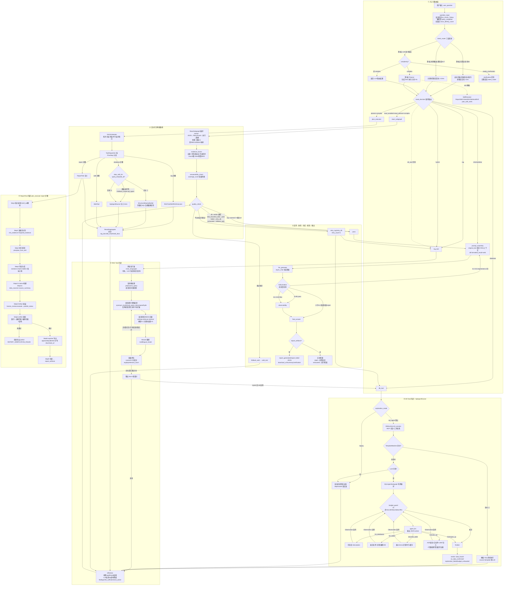

# 用户输入到报告/结果输出：全流程梳理

> 基于当前代码实际实现梳理（含 SQL Agent / Skill / Report 治理改造）。
> 覆盖：意图路由、Skill 路由、工具调用、RAG（混合检索 / Rerank / 质量评估）、DB（SqlAgentRunner）、报表生成、反思 / 质检 / 幻觉核验 / 最终输出。

---

## 一、流程图版

---

## 二、文字版（事无巨细）

### 阶段 ① 入口与意图路由

#### 1. question_input（`nodes/user_question.py`）

- 接收 `user_question`，调用历史 RAGFlow 的 `detect_query_language` 检测语言 → LangGraph 标识 `zh_CN / zh_TW / en`
- 繁体输入经 `get_query_simplified` 转简体（`query_simplified`），后续检索 / DB 表匹配统一用简体，语义空间一致
- 初始化：`retry_count=0`、`max_retries=3`、生成 `trace_id`、记录 `graph_start_time`（全链路计时基准）

#### 2. intent_router（`nodes/intent_router.py`，三层递进 + skill 解析）

先读两个**能力开关**（`agent_config`）：

- `react.enabled`（默认 False）
- `db_tool.enabled`（默认 True）

分层：

| 层 | 作用 | 耗时量级 | 行为 |
|---|---|---|---|
| 第 0 层 前置过滤 | 安全拦截、显式指令、问候语、实体格式 | <1ms | 命中即定目标直接返回 |
| 第 1 层 规则路由 | 关键词匹配 + 置信度打分 | <10ms | **置信度 ≥ 0.7 直接返回**，不再上调 LLM |
| 第 2 层 LLM 语义路由 | 结构化输出 target / confidence / complexity | <300ms | `needs_clarification` → clarification；非 complex → 直接返回 |
| 第 3 层 Planner | 仅 complex 任务触发 | <5s | 生成 DAG 执行计划（多个 PlanStep，含工具类型 / 参数 / 依赖关系） |

**Skill 解析（`_router_response`）**：当问题或路由元数据含 report / 报告 / skill / 技能，或 `complexity=complex` 时：

1. `SkillResolver` 按 `skill_id > report_type > 关键词 > 租户默认 > fallback` 顺序解析出 `ResolvedSkillSet`（ReportSkill + DataSkill + RetrievalSkill）
2. 产出 `skill_evidence_requirements`（证据要求）
3. 报告类 / 复杂任务再调 `plan_with_skills`，生成带 skill 参数（`data_skill_id`、`query_template_id`、`kb_ids`、`time_range` 等）的 ExecutionPlan 写入 state

**`route_decision` 条件路由优先级**：

1. `needs_clarification` → `clarification`
2. `react_enabled` + `source=react_planner` + complex → `react_subgraph`
3. `source=planner` + complex → `plan_executor`
4. `db_tool_enabled=False` 降级：`database` → `rag_tool`；`hybrid` → 仅 RAG
5. `rag` → `rag_tool`；`database` → `db_tool`；`hybrid` → `rag_tool`（完成后串行 `db_tool`）
6. chitchat / 其他 → 直接 `prompt_assembly`

---

### 阶段 ② RAG Tool 内部（`tools/rag_tool.py`）

固定流水线，最多 **1 次**内部重写重搜（`MAX_INTERNAL_RETRIES=1`）：

1. **跨语言扩展**（可选）  
   配置 `cross_languages` 且有 `tenant_id` + `llm_id` 时，调 `rag.prompts.generator.cross_languages` 用 LLM 生成目标语言扩展查询；失败降级用原查询。

2. **查询预处理**  
   `preprocess_query` 做语言检测 + 繁转简，输出 `query_simplified` 和 `detected_lang`（回写 AgentState）。

3. **查询重写**  
   `analyze_query_complexity` 分析复杂度（simple / boolean / multi_aspect / factual / complex），按重试次数轮转策略：
   - `synonym_rewrite`：本地词典同义词 OR 拼接
   - `sub_query_decompose` / `hyde`：目前**简化为同义词扩展**（代码里有 TODO，完整实现需 LLM）

4. **混合检索**  
   校验多知识库 embedding 模型一致 → `LLMBundle` 加载 embedding 模型 → `settings.retriever.retrieval` 执行 BM25 + 向量混合检索（`similarity_threshold=0.2`，关键词权重 0.5，即向量权重 0.5）。

5. **Rerank 精排**  
   `rerank_id` 配置时加载 RERANK 模型，调 `multilingual_rerank` 重排；未配置或失败则用原始排序。

6. **质量评估**  
   每条取 `rerank_score > similarity > score` 优先级分数；**≥0.5 计为相关**；`quality_score`=平均分，另输出 `top_score`、`relevant_count`、`has_relevant`。

7. **内部重试决策**  
   无相关文档或相关 <2 条且未重试过 → 换重写策略重搜一次；否则带着最好结果退出。

**输出**：`docs`（content / score / source / chunk_id / doc_id / metadata）、质量分、`query_simplified`、`detected_lang`。  
hybrid 模式下由 `after_rag_tool` 串行进入 `db_tool`。

---

### 阶段 ③ DB Tool 内部（= `SqlAgentRunner`）

决策总序：**① structured > ② template > ③ sql_agent > ④ legacy 回滚**。

1. **模式判断**  
   `exploration_mode=legacy` → 整体走启发式规则流水线（deprecated，仅回滚 / A/B 基线）。

2. **MCP 会话初始化**  
   `DbRuntime.init_session` 发现 `query_` / `list_tables_` / `describe_table_` 前缀工具；`list_databases` 给出 `db_id` + description。

3. **② 模板短路**  
   `TemplateMatcher` 命中预定义问法模板 → SQL 校验 → 直接执行，`source=template`，**零 LLM 调用**；模板执行失败不报错，而是放行给 SQL Agent。

4. **LLM 可用性检查**  
   拿不到 Chat 模型 → 降级 legacy 流水线。

5. **③ SQLAgentSubgraph 有界循环**
   - `budget_guard` 每步前置：10 步 / 10 次 LLM / 4 次 SQL 执行 / 6 次 describe / 90s 墙钟，任一耗尽强制 finalize（`verdict=budget_exhausted`）
   - `agent_llm`：System Prompt（极简工具描述 + 业务规则 + 可注入 DataSkill hints）+ 历史轨迹 → LLM 输出 JSON action（解析失败给 2 次容错）
   - `tool_exec` 分发 4 个细粒度工具：
     - `list_databases`：可见库 + description（Agent 自主选库）
     - `list_tables`：表白名单 + 注释（截断 200 条；返回写入 `_listed_tables` 供幻觉护栏）
     - `describe_table`：**幻觉护栏——表名必须在已披露清单内**；结果缓存（命中不计预算）
     - `execute_sql`：AST / 黑名单校验 → 表白名单校验 → **LIMIT 强制注入（500）** → 执行 → 行数截断；**执行错误不抛异常，作为 Observation 回传，Agent 分析错误自愈**（重探 schema / 修正 SQL / 放宽条件 / 换表）
   - `finalize` 计算 verdict：
     - `data_found`（有行）
     - `no_data_confirmed`（Agent 确认无数据，或 SQL 成功但空结果）
     - `exploration_failed`（LLM 错误或 give_up error）
     - `budget_exhausted`

6. **④ legacy**  
   启发式 `_route_by_intent` 选库 → `_filter_relevant_tables` 关键词筛表 → NL2SQL → 自愈重试 ≤2 次。

**输出**：`db_result`（sql / rows / row_count / source / quality_score / formatted_result / **exploration_verdict / exploration_stats / step_trace**），verdict 驱动下游 quality_check。

---

### 阶段 ④ 复杂任务两条路径

#### 4a. plan_executor（Planner 复杂任务，`nodes/plan_executor.py`）

- 从 `route_decision.metadata["plan"]` 解析 ExecutionPlan
- **DAGScheduler**：拓扑分层，**同层 PlanStep 并行、层间按 depends_on 串行**；单步骤失败不影响其他步骤（异常隔离）
- **ToolDispatcher** 按 `step.tool` 分发：

| 步骤类型 | 行为 |
|---|---|
| `rag` | 有 `retrieval_skill_id` → SkillRAGExecutor；否则 RAGTool（`step.args.kb_ids`） |
| `database` | `data_skill_id + query_template_id` 齐全 → **① 结构化路径**；模板未声明且 `fallback_mode=sql_agent` → 降级 SQL Agent 并注入 `exploration_hints`；否则 → SqlAgentRunner |
| `web` | WebTool（Tavily） |
| `report` | **ReportTool（见阶段⑥）**，evidence 来自 state.evidence + 前置步骤结果 |

- **ResultAggregator** 聚合后同步兼容字段（`rag_docs` / `db_result` / `web_docs` / 质量分），保证后续节点格式统一
- 计划失败 / 为空 → 降级空结果，不阻塞主流程

#### 4b. react_subgraph（受限 ReAct，`nodes/react_subgraph.py` + `react/`）

- 触发条件苛刻：`react_enabled=true`（默认关）+ Planner 标记 `react_planner` + complex
- 主循环（`ReactSubgraph.run`）：
  1. **预算检查**（步数 / 工具调用 / DB 查询 / LLM 调用 / token / 耗时）
  2. LLM 推理输出 JSON action
  3. **PolicyGuard 校验**（工具白名单 / db_id / kb_ids / 表字段权限；拒绝原因回写供下轮调整，连续 3 次拒绝终止）
  4. ReactExecutor 执行（`rag_search` / `db_query` / `web_search`；**`db_query` 内部即是 SqlAgentRunner**）
  5. Observation 标准化（截断 3000 字符、脱敏）→ 累积 Evidence 去重
- 终止：LLM 主动 finish / 请求澄清 / 预算耗尽 / 连续 policy 拒绝
- 产出**标准 Evidence**（不直接产答案）→ `evidence_fusion`（去重 + 可信度加权排序 + 冲突检测，max 20 条、token 预算 4000）→ `answerability_check`（轻量判断 `coverage_score`；当前所有 action 都放行到 quality_check）→ quality_check

---

### 阶段 ⑤ 反思 → 质检 → 生成 → 核验 → 输出

#### 5. reflection（`nodes/reflection.py`）

- 收集 `rag_docs`（前 5 条各截 500 字）/ `db_result`（截 2000 字）/ `web_docs` / plan_executor 的 `tool_results`
- 调 LLM 结构化反思（**5s 超时**）：输出 `key_findings`、`info_sufficient`、`gaps`、`next_action`
- LLM 不可用 / 失败 → 降级 `info_sufficient=True`，**不阻塞主流程**

#### 6. quality_check（`nodes/quality_check.py`）

| 路由 | 决策逻辑 |
|---|---|
| rag | score≥0.7 且相关≥2 条 → pass；否则 `retry_rag`（`retry_count+1`）；耗尽 → `fallback_web` |
| database | `data_found` / `no_data_confirmed` → **pass**；`exploration_failed` → `retry_db`；`budget_exhausted` → `fallback_web`；无 verdict 的老结果按 score≥0.7 + row_count>0 |
| hybrid | RAG / DB 分数平均 |

条件路由：

- `pass` → `prompt_assembly`
- `retry_*` → 回对应工具
- `fallback_web` → `web_tool`（结果再回 reflection）

#### 7. prompt_assembly（`nodes/prompt_assembly.py`）

- RAG 上下文：用 `extract_original_text` 取**原文**（繁体文档不被简体 `search_text` 污染）格式化
- DB 上下文：`db_result.formatted_result`（Markdown 表格 + 摘要 + SQL）
- Web 上下文：`web_docs`
- 合成 `final_prompt`（含系统指令与参考资料分区）

#### 8. llm_generate（`nodes/llm_generate.py`）

- `chat_mdl.async_chat` 以 `final_prompt` 为单轮 user 消息生成 `generated_answer`

#### 9. hallucination（`nodes/hallucination.py`）

- `_verify_faithfulness` 校验答案与证据的忠实度（数值一致性等）
- `_dispose` 按分数处置：

| 分数区间 | 动作 |
|---|---|
| ≥0.85 | `pass` |
| 0.6 ~ 0.85 | `filter`（放行但标记） |
| 0.4 ~ 0.6 | `regenerate`（回 prompt_assembly，**最多 2 次**，超限降级 `exhausted`） |
| <0.4 或超限 | `reject` |

条件路由：`pass` / `filter` → `observability`；`regenerate` → `prompt_assembly`；`reject` → `final_answer`。

#### 10. final_answer（`nodes/final_answer.py`）

- **`report_artifacts` 非空** → 输出结构化 JSON：
  - `report_generated`（download_url / summary / 章节图表统计 / verification）
  - 或 `report_failed`（验证失败原因 / issues / action=regenerate）
- 否则文本答案：
  - `reject` → 拒答话术（按语言）
  - `exhausted` → 保守答案
  - `filter` / `pass` → `generated_answer`
- `observability` 节点负责指标 / 轨迹落库

---

### 阶段 ⑥ ReportTool 内部（plan_executor 的 report 步骤，`tools/report/report_tool.py`）

1. **Step 1 输入校验**  
   解析 `skill_set`（显式 `skill_id` 或不解析），校验 title / report_type / format 等。

2. **Step 2 证据充分性**  
   证据数 < `min_evidence_count`（skill 可提高门槛）→ 报错；skill 声明的 `required_evidence` 缺失 → 返回专门错误。

3. **Step 3 章节规划**  
   有 skill → `plan_from_skill`（按 `section_templates` / `core_sections` 规划）；否则按 `report_type` 默认规划；产出 sections 计划。

4. **Step 4 内容生成**  
   `section_generator` 逐节 LLM 生成（失败章节记 `failed_sections`，报告标记 `partial`）；`chart_builder`（≤6 图）+ `table_builder`（≤8 表）从结构化证据构建；skill 的 `metric_definitions` 给图表 / 表格标注指标口径。

5. **Step 4.5 / 4.6 可信治理**  
   `claim_builder` 从章节 / 图表中提取**数据声明（claims）**并绑定证据；`data_source_collector` 汇总数据来源 + `build_source_summary` 人类可读摘要。

6. **Step 5 Artifact 组装**  
   `human_review.evaluate` 按 `publish_policy` 和报告敏感度（财报 / 成本 / 质量 / EHS / 人事）决定 `publish_status`（draft / pending_review / approved…）与是否需要人工审核。

7. **Step 6 / 7 验证**  
   `verifier.verify` 校验**数字 ↔ 证据匹配**、敏感数据扫描、结构完整性（章节 / 图 / 表数量上限、claim 规则、核心章节）；`require_verified_evidence=true` 且未通过 → **拒绝导出**，返回 `REPORT_VERIFICATION_FAILED` + partial artifact。

8. **Step 8 / 9 导出与存储**  
   `exporter` 按 format 导出文件；**仅 `publish_status ∈ {approved, published}` 才有 `download_url`**（draft / pending_review 只生成内容供人工查看）；落库后 `report_artifacts` 回传，经 plan_executor 聚合 → 主干 `final_answer` 输出 `report_generated`。

---

## 三、全流程一句话总览

> **输入** → 语言检测 / 繁转简 → **三层意图路由**（过滤 → 规则 → LLM → Planner，附带 skill 解析）→ 按复杂度分流：**简单查询**走 RAG / DB / SQL Agent 单工具，**复杂任务**走 plan_executor 并行 DAG 或受限 ReAct 子图（产出标准 Evidence 经融合 / 充分性判断）→ **LLM 反思** → **质量检查**（含 DB verdict 语义）→ 必要时回退重试 / 降级 Web → **Prompt 组装**（原文证据）→ **LLM 生成** → **幻觉核验**（可重新生成 ≤2 次）→ **输出**：文本答案 或 结构化报告响应（报告本身经「规划 → 生成 → claim → 血缘 → 人工审核评估 → 验证 → 导出」的治理管线产出）。

---

## 四、关键代码入口索引

| 阶段 | 主要文件 |
|---|---|
| 图构建 | `agent/langgraph/graph.py` |
| 入口 | `agent/langgraph/nodes/user_question.py` |
| 意图路由 | `agent/langgraph/nodes/intent_router.py` |
| Skill | `agent/langgraph/skills/` |
| RAG | `agent/langgraph/tools/rag_tool.py`、`nodes/rag_tool_node.py` |
| DB / SQL Agent | `agent/langgraph/tools/sql_agent/`、`tools/db_runtime.py`、`nodes/db_tool_node.py` |
| 计划执行 | `agent/langgraph/nodes/plan_executor.py`、`executor/` |
| ReAct | `agent/langgraph/nodes/react_subgraph.py`、`react/` |
| 证据融合 / 充分性 | `nodes/evidence_fusion.py`、`nodes/answerability_check.py` |
| 反思 / 质检 | `nodes/reflection.py`、`nodes/quality_check.py` |
| 生成 / 幻觉 / 输出 | `nodes/prompt_assembly.py`、`llm_generate.py`、`hallucination.py`、`final_answer.py` |
| 报表 | `agent/langgraph/tools/report/report_tool.py` |
| SQL Agent 设计 | `docs/数据库Tool渐进式披露LLM化落地设计.md` |
