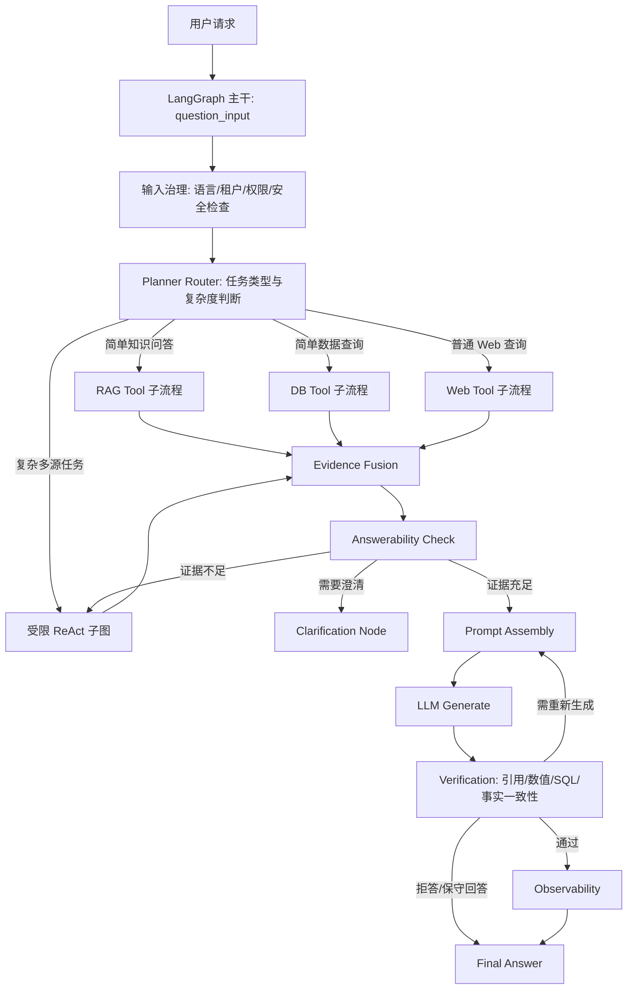
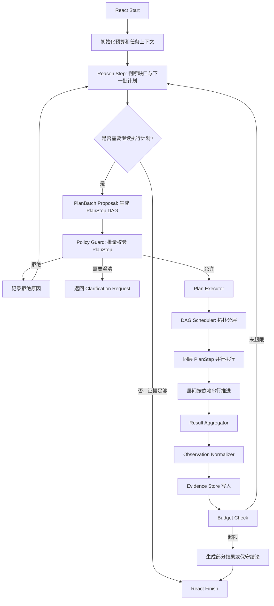

# 受限 ReAct 子图落地设计文档

> **项目名称**：生产级 Agentic RAG 编排升级  
> **设计目标**：保留 LangGraph 作为生产级主干编排骨架，在复杂任务分支中引入受限 ReAct 子图  
> **适用场景**：多源数据、DB Tool、Web Search、知识库检索、复杂业务推理  
> **版本**：v1.0  

---

## 1. 背景与目标

当前系统已经从原先的单一 RAGFlow Canvas 流程，演进为 LangGraph 全局编排 + RAG Tool / DB Tool / Web Tool 的分层结构。该设计解决了工具封装和状态管理问题，但主干流程仍然是预定义 DAG：

```text
question_input -> intent_router -> rag/db/hybrid -> quality_check
-> prompt_assembly -> llm_generate -> hallucination -> final_answer
```

该流程适合简单知识问答、简单数据查询和固定 Hybrid 问答，但对以下生产级场景支持不足：

- 需要多轮工具调用的复杂业务分析。
- 需要先查数据再检索规范，或先检索定义再查数据的动态任务。
- 需要根据中间结果决定下一步行动。
- 需要多源证据冲突检测、补充检索和多步验证。
- 未来可能需要生成报表、分析报告、图表数据和可下载文件，但报表生成不纳入本期落地范围。

因此，本设计提出：

```text
保留 LangGraph 主干稳定性、可观测性和安全治理能力；
在复杂任务分支中增加“受限 ReAct 子图”；
让 ReAct 负责动态推理和多步工具执行，但所有工具调用受策略、预算和权限约束。
```

---

## 2. 设计原则

### 2.1 LangGraph 主干负责生产治理

LangGraph 主干不应被 ReAct 完全替代。主干负责：

- 请求入口治理。
- 租户、用户和权限上下文注入。
- 路由与复杂度判断。
- 执行预算控制。
- 子图选择。
- 状态持久化。
- 工具策略校验。
- 全链路观测。
- 最终答案验证。
- 错误降级与安全兜底。

### 2.2 ReAct 子图只处理复杂任务

ReAct 不作为所有问题的默认路径，只在复杂任务中启用，例如：

- 用户问题包含多个子问题。
- 同时需要 RAG、DB、Web 多个工具。
- 第一次检索结果不足以回答。
- DB 查询需要探索 schema 或多步聚合。
- 用户要求原因分析、趋势分析、归因、对比、改进建议。
- 用户要求生成汇总材料或分析性回答。

### 2.3 ReAct 必须受限

ReAct 子图不允许无限自由推理和调用工具。必须具备：

- 最大步骤数。
- 最大工具调用次数。
- 最大 DB 查询次数。
- 最大 LLM 调用次数。
- 最大 token 预算。
- 最大耗时。
- 工具白名单。
- 表和字段权限白名单。
- SQL 安全校验。
- 高风险操作人工审批。
- 每一步可观测和可审计。

### 2.4 ReAct 与 Plan Executor 互补，不替代

系统已经具备 Plan Executor（DAG 调度器 + Tool Dispatcher + Result Aggregator）。本设计不另起一套执行器：

- ReAct 子图负责推理、计划生成、计划修正和是否继续探索的判断。
- Plan Executor 负责执行 `ExecutionPlan`，包括 DAG 拓扑分层、同层并行、层间串行、工具分发和结果聚合。
- ReAct 子图内部需要工具调用时，必须先生成一组 `PlanStep`，再交给 Plan Executor 执行。
- ReAct 不直接调用 RAG Tool / DB Tool / Web Tool，避免绕过已有并行调度和工具适配层。

### 2.5 Tool 只返回证据，不直接决定最终答案

RAG Tool、DB Tool、Web Tool 的输出统一转化为标准化 Evidence。最终答案生成和验证仍由 LangGraph 主干控制。

---

## 3. 总体架构

### 3.1 目标架构图



### 3.2 关键变化

| 模块 | 当前方式 | 目标方式 |
|------|----------|----------|
| 路由 | 关键词规则为主 | 规则 + LLM 结构化路由 + 复杂度判断 |
| Hybrid | 固定 RAG -> DB 串行 | Planner 根据依赖决定串行或并行 |
| 复杂任务 | 无专门处理 | 进入受限 ReAct 子图 |
| 工具输出 | 各自返回不同结构 | 标准化 Evidence |
| 验证 | 生成后幻觉检测 | claim、数值、SQL、引用多层验证 |
| 报表 | 未内置 | 本期不做，仅保留后续扩展点 |
| 观测 | 节点耗时和日志 | trace/span、成本、工具轨迹、质量指标 |

---

## 4. 主干流程设计

### 4.1 主干节点

目标主干节点如下：

```text
question_input
  -> input_guard
  -> planner_router
  -> simple_rag / simple_db / simple_web / react_subgraph
  -> evidence_fusion
  -> answerability_check
  -> prompt_assembly
  -> llm_generate
  -> verification
  -> observability
  -> final_answer
```

### 4.2 `planner_router` 职责

`planner_router` 替代单纯关键词路由，输出结构化路由结果。

建议输出结构：

```json
{
  "route_target": "react",
  "task_type": "business_analysis",
  "complexity": "complex",
  "confidence": 0.86,
  "required_tools": ["rag", "db"],
  "may_need_tools": ["web"],
  "needs_clarification": false,
  "clarification_question": "",
  "reason": "用户要求分析原因并结合规范给出建议，需要查询业务数据并检索知识库规范",
  "constraints": {
    "freshness_required": true,
    "must_cite_sources": true,
    "needs_numeric_validation": true
  }
}
```

### 4.3 进入 ReAct 的条件

满足任一条件即可进入 ReAct 子图：

1. `required_tools` 数量大于 1。
2. `task_type` 属于 `business_analysis`、`root_cause_analysis`、`trend_analysis`、`comparison`。
3. 用户问题包含多个明确子问题。
4. 第一次简单 RAG/DB 执行后 `answerability_check` 判断证据不足。
5. 路由置信度低但不适合直接澄清，需要先做低成本探查。

不进入 ReAct 的场景：

1. 简单概念解释。
2. 简单单表统计。
3. 明确单一知识库查找。
4. 闲聊。
5. 用户权限不足或输入安全检查失败。

---

## 5. 受限 ReAct 子图设计

### 5.1 子图目标

受限 ReAct 子图负责：

- 动态拆解复杂问题。
- 根据中间观察生成或修正下一批 `PlanStep`。
- 多源证据补充。
- 复用现有 Plan Executor 对 DB 查询、RAG 检索、Web 搜索进行 DAG 并行调度。
- 产出标准化 `ReactExecutionResult`，而不是直接返回最终答案。

### 5.2 子图流程



### 5.3 与 Plan Executor 的关系

ReAct 子图与现有 Plan Executor 是互补关系，不是替代关系。

| 模块 | 职责 | 是否直接调用工具 |
|------|------|----------------|
| ReAct 子图 | 推理、识别证据缺口、生成/修正 `ExecutionPlan`、判断是否继续 | 否 |
| Plan Executor | 执行 `ExecutionPlan`、DAG 拓扑分层、同层并行、工具分发、结果聚合 | 是 |
| Tool Dispatcher | 将 `PlanStep` 分发到 RAG / DB / Web Tool | 是 |
| Result Aggregator | 聚合多个 `ToolResult`，供 Evidence Normalizer 和主干节点使用 | 否 |

执行约束：

1. ReAct 每轮最多输出一个 `ExecutionPlan`，该计划可包含多个 `PlanStep`。
2. 无依赖的 `PlanStep` 必须交给 Plan Executor 并行执行，不允许在 ReAct 中串行逐个调用。
3. 有依赖的 `PlanStep` 通过 `depends_on` 表达，由 DAG Scheduler 分层执行。
4. ReAct 只能基于 Plan Executor 返回的 Observation 决定是否继续下一轮。
5. ReAct 不直接调用 `RAGTool.invoke()`、`DatabaseTool.invoke()`、`WebTool.invoke()`。
6. Plan Executor 不负责思考下一步，只负责确定性执行当前计划。

示例：

```json
{
  "plan_id": "react_round_1",
  "steps": [
    {
      "step_id": "db_quality_trend",
      "tool": "database",
      "args": {
        "query": "查询近三个月质量异常趋势",
        "db_id": "quality_db"
      },
      "depends_on": [],
      "can_parallel": true,
      "description": "查询质量异常趋势"
    },
    {
      "step_id": "rag_quality_rule",
      "tool": "rag",
      "args": {
        "query": "质量异常处理规范",
        "kb_ids": ["quality_rule_kb"]
      },
      "depends_on": [],
      "can_parallel": true,
      "description": "检索质量异常处理规范"
    },
    {
      "step_id": "web_recent_policy",
      "tool": "web",
      "args": {
        "query": "最新质量管理政策 质量异常 处理要求"
      },
      "depends_on": [],
      "can_parallel": true,
      "description": "补充外部时效信息"
    }
  ]
}
```

以上三个步骤无依赖，应由 Plan Executor 在同一层并行执行。ReAct 在收到聚合 Observation 后，再判断是否需要生成第二轮计划。

### 5.4 ReAct 状态定义

建议新增 `ReactState`，由 `AgentState` 派生，但独立管理子图内部状态。

```python
class ReactState(TypedDict, total=False):
    trace_id: str
    user_question: str
    tenant_id: str
    user_id: str
    query_lang: str
    task_type: str
    objective: str
    constraints: dict

    step_count: int
    max_steps: int
    tool_call_count: int
    max_tool_calls: int
    db_query_count: int
    max_db_queries: int
    llm_call_count: int
    max_llm_calls: int
    deadline_ts: float
    token_budget: int
    cost_budget: float

    allowed_tools: list[str]
    denied_tools: list[str]
    current_plan: dict
    plan_history: list[dict]
    tool_results: list[dict]
    action_history: list[dict]
    observations: list[dict]
    evidence: list[dict]
    failures: list[dict]

    next_action: dict
    finish_reason: str
    needs_clarification: bool
    clarification_question: str
```

### 5.5 ReAct Step 输出协议

LLM 每一步不得输出自由文本动作，必须输出 JSON。需要工具执行时，输出 `plan_batch`，而不是单个工具调用。

```json
{
  "thought_summary": "需要并行获取质量异常趋势和质量规范，之后再判断是否需要追查具体批次",
  "action_type": "plan_batch",
  "execution_plan": {
    "plan_id": "react_round_1",
    "steps": [
      {
        "step_id": "db_exception_trend",
        "tool": "database",
        "args": {
          "query": "近三个月质量异常按月份和异常类型统计",
          "db_id": "quality_db"
        },
        "depends_on": [],
        "can_parallel": true,
        "description": "获取质量异常趋势数据"
      },
      {
        "step_id": "rag_exception_rule",
        "tool": "rag",
        "args": {
          "query": "质量异常分类和处理规范",
          "kb_ids": ["quality_rule_kb"]
        },
        "depends_on": [],
        "can_parallel": true,
        "description": "检索质量异常处理规范"
      }
    ]
  }
}
```

禁止将完整私有 chain-of-thought 暴露给用户或日志。日志只记录 `thought_summary`。

### 5.6 支持的 Action 类型

| Action | 说明 | 是否需要 Policy Guard |
|--------|------|----------------------|
| `plan_batch` | 输出一组可由 Plan Executor 执行的 `PlanStep` | 是 |
| `ask_clarification` | 请求用户澄清 | 否 |
| `finish` | 结束 ReAct 子图 | 否 |

`plan_batch` 内部允许的工具类型仅限当前已接入的 `rag`、`database`、`web`。本期不包含 `report` 工具。

### 5.7 终止条件

满足任一条件即终止：

1. LLM 输出 `finish`。
2. `answerability_check` 判断证据足够。
3. 达到 `max_steps`。
4. 达到 `max_tool_calls`。
5. 达到 `max_db_queries`。
6. 达到 `deadline_ts`。
7. Policy Guard 连续拒绝超过阈值。
8. 工具连续失败超过阈值。
9. 需要用户澄清。
10. 触发安全策略。

---

## 6. 工具治理与安全约束

### 6.1 Policy Guard

所有 ReAct 输出的 `plan_batch` 在交给 Plan Executor 前必须经过 `Policy Guard`。校验粒度包含计划级和步骤级：

- 计划级：检查总工具数、总 DB 查询数、预算、是否允许并行执行。
- 步骤级：检查每个 `PlanStep.tool`、`args.db_id`、`args.kb_ids`、表/字段权限、Web 访问范围。

Policy Guard 输入：

```json
{
  "tenant_id": "tenant_a",
  "user_id": "user_1",
  "execution_plan": {
    "plan_id": "react_round_1",
    "steps": [
      {
        "step_id": "db_exception_trend",
        "tool": "database",
        "args": {
          "query": "近三个月质量异常按月份和异常类型统计",
          "db_id": "quality_db"
        },
        "depends_on": [],
        "can_parallel": true
      }
    ]
  },
  "current_budget": {},
  "agent_config": {}
}
```

Policy Guard 输出：

```json
{
  "decision": "allow",
  "reason": "计划内步骤均满足用户权限和预算约束",
  "sanitized_plan": {
    "plan_id": "react_round_1",
    "steps": []
  },
  "step_decisions": [
    {
      "step_id": "db_exception_trend",
      "decision": "allow",
      "reason": "用户具备 quality_db 的聚合查询权限",
      "risk_level": "low"
    }
  ],
  "requires_approval": false,
  "risk_level": "low"
}
```

`decision` 只允许：

- `allow`
- `deny`
- `needs_approval`
- `needs_clarification`
- `rewrite_arguments`

当部分步骤被拒绝时，默认不执行整个 `ExecutionPlan`，而是把拒绝原因作为 Observation 返回 ReAct，由 ReAct 决定是否生成新的计划。只有显式配置 `allow_partial_plan_execution=true` 时，才允许执行剩余低风险步骤。

### 6.2 DB Tool 约束

DB Tool 是最高风险工具，必须满足：

1. 使用只读数据库账号。
2. SQL 经过 AST 解析，而不是简单关键词检查。
3. 禁止 DDL、DML、函数副作用、存储过程。
4. 禁止多语句。
5. 强制注入租户过滤条件。
6. 按用户权限限制可访问表。
7. 按用户权限限制可访问列。
8. 敏感字段默认脱敏。
9. 强制 `LIMIT`。
10. 强制 `statement_timeout`。
11. 执行前可选 `EXPLAIN` 成本预估。
12. 查询结果行数限制。
13. 查询结果大小限制。
14. 高风险查询进入人工审批。

### 6.3 RAG Tool 约束

1. 只能访问当前用户和租户授权的知识库。
2. 检索结果必须带 `kb_id`、`document_id`、`chunk_id`。
3. 检索内容进入 Prompt 前必须作为证据文本处理，不能作为系统指令。
4. 检索内容需要做 Prompt Injection 检测。
5. 长文档必须压缩后进入上下文。

### 6.4 Web Tool 约束

1. Web 默认低可信度，不得覆盖内部知识库和数据库事实。
2. Web 结果必须保存 URL、标题、发布时间、抓取时间。
3. 禁止访问内网地址和本地地址。
4. 禁止执行网页脚本。
5. 对网页内容做清洗和注入检测。

---

## 7. Evidence 标准化设计

### 7.1 Evidence 数据结构

所有工具结果必须转换为统一 Evidence。

```python
class Evidence(TypedDict, total=False):
    evidence_id: str
    source_type: Literal["rag", "db", "web"]
    title: str
    content: str
    structured_data: dict
    source_uri: str
    tenant_id: str
    confidence: float
    relevance_score: float
    authority_score: float
    freshness_score: float
    created_at: str
    metadata: dict
```

### 7.2 DB Evidence

DB 查询结果需包含：

```json
{
  "source_type": "db",
  "content": "近三个月质量异常按类型统计结果",
  "structured_data": {
    "columns": ["异常类型", "数量", "占比"],
    "rows": []
  },
  "metadata": {
    "sql": "SELECT exception_type, COUNT(*) AS exception_count FROM quality_exception WHERE tenant_id = :tenant_id AND occurred_at >= :start_date GROUP BY exception_type ORDER BY exception_count DESC LIMIT 10",
    "tables": ["quality_exception"],
    "row_count": 10,
    "query_time_ms": 230,
    "aggregation": true,
    "time_range": "last_3_months"
  }
}
```

### 7.3 RAG Evidence

RAG 检索结果需包含：

```json
{
  "source_type": "rag",
  "title": "质量异常处理规范",
  "content": "规范片段正文",
  "source_uri": "kb://document/chunk",
  "metadata": {
    "kb_id": "kb_1",
    "document_id": "doc_1",
    "chunk_id": "chunk_1",
    "page": 12
  }
}
```

### 7.4 Evidence Fusion 策略

融合阶段负责：

1. 去重。
2. 按子问题聚类。
3. 判断来源可信度。
4. 判断数据时效性。
5. 识别证据冲突。
6. 为最终 Prompt 分配 token 预算。
7. 保留可引用的 evidence_id。

---

## 8. 本期不做：报表生成

报表生成本期不纳入实现范围。本设计只为后续报表能力保留一个原则性边界：

1. 本期不新增 `Report Tool`、`Report Subgraph`、`ReportArtifact`、图表生成器或文件导出能力。
2. ReAct 子图本期只允许生成和调度 `rag`、`database`、`web` 三类 `PlanStep`。
3. 如果后续增加报表能力，报表生成应作为独立阶段设计，基于已验证 Evidence 生成结构化 Artifact。
4. 后续报表不能绕过 ReAct / Plan Executor / Policy Guard 自行查询数据。
5. 后续报表中的数字、图表和结论必须能回溯到 Evidence。

---

## 9. Answerability 与 Verification

### 9.1 Answerability Check

在生成答案前判断证据是否足够。

输出结构：

```json
{
  "answerable": true,
  "coverage_score": 0.82,
  "missing_aspects": [],
  "conflicts": [],
  "needs_more_evidence": false,
  "recommended_action": "generate"
}
```

推荐动作：

- `generate`
- `react_continue`
- `ask_clarification`
- `fallback_web`
- `partial_answer`
- `reject`

### 9.2 Verification

生成后验证包括：

1. Claim 拆解。
2. Evidence 支持性判断。
3. 数字和单位校验。
4. SQL 结果一致性校验。
5. 引用真实性校验。
6. 敏感信息泄露检查。
7. 语言一致性检查。

验证输出：

```json
{
  "passed": true,
  "faithfulness_score": 0.91,
  "numeric_check_passed": true,
  "citation_check_passed": true,
  "sensitive_data_detected": false,
  "action": "pass"
}
```

`action` 可选：

- `pass`
- `filter`
- `regenerate`
- `partial_answer`
- `reject`

---

## 10. 配置设计

### 10.1 Agent 配置

建议在 `agent_config` 中增加：

```yaml
react:
  enabled: true
  max_steps: 8
  max_tool_calls: 6
  max_db_queries: 3
  max_llm_calls: 5
  max_latency_ms: 30000
  token_budget: 12000
  cost_budget: 0.5
  allowed_tools:
    - rag
    - database
    - web
  require_approval_for:
    - cross_database_query
    - sensitive_fields
    - large_result_set

verification:
  enabled: true
  numeric_check: true
  citation_check: true
  sensitive_data_check: true
```

### 10.2 工具权限配置

```yaml
tools:
  db_query:
    enabled: true
    readonly: true
    max_rows: 500
    timeout_seconds: 10
    require_ast_validation: true
    allowed_tables:
      - quality_exception
      - production_order
    denied_columns:
      - employee_phone
      - id_card

  web_search:
    enabled: true
    max_results: 5
    allow_private_ip: false

  rag_search:
    enabled: true
    max_chunks: 8
```

---

## 11. 错误处理与降级策略

### 11.1 失败类型

统一失败类型：

```text
AMBIGUOUS_QUERY
NO_EVIDENCE
LOW_CONFIDENCE
TOOL_TIMEOUT
TOOL_UNAVAILABLE
PERMISSION_DENIED
POLICY_DENIED
INVALID_SQL
SQL_EXECUTION_FAILED
EVIDENCE_CONFLICT
BUDGET_EXHAUSTED
MODEL_UNAVAILABLE
VERIFICATION_FAILED
HUMAN_APPROVAL_REQUIRED
```

### 11.2 降级策略

| 失败类型 | 降级策略 |
|----------|----------|
| `AMBIGUOUS_QUERY` | 请求用户澄清 |
| `NO_EVIDENCE` | ReAct 继续补充证据或 Web 兜底 |
| `PERMISSION_DENIED` | 明确告知无权限，不继续绕路 |
| `INVALID_SQL` | DB Tool 自愈一次，失败后终止 DB 分支 |
| `TOOL_TIMEOUT` | 使用已有证据部分回答 |
| `BUDGET_EXHAUSTED` | 输出部分结果和未完成项 |
| `VERIFICATION_FAILED` | 重新生成或保守回答 |
| `HUMAN_APPROVAL_REQUIRED` | 返回审批状态 |

---

## 12. 可观测性要求

### 12.1 Trace

每次请求必须有唯一 `trace_id`。ReAct 子图每一步必须有 `step_id`。

记录字段：

- route decision。
- planner output。
- ReAct step summary。
- action proposal。
- policy decision。
- tool name。
- sanitized arguments。
- execution latency。
- token usage。
- cost。
- evidence count。
- verification result。
- final action。

### 12.2 指标

核心指标：

- `agent_request_total`
- `agent_request_latency_seconds`
- `agent_react_steps_total`
- `agent_plan_executor_layers_total`
- `agent_parallel_plan_steps_total`
- `agent_tool_calls_total`
- `agent_tool_latency_seconds`
- `agent_db_query_total`
- `agent_policy_denied_total`
- `agent_verification_failed_total`
- `agent_answerability_score`
- `agent_cost_total`
- `agent_token_usage_total`

### 12.3 日志脱敏

不得在日志中记录：

- 原始密码。
- API Key。
- 敏感字段值。
- 完整用户隐私数据。
- 大量 SQL 结果。
- 未脱敏 Prompt。

可以记录：

- SQL 摘要。
- 表名列表。
- 行数。
- 耗时。
- 失败类型。
- Evidence ID。

---

## 13. 测试要求

### 13.1 单元测试

必须覆盖：

- Planner Router 输出结构。
- ReAct Step JSON 解析。
- Policy Guard allow/deny/approval。
- ReAct `plan_batch` 到 `ExecutionPlan` 的解析。
- Policy Guard 对 `ExecutionPlan` 的计划级和步骤级校验。
- Budget Check。
- DAGScheduler 拓扑分层和同层并行调度。
- Evidence Normalizer。
- Answerability Check。
- Verification。

### 13.2 集成测试

必须覆盖：

1. 简单 RAG 不进入 ReAct。
2. 简单 DB 不进入 ReAct。
3. 复杂 Hybrid 进入 ReAct。
4. ReAct 生成包含 RAG + DB 的 `ExecutionPlan`。
5. 无依赖的 RAG + DB `PlanStep` 经 Plan Executor 并行执行。
6. 有依赖的 `PlanStep` 按 DAG 层级串行推进。
7. Plan Executor 返回结果后，ReAct 能基于 Observation 决定是否继续。
8. DB 权限不足时不绕过查询。
9. 工具超时时输出部分回答。
10. 预算耗尽时停止循环。
11. 引用不存在时 Verification 失败。

### 13.3 安全测试

必须覆盖：

- Prompt Injection 文档。
- Web 内容注入。
- SQL 注入。
- 多语句 SQL。
- 未授权表访问。
- 未授权字段访问。
- 大结果集查询。
- 跨租户查询。
- 敏感信息输出。

### 13.4 评测集

建议建立黄金评测集：

- 单知识库问答。
- 单 DB 统计。
- RAG + DB 归因分析。
- 多源冲突问题。
- 无答案问题。
- 需要澄清的问题。

---

## 14. 分阶段落地计划

### 阶段一：主干可接入

目标：不破坏现有 RAG / DB / Web 流程，增加 ReAct 子图入口。

交付：

- `planner_router` 结构化输出。
- `react_subgraph` 最小可运行版本。
- `ReactState`。
- ReAct `plan_batch` 输出协议。
- ReAct 到现有 Plan Executor 的调用桥接。
- `Policy Guard` 基础接口。
- `Budget Check`。
- `ReactExecutionResult`。

### 阶段二：工具受控执行

目标：所有 ReAct 计划执行经过统一治理，并复用现有 Plan Executor 的并行能力。

交付：

- `ExecutionPlan` 计划级 Policy Guard。
- `PlanStep` 步骤级 Policy Guard。
- 复用 `DAGScheduler` 的同层并行执行。
- 复用 `ToolDispatcher` 的 RAG / DB / Web 工具分发。
- 复用 `ResultAggregator` 的多工具结果聚合。
- Evidence Normalizer。
- DB AST 校验。
- 权限校验。
- 工具超时和熔断。

### 阶段三：证据融合与验证

目标：从“拼接上下文”升级为“证据驱动生成”。

交付：

- Evidence Store。
- Evidence Fusion。
- Answerability Check。
- Claim Verification。
- Numeric Verification。
- Citation Verification。

### 阶段四：生产化增强

目标：达到可上线运行要求。

交付：

- 持久化 checkpoint。
- 幂等执行。
- Human Approval。
- OpenTelemetry Trace。
- Prometheus 指标。
- 离线评测集。
- 灰度配置。

---

## 15. 与现有代码的映射建议

### 15.1 新增目录

建议新增：

```text
agent/langgraph/react/
  __init__.py
  state.py
  graph.py
  planner.py
  policy.py
  budget.py
  normalizer.py
  models.py

agent/langgraph/evidence/
  __init__.py
  models.py
  fusion.py
  answerability.py
  verification.py
```

现有 `agent/langgraph/executor/` 目录继续作为 DAG 并行执行层使用，不在 `react/` 下重复实现执行器。

### 15.2 修改现有模块

建议修改：

```text
agent/langgraph/graph.py
  增加 react_subgraph 条件边。

agent/langgraph/state.py
  增加 planner_result、evidence、verification_result。

agent/langgraph/nodes/intent_router.py
  升级为 planner_router，保留规则路由作为 fallback。

agent/langgraph/nodes/prompt_assembly.py
  从 merged_context 字符串拼接改为基于 Evidence 组装。

agent/langgraph/nodes/hallucination.py
  升级为 verification_node 或拆分为多个验证器。

agent/langgraph/tools/*.py
  保持工具能力复用，由 ToolDispatcher 调用；新增 Evidence Normalizer 转换工具结果。

agent/langgraph/executor/dag_scheduler.py
  继续负责 ExecutionPlan 的拓扑分层、同层并行和层间串行。

agent/langgraph/executor/tool_dispatcher.py
  继续负责 PlanStep 到 RAG / DB / Web Tool 的分发。

agent/langgraph/executor/result_aggregator.py
  继续负责多工具 ToolResult 聚合。
```

---

## 16. 关键约束清单

1. ReAct 不作为默认路径，只处理复杂任务。
2. ReAct 不直接返回最终答案，只返回证据、步骤和建议。
3. ReAct 不直接调用工具，只生成 `ExecutionPlan` 并交给 Plan Executor。
4. 所有 `ExecutionPlan` / `PlanStep` 必须经过 Policy Guard。
5. DB Tool 必须使用 AST 校验和权限控制。
6. ReAct 必须有最大步骤和预算。
7. 每一步必须可观测、可审计。
8. 工具 Observation 必须截断和脱敏。
9. 所有证据必须标准化为 Evidence。
10. 最终答案必须经过 Verification。
11. 报表生成本期不做。
12. 敏感信息不得进入日志和最终答案。
13. 所有失败必须有类型化原因和降级策略。

---

## 17. 风险与应对

| 风险 | 描述 | 应对 |
|------|------|------|
| 成本失控 | ReAct 多步调用 LLM 和工具 | 设置预算、缓存、最大步骤 |
| 延迟升高 | 多工具执行链路变长 | 复用 Plan Executor 的 DAG 并行、deadline、部分回答 |
| 安全风险 | LLM 自主调用 DB | Policy Guard、AST、权限、审批 |
| 结果不稳定 | ReAct 路径动态变化 | 结构化输出、评测集、配置版本化 |
| 调试困难 | 多步轨迹复杂 | trace_id、step_id、action log |
| 架构重复 | ReAct 自己实现执行器导致和 Plan Executor 分叉 | ReAct 只生成计划，执行统一交给 Plan Executor |
| 权限绕过 | 通过 Web 或 RAG 侧路获取敏感信息 | 统一 Evidence 权限标记和输出过滤 |

---

## 18. 验收标准

### 18.1 功能验收

- 简单 RAG 问题仍走 RAG Tool。
- 简单 DB 问题仍走 DB Tool。
- 复杂多源问题进入 ReAct 子图。
- ReAct 能在预算内生成包含 RAG + DB 的 `ExecutionPlan`。
- Plan Executor 能并行执行无依赖的 RAG + DB `PlanStep`。
- ReAct 能基于 Plan Executor 的 Observation 决定继续、澄清或结束。
- Evidence Fusion 能输出可用于 Prompt 的证据集合。
- Verification 能拦截不被证据支持的结论。

### 18.2 安全验收

- 未授权表无法查询。
- 未授权字段无法输出。
- SQL 注入无法执行。
- Prompt Injection 无法改变工具权限。
- 敏感字段不会出现在日志和最终答案。

### 18.3 观测验收

- 每次请求有完整 trace。
- 每个 ReAct step 有 step_id。
- 每次工具调用有耗时、状态和失败原因。
- 能统计 ReAct 平均步数、成功率、失败率、成本和延迟。

---

## 19. 总结

本方案的核心不是把系统改成完全自由的 ReAct Agent，而是采用：

```text
LangGraph 主干治理 + 受限 ReAct 计划推理 + Plan Executor 并行执行 + Evidence 驱动生成 + Verification 收口
```

该设计同时满足：

- 复杂业务推理需要的动态多步能力。
- 生产系统需要的安全、稳定和可观测。
- 现有 Plan Executor 的 DAG 并行调度能力复用。

下一步建议先实现最小闭环：

```text
planner_router -> react_subgraph 生成 ExecutionPlan
-> Policy Guard -> Plan Executor 并行执行 RAG/DB/Web PlanStep
-> Evidence Normalizer -> Evidence Fusion -> Verification -> final_answer
```

在该闭环稳定后，再扩展更强的多源冲突检测。报表生成作为后续独立设计，不进入本期实现范围。
