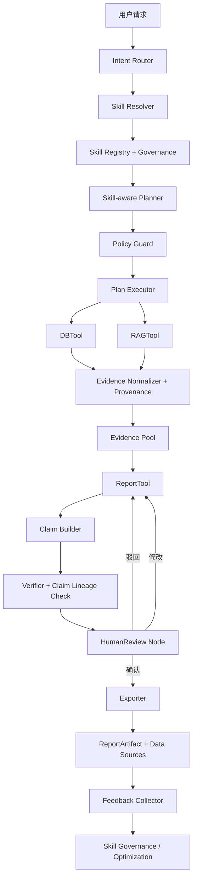

# 报告可信治理与人机协同补强设计（下一期）

> **项目名称**：Skill 与报告体系下一期补强  
> **设计目标**：补齐“数据 → Evidence → Claim → 图表/章节 → 报告”的完整血缘；引入人机协同审核；建立 Skill 生命周期治理；报告输出必须显式标注数据来源  
> **适用范围**：制造业高管报告、质量报告、运营复盘、工厂绩效、交付绩效、生产日报、成本分析  
> **版本**：v1.0  
> **前置实现**：`docs/Skill整合落地设计.md` 已完成基础 Skill Runtime / Planner / DB / RAG / Report 接入  
> **本设计约束**：本文件用于下一期落地；不改变本期已提交实现架构

---

## 1. 背景与问题

当前体系已经实现：

- ReportSkill / DataSkill / RetrievalSkill 加载、解析、校验
- Skill-aware Planner 生成受控 DB / RAG / Report 步骤
- 结构化 DB 查询（表/字段白名单、租户注入、敏感字段脱敏）
- Skill 化 RAG 检索（kb / query template / filters）
- ReportTool 使用 Skill 模板、指标、claim_rules、publish_policy
- AgentState / Policy / Answerability 初步接入 Skill

但仍存在三项生产级缺口：

1. **证据血缘不完整**
   - 已有 Evidence 和章节级 `evidence_refs`
   - 缺少 Claim 级血缘对象
   - 缺少 `Claim → Evidence → query_id / chunk_id → 数据行 / 文档片段 → 原始查询` 的闭环

2. **缺少人机协同**
   - 报告生成链路完全自动化
   - 没有报告草稿审核节点
   - 没有低置信度人工核实标记
   - 没有用户反馈回流机制

3. **Skill 治理不足**
   - 只有 `enabled` / `required_permissions`
   - 没有 Skill 创建审批、变更审计、废弃机制
   - 没有企业级权限治理和灰度生命周期

下一期的核心目标是让报告成为：

```text
可信、可审计、可审核、可治理的企业级报告
```

---

## 2. 下一期总目标

### 2.1 业务目标

1. 每份报告都能清楚回答：
   - 数字来自哪个数据库、哪张表、哪次查询、哪几行数据。
   - 文字依据来自哪个知识库、哪篇文档、哪个 chunk。
   - 图表由哪些 Evidence 驱动。
2. 高管或业务负责人可以审核、修改、确认或驳回报告草稿。
3. Skill 不是“配置文件裸奔”，而是有审批、版本、权限、审计的领域能力资产。
4. 用户对报告的反馈可以沉淀为 Skill 优化输入。

### 2.2 技术目标

1. 建立 Claim 级血缘模型。
2. 建立统一 Evidence Provenance 模型。
3. 报告输出增加 `source_summary` 与 `data_sources`。
4. 增加 HumanReview 节点。
5. 增加低置信度“需人工核实”标记。
6. 建立 Skill 生命周期模型：`draft → pending_review → approved → active → deprecated`。
7. 建立 Skill 权限与用户权限交集机制。
8. 建立反馈闭环：用户反馈 → Skill 优化建议。

---

## 3. 总体架构演进

### 3.1 下一期目标架构



### 3.2 数据血缘链路

下一期必须保证以下链路存在：

```text
DBTool 查询
  -> DBQueryResult(query_id, db_id, table_name, rows)
  -> Evidence(evidence_id, source_type=db, metadata.query_id/table_name/db_id)
  -> Claim(claim_id, evidence_refs, evidence_sources)
  -> Chart/Table/Section(chart_refs/table_refs/claim_refs)
  -> ReportArtifact(data_sources, source_summary)
```

以及：

```text
RAGTool 检索
  -> RAG Docs(doc_id, chunk_id, kb_id, score)
  -> Evidence(evidence_id, source_type=rag, metadata.kb_id/doc_id/chunk_id)
  -> Claim(claim_id, evidence_refs)
  -> Section
  -> ReportArtifact(data_sources, source_summary)
```

---

## 4. 证据血缘设计

### 4.1 统一 Evidence Provenance

在现有 `Evidence` 基础上增加 provenance 标准。

```python
class EvidenceProvenance(TypedDict, total=False):
    """证据来源血缘。"""

    # DB 血缘
    db_id: str
    table_name: str
    query_id: str
    sql_fingerprint: str
    row_keys: list[str]

    # RAG 血缘
    kb_id: str
    doc_id: str
    chunk_id: str
    doc_title: str
    doc_uri: str
    retrieval_query: str

    # 通用血缘
    source_target_id: str
    query_template_id: str
    skill_id: str
    step_id: str
```

`Evidence.metadata` 必须包含：

```json
{
  "provenance": {
    "db_id": "qms_prod",
    "table_name": "quality_exception",
    "query_id": "q_9f21a7c3",
    "row_keys": ["exception_id=EX001", "exception_id=EX002"]
  }
}
```

或：

```json
{
  "provenance": {
    "kb_id": "quality_sop_kb",
    "doc_id": "SOP-QA-001",
    "chunk_id": "SOP-QA-001#c3",
    "doc_title": "质量异常处理规范",
    "retrieval_query": "质量异常纠正预防措施 设备参数波动"
  }
}
```

### 4.2 Claim 级血缘

下一期必须落地真正的 `Claim` 对象，不再只有章节级 refs。

```python
class Claim(TypedDict, total=False):
    claim_id: str
    text: str
    claim_type: Literal["fact", "metric", "comparison", "trend", "recommendation"]

    # 血缘
    evidence_refs: list[str]
    evidence_sources: list[dict]  # EvidenceProvenance 摘要

    # 校验
    support_status: Literal["pending", "supported", "partially_supported", "unsupported"]
    verification_notes: list[str]
    confidence: float
    needs_human_review: bool
```

`evidence_sources` 示例：

```json
[
  {
    "evidence_id": "ev_db_001",
    "source_type": "db",
    "db_id": "qms_prod",
    "table_name": "quality_exception",
    "query_id": "q_123",
    "rows_used": 128
  },
  {
    "evidence_id": "ev_rag_003",
    "source_type": "rag",
    "kb_id": "quality_sop_kb",
    "doc_id": "SOP-QA-001",
    "chunk_id": "SOP-QA-001#c3"
  }
]
```

### 4.3 章节 / 图表 / 表格与 Claim 绑定

现有 `ReportSection`、`ChartSpec`、`TableSpec` 需要增加：

```python
claim_refs: list[str]
```

血缘关系：

- `ReportSection.claim_refs` → Claim
- `ChartSpec.claim_refs` → Claim
- `TableSpec.claim_refs` → Claim
- `Claim.evidence_refs` → Evidence
- `Evidence.metadata.provenance` → DB / RAG 原始来源

最终形成：

```text
报告段落 → Claim → Evidence → query_id/chunk_id → 表/文档
```

### 4.4 未验证 Claim 标记

如果 Claim 无法关联任何 Evidence，必须二选一：

1. **删除该 Claim**
2. **保留但显式标记**

推荐策略：

- `metric` / `comparison` / `trend`：直接删除或拦截，不允许保留
- `recommendation`：可保留但必须标记“未经验证”
- `fact`：无 Evidence 时默认删除

导出时支持：

```text
（未经验证）
```

或：

```html
<span class="unverified">未经验证</span>
```

Verifier 必须记录：

```json
{
  "claim_id": "claim_xxx",
  "support_status": "unsupported",
  "action": "removed"
}
```

---

## 5. 报告数据来源输出设计

下一期硬性要求：**报告生成的同时，必须输出数据来源摘要**。

### 5.1 ReportArtifact 增加 `data_sources`

```python
class DataSourceRef(TypedDict, total=False):
    source_id: str
    source_type: Literal["db", "rag", "web"]

    # DB
    db_id: str
    table_name: str
    query_id: str
    query_template_id: str
    row_count: int

    # RAG
    kb_id: str
    doc_id: str
    chunk_id: str
    doc_title: str
    doc_uri: str

    used_by_sections: list[str]
    used_by_charts: list[str]
    used_by_tables: list[str]
    used_by_claims: list[str]
```

`ReportArtifact` 增加：

```python
data_sources: list[DataSourceRef]
source_summary: list[dict]
```

### 5.2 `source_summary` 形式

用于人类可读摘要：

```json
[
  {
    "label": "质量异常明细",
    "source": "数据库 qms_prod.quality_exception",
    "query_id": "q_123",
    "used_for": ["异常趋势", "异常类型分布", "根因分析"]
  },
  {
    "label": "质量异常处理规范",
    "source": "知识库 quality_sop_kb / 文档《质量异常处理规范》",
    "doc_id": "SOP-QA-001",
    "used_for": ["纠正与预防措施"]
  }
]
```

### 5.3 导出展示要求

Markdown 报告末尾必须增加：

```markdown
## 数据来源

- 数据库：`qms_prod.quality_exception`，查询 ID：`q_123`，用于：异常趋势、异常类型分布
- 知识库：`quality_sop_kb`，文档：《质量异常处理规范》，Chunk：`SOP-QA-001#c3`，用于：纠正与预防措施
```

HTML 报告应提供可折叠“数据来源”面板。

---

## 6. 人机协同设计

### 6.1 HumanReview 节点

下一期在 ReportTool / Verifier 之后增加：

```text
human_review
```

推荐流程：

```text
ReportTool 生成草稿
  -> Verifier 验证
  -> HumanReview 节点
  -> 用户确认 / 编辑 / 驳回
  -> 确认后导出正式发布
```

### 6.2 审核动作

HumanReview 支持：

- `approve`
- `reject`
- `edit`
- `comment`
- `request_regenerate`

节点输出：

```python
class HumanReviewResult(TypedDict, total=False):
    action: Literal["approve", "reject", "edit", "comment", "request_regenerate"]
    reviewer_id: str
    reviewed_at: str
    comments: list[dict]
    edited_sections: list[dict]
    approved: bool
    publish_allowed: bool
```

### 6.3 审核策略

默认规则：

1. 高敏 Skill（财报、成本、质量、EHS、人事）必须人工审核。
2. `publish_policy.require_human_review = true` 时强制进入 HumanReview。
3. 低置信度 Claim 超过阈值时强制人工审核。
4. 无人工审核时，报告只能标记为草稿，不生成正式下载链接。

### 6.4 低置信度“需人工核实”

如果 Claim 或章节低于阈值：

```yaml
human_review:
  low_confidence_threshold: 0.7
```

导出时标记：

```text
（需人工核实）
```

HTML 支持高亮：

```html
<span class="needs-review">需人工核实</span>
```

低置信度原因必须写入 artifact：

```json
{
  "claim_id": "claim_123",
  "needs_human_review": true,
  "review_reason": "Claim 支撑 Evidence 置信度 0.58，低于阈值 0.70"
}
```

### 6.5 用户反馈闭环

用户对报告的行为需要回流：

- 点赞 / 点踩
- 修改章节
- 删除 Claim
- 新增人工结论
- 评论数据来源问题

新增反馈模型：

```python
class ReportFeedback(TypedDict, total=False):
    report_id: str
    artifact_version: str
    user_id: str
    action: Literal["like", "dislike", "edit", "comment", "reject", "approve"]
    section_id: str
    claim_id: str
    comment: str
    edited_content: str
    created_at: str
```

反馈用途：

1. 形成 Skill 优化建议。
2. 调整 `metric_definitions`。
3. 调整 `claim_rules`。
4. 调整模板章节。
5. 标记低质量 Evidence 来源。

---

## 7. Skill 治理设计

### 7.1 Skill 生命周期

Skill 状态机：

```text
draft
  -> pending_review
  -> approved
  -> active
  -> deprecated
```

建议模型：

```python
class SkillGovernance(TypedDict, total=False):
    skill_id: str
    version: str
    status: Literal["draft", "pending_review", "approved", "active", "deprecated"]
    created_by: str
    approved_by: str
    created_at: str
    approved_at: str
    deprecated_at: str
    deprecation_reason: str
    change_log: list[dict]
```

### 7.2 Resolver 规则调整

Resolver 只能选择：

- `active`
- 或租户明确灰度放开的 `approved`

不得选择：

- `draft`
- `pending_review`
- `deprecated`

### 7.3 Skill 创建与审批流程

新增 Skill 的流程：

```text
Skill Request
  -> 业务审核（模板、章节、指标是否合理）
  -> 数据治理审核（库表字段、权限、敏感数据）
  -> 安全审核（导出格式、脱敏、外链）
  -> 上线
```

每次变更记录：

- 修改人
- 修改时间
- 修改 diff
- 审批人
- 审批结论
- 生效租户

### 7.4 权限交集机制

Skill 声明的 `required_permissions` 不是用户自动获得，而是必须做交集：

```text
effective_permissions = user_permissions ∩ skill_required_permissions
```

如果交集不等于 Skill 要求全集，则 Skill 不可用。

示例：

```text
Skill 要求：quality:read, report:generate
用户实际：report:generate
=> 不可用
```

### 7.5 软删除与废弃

`deprecated` 语义：

- 不出现在 Resolver 候选
- 不允许新报告使用
- 旧报告 artifact 仍可追溯其 `skill_id/version`
- 可保留只读历史配置用于审计

---

## 8. 代码落地设计

### 8.1 新增或扩展模块

建议新增：

```text
agent/langgraph/evidence/provenance.py
agent/langgraph/report/claims.py 或 agent/langgraph/tools/report/claims.py
agent/langgraph/nodes/human_review.py
agent/langgraph/skills/governance.py
agent/langgraph/feedback/collector.py
```

### 8.2 Evidence 扩展

修改：

- `agent/langgraph/evidence/models.py`
- `Evidence.metadata.provenance` 标准化
- Evidence Normalizer 从 DBQueryResult / RAG docs 提取 provenance

### 8.3 Claim Builder

新增 Claim Builder：

```text
Section Generator
  -> Claim Builder
  -> ClaimVerifier
  -> Section Assembler
```

职责：

1. 从 LLM 输出或模板生成 claims。
2. 绑定 Evidence。
3. 生成 `evidence_sources`。
4. 标记 unsupported / low confidence。
5. 汇总到章节和 artifact。

### 8.4 ReportTool 输出改造

`ReportToolOutput` 和 `ReportArtifact` 增加：

- `claims`
- `data_sources`
- `source_summary`
- `human_review_result`
- `publish_status: draft / pending_review / approved / published / rejected`

### 8.5 HumanReview 节点

新增：

```text
agent/langgraph/nodes/human_review.py
```

接入图：

```text
report_tool -> human_review -> exporter/final_answer
```

如果 LangGraph 需要 interrupt，可以复用 clarification 现有 interrupt 机制。

### 8.6 Skill 治理服务

新增：

```text
agent/langgraph/skills/governance.py
```

职责：

- 生命周期状态校验
- 审批记录
- deprecated 过滤
- 变更审计
- 租户灰度

---

## 9. 报告数据来源落库建议

如果需要 API / 前端展示数据来源，建议增加表：

### 9.1 report_artifact

保存：

- `report_id`
- `skill_id`
- `skill_version`
- `publish_status`
- `created_by`
- `tenant_id`

### 9.2 report_claim

保存：

- `claim_id`
- `report_id`
- `section_id`
- `text`
- `claim_type`
- `support_status`
- `confidence`
- `needs_human_review`

### 9.3 report_evidence

保存：

- `evidence_id`
- `report_id`
- `source_type`
- `db_id`
- `table_name`
- `query_id`
- `kb_id`
- `doc_id`
- `chunk_id`

### 9.4 report_feedback

保存：

- `report_id`
- `user_id`
- `action`
- `section_id`
- `claim_id`
- `comment`
- `created_at`

---

## 10. 配置扩展

### 10.1 ReportSkill 增加治理与人审配置

```yaml
human_review:
  required: true
  low_confidence_threshold: 0.7
  reviewer_roles:
    - quality_manager
    - operations_director

governance:
  status: active
  approval_required: true
  tenant_rollout:
    - tenant_a
```

### 10.2 数据血缘配置

```yaml
lineage:
  require_claim_level: true
  require_query_id: true
  require_chunk_id: true
  mark_unverified_claims: true
  allow_unverified_recommendations: true
```

---

## 11. 分阶段实施计划

### 阶段一：Provenance 与数据来源输出

目标：报告能够输出来自哪个库表、哪个知识库文档。

交付：

- Evidence provenance 标准化
- DB / RAG metadata 回写
- `ReportArtifact.data_sources`
- `ReportArtifact.source_summary`
- Markdown / HTML 数据来源区块

### 阶段二：Claim 级血缘

目标：形成“报告段落 → Claim → Evidence → 查询/文档”的完整链路。

交付：

- Claim Builder
- `Claim.evidence_sources`
- Section / Chart / Table `claim_refs`
- 未验证 Claim 标记和过滤

### 阶段三：HumanReview

目标：报告草稿可审核、可驳回、可修改后发布。

交付：

- `human_review` 节点
- `HumanReviewResult`
- `publish_status`
- 低置信度“需人工核实”

### 阶段四：Skill Governance

目标：Skill 可治理、可审批、可废弃。

交付：

- Skill lifecycle
- `deprecated` 过滤
- 权限交集
- 变更审计

### 阶段五：反馈闭环

目标：用户反馈回流 Skill 优化。

交付：

- Feedback Collector
- 反馈存储
- Skill 优化建议生成

---

## 12. 验收标准

### 12.1 数据来源验收

1. 每份报告都包含 `data_sources` 和 `source_summary`。
2. 每个 DB 来源都能看到 `db_id + table_name + query_id`。
3. 每个 RAG 来源都能看到 `kb_id + doc_id + chunk_id`。
4. Markdown / HTML 报告末尾有“数据来源”区块。

### 12.2 血缘验收

1. 每个关键 Claim 能追溯到至少一个 Evidence。
2. Evidence 能追溯到 query_id 或 chunk_id。
3. 图表和表格能追溯到 Claim 和 Evidence。
4. 无 Evidence 的 metric/comparison Claim 不得发布。

### 12.3 人机协同验收

1. 高敏报告必须进入 HumanReview。
2. 用户可 approve / reject / edit。
3. 低置信度段落有“需人工核实”标记。
4. 未审核报告不能生成正式下载链接。

### 12.4 治理验收

1. `deprecated` Skill 不再被 Resolver 选中。
2. Skill 上线前有审批记录。
3. Skill 权限和用户权限做交集。
4. Skill 修改有审计记录。

---

## 13. 风险与约束

1. Claim 级血缘会增加实现复杂度，应先在质量报告和成本报告试点。
2. HumanReview 会延长报告发布时间，应只对高敏 Skill 默认开启。
3. Skill 治理不能做成纯前端流程，必须有后端状态与审计。
4. 数据来源输出不能泄露敏感 SQL、连接信息或未授权字段。
5. 用户反馈回流不能直接自动修改 Skill，只能生成优化建议并进入审批。

---

## 14. 最终结论

下一期应优先解决的不是“再多几个报告模板”，而是：

1. **让每份报告说得清数据从哪来。**
2. **让报告可以被人审核、纠偏和承担责任。**
3. **让 Skill 成为受治理的企业资产，而不是散落配置。**

推荐的下一期核心落地顺序：

```text
Provenance / 数据来源输出
  -> Claim 级血缘
  -> HumanReview
  -> Skill Governance
  -> Feedback Loop
```

这一期完成后，当前 Skill + 报告体系才会从“能生成报告”升级为“能生成可信、可审计、可运营的企业级报告”。
