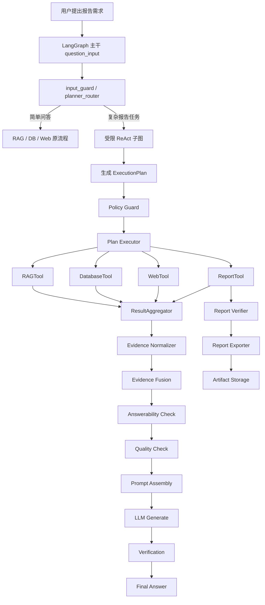
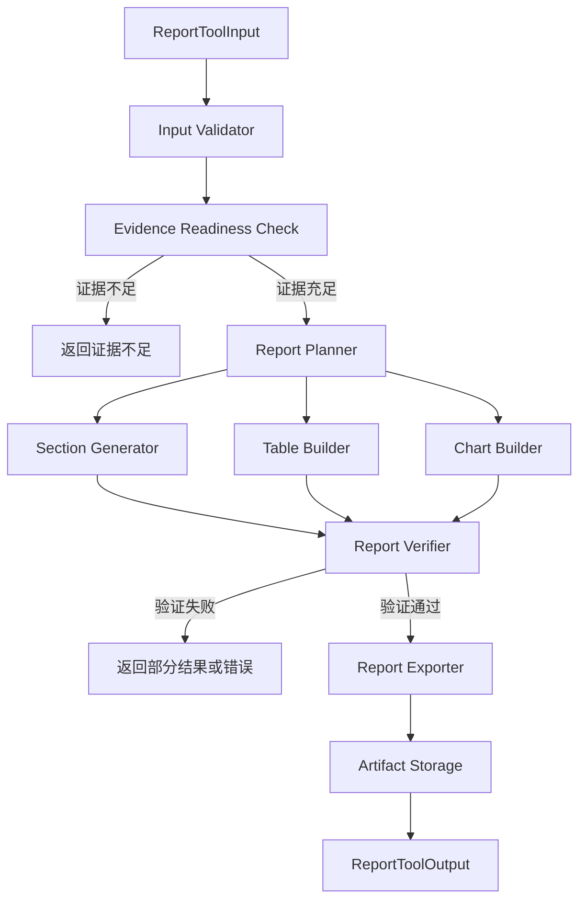

# 报告/报表生成 Tool 设计文档

> **项目名称**：Agentic RAG 报告/报表生成能力  
> **设计目标**：在现有 LangGraph 主干、Plan Executor、受限 ReAct 子图基础上，新增受控 Report Tool，支持基于已验证 Evidence 生成结构化报告/报表  
> **适用范围**：多源数据分析报告、业务趋势报告、质量归因报告、知识摘要报告、管理层汇报材料  
> **版本**：v1.0  

---

## 1. 背景与目标

当前系统已经具备：

- LangGraph 主干编排。
- `intent_router` / `planner_router` 路由能力。
- `RAGTool`、`DatabaseTool`、`WebTool`。
- `Plan Executor`：基于 `ExecutionPlan` 的 DAG 并行调度。
- `ToolDispatcher`：将 `PlanStep` 分发到 RAG / DB / Web 工具。
- `ResultAggregator`：聚合多工具结果。
- `Evidence`、`Answerability`、`Verification` 的演进方向。

报告/报表生成需求与普通问答不同：

| 普通问答 | 报告/报表生成 |
|----------|---------------|
| 直接回答用户问题 | 产出结构化、可回溯、可交付的文档 |
| 重点是即时回答 | 重点是内容完整、结构清晰、数据准确 |
| 通常不生成文件 | 可能需要 Markdown、HTML、PDF、Excel、PPT |
| 引用用于辅助回答 | 引用用于审计和追溯 |
| 一次 LLM 生成即可 | 需要规划、章节生成、数据填充、验证、导出 |

因此，报告/报表能力不应直接在 `llm_generate_node` 中临时扩展，也不应让 ReAct 自由生成文本文件，而应新增一个受控工具：

```text
ReportTool
```

ReportTool 的核心职责：

1. 基于已经收集和验证过的 Evidence 生成报告。
2. 产出结构化 `ReportArtifact`。
3. 支持多种导出格式。
4. 保证报告中的数字、结论和引用可回溯。
5. 与 Plan Executor、ReAct、Policy Guard、Verification 无缝集成。

---

## 2. 设计原则

### 2.1 ReportTool 是工具，不是独立 Agent

ReportTool 不自行决定查询哪些知识库、数据库或网站，也不自行绕过权限执行数据访问。

它只接收：

- 用户报告需求。
- 已收集的 Evidence。
- 报告类型与格式。
- 租户和用户上下文。
- 配置和导出约束。

它不负责：

- 自行执行 SQL。
- 自行访问外部数据源。
- 自行决定用户是否有权限。
- 自行选择未授权的数据来源。

数据收集仍由 RAG / DB / Web Tool 通过 Plan Executor 执行。

### 2.2 Evidence 驱动，不允许凭空生成

ReportTool 必须基于 Evidence 生成报告。关键约束：

1. 每个重要结论必须关联至少一个 Evidence。
2. 每个数字必须来自结构化 DB Evidence 或明确引用来源。
3. 图表必须由结构化数据生成，不允许 LLM 编造图表数据。
4. 引用必须能通过 `evidence_id` 追溯。
5. 如果 Evidence 不足，ReportTool 应返回“证据不足”而不是编造完整报告。

### 2.3 复用 Plan Executor

报告生成经常涉及多个数据收集步骤，例如：

- 查人力成本。
- 查物料成本。
- 查异常趋势。
- 检索质量管理规范。
- 搜索外部政策或行业信息。

这些步骤仍然应通过 `ExecutionPlan` 交给 Plan Executor 执行，ReportTool 只作为最后一步或某些依赖步骤之后的生成节点。

示例：

```json
{
  "plan_id": "quality_report_plan",
  "steps": [
    {
      "step_id": "db_quality_trend",
      "tool": "database",
      "args": {
        "query": "查询近三个月质量异常趋势",
        "db_id": "quality_db"
      },
      "depends_on": [],
      "can_parallel": true
    },
    {
      "step_id": "rag_quality_rules",
      "tool": "rag",
      "args": {
        "query": "质量异常处理规范",
        "kb_ids": ["quality_rule_kb"]
      },
      "depends_on": [],
      "can_parallel": true
    },
    {
      "step_id": "generate_quality_report",
      "tool": "report",
      "args": {
        "extra": {
          "report_type": "quality_analysis",
          "format": "markdown",
          "title": "近三个月质量异常分析报告"
        }
      },
      "depends_on": ["db_quality_trend", "rag_quality_rules"],
      "can_parallel": false
    }
  ]
}
```

### 2.4 报告生成结果不是最终答案

ReportTool 的输出是 `ReportArtifact` 和报告摘要，不直接决定最终用户答案。

最终答案仍由 LangGraph 主干决定，例如：

- 返回报告下载链接。
- 返回报告摘要。
- 返回“报告已生成”的消息。
- 如果验证失败，返回重新生成或保守回答。

### 2.5 分阶段支持格式

报告导出格式按复杂度分阶段支持：

1. **第一阶段**：Markdown、HTML。
2. **第二阶段**：Excel。
3. **第三阶段**：PDF。
4. **第四阶段**：PPTX。

本期建议优先支持 Markdown 和 HTML，因为结构化、可验证、可直接预览，工程成本最低。

---

## 3. 总体架构

### 3.1 架构图



### 3.2 数据流

```text
用户报告需求
  -> planner_router 识别 report_request
  -> ReAct 生成 ExecutionPlan
  -> Policy Guard 校验数据收集步骤和 report 步骤
  -> Plan Executor 并行执行 RAG / DB / Web
  -> ResultAggregator 聚合 ToolResult
  -> Evidence Normalizer 生成 Evidence
  -> Evidence Fusion 去重、聚类、冲突检测
  -> ReportTool 根据 Evidence 生成 ReportArtifact
  -> Report Verifier 验证数字、引用、敏感信息
  -> Report Exporter 导出 Markdown / HTML / PDF / Excel / PPT
  -> Final Answer 返回摘要和下载链接
```

---

## 4. ReportTool 输入输出设计

### 4.1 ReportToolInput

```python
class ReportToolInput(TypedDict, total=False):
    """ReportTool 输入定义。"""

    title: str
    report_type: Literal[
        "business_analysis",
        "quality_analysis",
        "trend_analysis",
        "comparison",
        "knowledge_summary",
        "management_briefing",
    ]
    objective: str
    audience: str

    format: Literal["markdown", "html", "pdf", "xlsx", "pptx"]
    language: Literal["zh_CN", "zh_TW", "en"]

    tenant_id: str
    user_id: str
    query_lang: str

    evidence: list[dict]
    tool_results: list[dict]
    route_decision: dict
    conversation_history: list[dict]

    max_sections: int
    max_charts: int
    max_tables: int
    include_appendix: bool
    include_raw_data: bool
    include_evidence_refs: bool

    export_options: dict
    template_id: str
    style_config: dict
```

### 4.2 ReportToolOutput

```python
class ReportToolOutput(TypedDict, total=False):
    """ReportTool 输出定义。"""

    success: bool
    error_message: str

    artifact: dict          # ReportArtifact
    summary: str            # 报告摘要，用于最终答案展示
    quality_score: float

    section_count: int
    chart_count: int
    table_count: int
    evidence_count: int

    generation_time_ms: int
    export_time_ms: int
    file_uri: str
    download_url: str
```

### 4.3 ReportArtifact

```python
class ReportArtifact(TypedDict, total=False):
    """报告产物。"""

    report_id: str
    title: str
    report_type: str
    format: Literal["markdown", "html", "pdf", "xlsx", "pptx"]
    language: Literal["zh_CN", "zh_TW", "en"]

    objective: str
    audience: str
    summary: str

    sections: list[dict]
    charts: list[dict]
    tables: list[dict]
    appendix: list[dict]

    evidence_refs: list[str]
    source_summary: list[dict]

    verification_result: dict
    metadata: dict

    # 部分成功报告：允许非核心章节失败后导出降级版
    partial: bool
    coverage_score: float
    failed_sections: list[str]
    failed_charts: list[str]
    failed_tables: list[str]
    publishable: bool
    publish_mode: Literal["full", "partial", "summary_only", "none"]
    missing_required_sections: list[str]

    tenant_id: str
    user_id: str
    created_at: str
    file_uri: str
    file_size_bytes: int
```

### 4.4 ReportSection

```python
class Claim(TypedDict, total=False):
    """章节论断，必须绑定可验证证据。"""

    claim_id: str
    text: str
    evidence_refs: list[str]
    claim_type: Literal["fact", "metric", "comparison", "trend", "recommendation"]
    support_status: Literal["pending", "supported", "partially_supported", "unsupported"]
    verification_notes: list[str]


class ReportSection(TypedDict, total=False):
    """报告章节。"""

    section_id: str
    title: str
    order: int
    section_type: Literal[
        "overview",
        "analysis",
        "data",
        "conclusion",
        "recommendation",
        "appendix",
    ]
    content: str
    claims: list[Claim]
    evidence_refs: list[str]
    chart_refs: list[str]
    table_refs: list[str]

    # 章节级质量与局部重试控制
    confidence: float
    quality_score: float
    status: Literal["pending", "generated", "verified", "failed", "skipped"]
    retry_count: int
    issues: list[str]
```

---

## 5. 与现有代码的集成方式

### 5.1 PlanStep 扩展

当前 `PlanStep.tool` 只允许：

```python
tool: Literal["rag", "database", "web"]
```

需要扩展为：

```python
tool: Literal["rag", "database", "web", "report"]
```

同时，`StepArgs.extra` 继续承载 report 参数，不新增专属字段，降低对现有 Planner 和调度器的侵入。

示例：

```json
{
  "step_id": "generate_quality_report",
  "tool": "report",
  "args": {
    "query": "生成近三个月质量异常分析报告",
    "extra": {
      "report_type": "quality_analysis",
      "format": "markdown",
      "title": "近三个月质量异常分析报告",
      "max_sections": 8,
      "max_charts": 4
    }
  },
  "depends_on": ["db_quality_trend", "rag_quality_rules"],
  "can_parallel": false
}
```

### 5.2 ToolDispatcher 集成

`ToolDispatcher` 新增：

```python
elif step.tool == "report":
    result = await self._execute_report(step, state, previous_results)
```

`_execute_report` 输入构建：

```python
input_data = {
    "title": step.args.extra.get("title", "分析报告"),
    "report_type": step.args.extra.get("report_type", "business_analysis"),
    "format": step.args.extra.get("format", "markdown"),
    "language": state.get("query_lang", "zh_CN"),
    "tenant_id": state.get("tenant_id", ""),
    "user_id": state.get("user_id", ""),
    "objective": step.args.query or state.get("user_question", ""),
    "evidence": state.get("evidence", []),
    "tool_results": list(previous_results.values()),
    "route_decision": state.get("route_decision"),
    "conversation_history": state.get("conversation_history", []),
}
```

### 5.3 ResultAggregator 集成

当前聚合器支持：

- `rag_docs`
- `db_result`
- `web_docs`

需要新增：

- `report_artifacts`
- `report_summary`
- `report_quality_score`

示例聚合结构：

```python
{
    "rag_docs": all_rag_docs,
    "db_result": aggregated_db_result,
    "web_docs": all_web_docs,
    "report_artifacts": report_artifacts,
    "report_summary": latest_report_summary,
    "report_quality_score": max_report_score,
}
```

### 5.4 AgentState 扩展

`AgentState` 新增字段：

```python
report_artifacts: list[dict]
report_summary: str
report_quality_score: float
report_error: str
```

如果后续 Evidence 模块独立，则建议：

```python
evidence: list[dict]
```

### 5.5 Evidence 扩展

当前 Evidence `source_type` 建议扩展：

```python
source_type: Literal["rag", "db", "web", "report"]
```

Report Evidence 用于记录报告产物本身：

```json
{
  "source_type": "report",
  "title": "近三个月质量异常分析报告",
  "content": "报告摘要",
  "source_uri": "artifact://reports/report_001",
  "metadata": {
    "format": "markdown",
    "sections": 6,
    "charts": 3,
    "tables": 2,
    "file_size_bytes": 120000
  }
}
```

---

## 6. ReportTool 内部设计

### 6.1 内部模块

建议新增目录：

```text
agent/langgraph/tools/report/
  __init__.py
  report_tool.py
  models.py
  planner.py
  generator.py
  chart_builder.py
  table_builder.py
  verifier.py
  exporter.py
  storage.py
  templates.py
```

### 6.2 内部流程



### 6.3 Input Validator

负责校验：

- `title` 不为空。
- `format` 是否支持。
- `report_type` 是否支持。
- 是否有租户和用户上下文。
- Evidence 数量是否超过最小要求。
- Evidence 中是否包含必要的数据类型。

### 6.4 Evidence Readiness Check

判断当前 Evidence 是否足以生成报告：

```json
{
  "ready": true,
  "missing": [],
  "warnings": [
    "缺少管理层建议所需的外部行业数据"
  ]
}
```

判断维度：

- 是否有 DB Evidence。
- 是否有 RAG Evidence。
- 是否需要 Web Evidence。
- 是否有时间范围数据。
- 是否有结构化 rows。
- 是否存在冲突证据。

### 6.5 Report Planner

Report Planner 将报告拆成章节计划。Planner 可以使用 LLM，但输出必须经过 `Plan Validator` 校验后才允许进入生成阶段。Planner 的职责仅是“提出章节结构”，不具备最终决定权。

```json
{
  "title": "近三个月质量异常分析报告",
  "sections": [
    {
      "section_id": "overview",
      "title": "一、总体概况",
      "section_type": "overview",
      "required_evidence_types": ["db"]
    },
    {
      "section_id": "root_cause",
      "title": "二、异常原因分析",
      "section_type": "analysis",
      "required_evidence_types": ["db", "rag"]
    },
    {
      "section_id": "recommendation",
      "title": "三、改进建议",
      "section_type": "recommendation",
      "required_evidence_types": ["rag", "db"]
    }
  ]
}
```

#### 6.5.1 Plan Validator

Plan Validator 是确定性校验组件，位于 Report Planner 之后、Section Generator 之前，负责消除“规划幻觉”。

必须校验以下规则：

1. **模板完整性**：报告章节必须覆盖 `report_type` 模板要求的核心章节；缺少核心章节时，必须补充章节或返回 `REPORT_PLAN_INVALID`。
2. **章节顺序**：`overview` 必须位于最前；`conclusion` 和 `recommendation` 不得位于 `analysis` 之前；`appendix` 必须位于最后。
3. **证据类型匹配**：每个章节的 `required_evidence_types` 必须与实际 Evidence 存在交集；如果章节要求 `web` 但没有 Web Evidence，必须降级为非核心章节、调整证据类型或删除该章节。
4. **证据数量满足度**：每个章节至少映射一个 Evidence；核心章节必须至少映射一个结构化 DB Evidence 或高置信 RAG Evidence。
5. **重复与缺失**：章节标题和 `section_type` 不得重复；同一 Evidence 不得被机械复制到所有章节以制造覆盖假象。
6. **章节数量限制**：章节数不得超过 `max_sections`；核心章节优先保留，非核心章节可裁剪。
7. **可发布性预判**：如果核心章节缺失或核心章节没有可用 Evidence，则不允许进入完整报告生成，只能进入 `summary_only` 或返回证据不足。

输出示例：

```json
{
  "valid": true,
  "publish_mode": "partial",
  "normalized_plan": {
    "title": "近三个月质量异常分析报告",
    "sections": [
      {
        "section_id": "overview",
        "title": "一、总体概况",
        "section_type": "overview",
        "required_evidence_types": ["db"],
        "evidence_refs": ["ev_db_001"],
        "required": true
      },
      {
        "section_id": "root_cause",
        "title": "二、异常原因分析",
        "section_type": "analysis",
        "required_evidence_types": ["db", "rag"],
        "evidence_refs": ["ev_db_002", "ev_rag_003"],
        "required": true
      }
    ]
  },
  "issues": [
    {
      "type": "missing_evidence",
      "section_id": "industry_benchmark",
      "action": "dropped",
      "reason": "章节要求 web evidence，但当前没有 Web Evidence"
    }
  ],
  "warnings": [
    "改进建议章节仅由 RAG Evidence 支撑，置信度上限不得超过 0.75"
  ]
}
```

### 6.6 Section Generator

Section Generator 负责生成章节正文，但不得以自由文本直接产出最终章节。每个章节必须先生成结构化 `claims`，再由模板组装为正文。

强制约束：

1. 每个章节输出结构化 JSON。
2. 每个实质性论断必须生成 `Claim`。
3. 每个 `Claim` 必须绑定至少一个存在的 `evidence_id`。
4. 数字、趋势、对比、占比和排名类论断必须使用 `claim_type="metric"` 或 `claim_type="comparison"`。
5. 不得使用“约”“左右”“大概”“可能显著提升”等无法验证的模糊数字表述；如果只能定性描述，必须明确说明“当前证据不足以量化”。
6. 同一 Evidence 在同一章节中不得被重复引用超过合理次数；多个独立论断不能全部机械复用同一 Evidence。
7. `content` 只能由已通过校验的 `claims` 模板化组装，不允许 LLM 在 `claims` 之外补充额外结论。
8. 不允许直接生成最终完整报告文本后结束，必须按 section 校验。

输出示例：

```json
{
  "section_id": "root_cause",
  "title": "二、异常原因分析",
  "claims": [
    {
      "claim_id": "claim_root_cause_1",
      "text": "近三个月异常主要集中在设备参数波动和来料不稳定两个方向。",
      "evidence_refs": ["ev_db_001", "ev_rag_003"],
      "claim_type": "fact"
    },
    {
      "claim_id": "claim_root_cause_2",
      "text": "设备参数波动类异常占比为 42%。",
      "evidence_refs": ["ev_db_004"],
      "claim_type": "metric"
    }
  ],
  "content": "近三个月异常主要集中在设备参数波动和来料不稳定两个方向。其中，设备参数波动类异常占比为 42%。",
  "evidence_refs": ["ev_db_001", "ev_rag_003", "ev_db_004"],
  "confidence": 0.86,
  "quality_score": 0.0,
  "status": "generated"
}
```

### 6.7 Chart Builder

Chart Builder 只从结构化 Evidence 生成图表。

支持图表：

- `bar`
- `line`
- `pie`
- `table`
- `kpi`

图表结构：

```python
class ChartSpec(TypedDict, total=False):
    chart_id: str
    chart_type: Literal["bar", "line", "pie", "table", "kpi"]
    title: str
    x_axis: str
    y_axis: str
    series: list[dict]
    data: list[dict]
    evidence_refs: list[str]
```

生成约束：

1. `data` 必须来自 DB Evidence `structured_data`。
2. 不允许 LLM 自由填写 `data`。
3. 图表字段必须和 Evidence metadata 对齐。
4. 图表数据需要保留原始精度和单位。

### 6.8 Table Builder

Table Builder 将 DB Evidence 或结构化结果转为报告表格：

```python
class TableSpec(TypedDict, total=False):
    table_id: str
    title: str
    columns: list[str]
    rows: list[list[Any]]
    evidence_refs: list[str]
```

### 6.9 Report Verifier

Report Verifier 在导出前执行“结构校验 + claim 支撑校验 + 章节质量评分 + 发布决策”。

#### 6.9.1 结构与引用校验

必须验证：

1. 每个章节是否有 Evidence。
2. 每个数字是否来自结构化 Evidence。
3. 每个图表是否绑定 Evidence。
4. 每个表格是否绑定 Evidence。
5. 引用 ID 是否真实存在。
6. 是否包含敏感字段。
7. 是否包含用户无权限数据。
8. 内容语言是否一致。
9. 章节是否重复。
10. 是否超过最大 section/chart/table 限制。

#### 6.9.2 Claim 支撑校验

Verifier 不能只检查 `evidence_id` 存在，还必须检查 Evidence 是否真正支持 Claim。

对每个 `Claim` 执行：

1. **实体一致性**：Claim 中的业务实体、时间范围、指标名称必须出现在 Evidence 或其 metadata 中。
2. **数字一致性**：`metric` / `comparison` 类型 Claim 中的数字必须与结构化 Evidence 精确匹配，允许配置数值容差。
3. **语义支撑**：使用校验模型或规则判断 Claim 是否被 Evidence 支撑，输出 `supported` / `partially_supported` / `unsupported`。
4. **模糊表达拦截**：出现“约”“左右”“显著提升”“明显恶化”等无法验证表述时，要求改成可验证事实或删除。
5. **伪复用检测**：同一 Evidence 支撑大量互不相同论断时，降低章节质量分并触发章节重生成。
6. **建议类论断约束**：`recommendation` 必须同时有事实 Evidence 和规则/知识 Evidence 支撑，否则只能标记为“参考建议”。

Claim 校验结果必须写回：

```json
{
  "claim_id": "claim_root_cause_2",
  "support_status": "supported",
  "verification_notes": [
    "数字 42% 与 ev_db_004.structured_data.metric_share 一致"
  ]
}
```

#### 6.9.3 章节质量评分与局部重试

每个章节必须计算独立质量分：

```text
section_quality_score =
  0.35 * claim_support_score +
  0.25 * evidence_coverage_score +
  0.20 * numeric_consistency_score +
  0.10 * structure_score +
  0.10 * language_score
```

发布阈值建议：

- 核心章节：`quality_score >= 0.80`。
- 非核心章节：`quality_score >= 0.70`。
- 所有章节最低可接受分：`0.60`。
- 整体报告分：核心章节加权平均分，非核心章节不得拉高整体分。

重试规则：

1. 只重试低质量章节，不重试整篇报告。
2. 单个章节最多重试 `max_section_retries`。
3. 章节重试必须使用 Verifier 返回的 `issues` 作为修正上下文。
4. 重试后仍低于阈值的核心章节，必须将报告标记为 `partial=true` 且 `publish_mode="summary_only"`。
5. 重试后仍低于阈值的非核心章节，可以标记 `failed_sections` 并导出 `partial` 报告。
6. 如果失败章节属于 `overview` 或 `conclusion`，不得发布完整报告。

#### 6.9.4 发布决策输出

输出示例：

```json
{
  "passed": false,
  "score": 0.76,
  "publishable": true,
  "publish_mode": "partial",
  "coverage_score": 0.83,
  "failed_sections": ["industry_benchmark"],
  "low_quality_sections": [
    {
      "section_id": "recommendation",
      "quality_score": 0.68,
      "action": "retry",
      "issues": [
        "2 条 recommendation claim 缺少规则类 Evidence"
      ]
    }
  ],
  "issues": [],
  "warnings": [
    "外部行业数据较旧，建议在最终答复中说明数据时间范围"
  ]
}
```

### 6.10 Report Exporter

导出器按格式生成文件：

| 格式 | 建议实现 |
|------|----------|
| Markdown | 原生字符串模板 |
| HTML | Jinja2 模板 |
| Excel | openpyxl / xlsxwriter |
| PDF | HTML -> PDF，例如 WeasyPrint |
| PPTX | python-pptx |

第一期建议：

- Markdown：直接模板拼接。
- HTML：Jinja2 渲染。

后续再扩展 Excel / PDF / PPTX。

### 6.11 Artifact Storage

Artifact Storage 负责保存产物：

```python
class ArtifactStorageResult(TypedDict, total=False):
    artifact_id: str
    file_uri: str
    download_url: str
    storage_backend: Literal["local", "minio", "oss"]
    file_size_bytes: int
```

存储建议：

1. 开发期：本地文件系统。
2. 生产期：MinIO 或对象存储。
3. 文件路径必须包含 `tenant_id` 和 `report_id`。
4. 下载链接必须带过期时间。
5. 不允许通过 URL 直接访问其他租户文件。

---

## 7. 权限与安全约束

### 7.1 数据权限

ReportTool 必须使用已收集 Evidence，不得重新访问数据源。

Policy Guard 在 PlanStep 校验时需要检查：

- RAG 步骤的 `kb_ids` 是否有权限。
- DB 步骤的 `db_id` 是否有权限。
- report 步骤是否允许生成。
- 报告导出格式是否允许。
- 是否包含敏感字段。

### 7.2 敏感信息

ReportTool 输出前必须扫描：

- 身份证号。
- 手机号。
- 邮箱。
- API Key。
- 密码。
- 数据库连接串。
- 内部地址。
- 其他用户隐私信息。

如果检测到敏感信息：

- 低风险：脱敏。
- 高风险：拒绝导出并返回错误。

### 7.3 模板安全

如果使用 HTML/PDF 模板：

1. 模板必须来自可信目录。
2. 禁止用户上传任意模板直接执行。
3. HTML 必须转义用户内容。
4. 禁止加载外部脚本。
5. 禁止访问内网地址和本地文件地址。

### 7.4 文件下载安全

1. 下载接口必须鉴权。
2. 必须校验 `tenant_id` 和 `report_id`。
3. 下载链接应短时有效。
4. 文件路径不得由用户直接传入。
5. 不允许路径穿越。

---

## 8. 与 ReAct 子图的关系

ReportTool 是 Plan Executor 中可被调度的一个工具，不是 ReAct 的自由文本生成动作。

### 8.1 ReAct 生成计划

ReAct 可以判断：

- 当前用户是请求报告。
- 需要哪些数据。
- 数据收集完成后是否需要 `report` 步骤。

但 ReAct 不直接生成报告文件。

### 8.2 Plan Executor 执行报告步骤

典型计划：

1. 并行查 DB 和 RAG。
2. 根据结果决定是否追加 Web。
3. 证据收集完成后执行 `report` 步骤。
4. `report` 步骤依赖所有数据收集步骤。

```json
{
  "step_id": "generate_report",
  "tool": "report",
  "depends_on": [
    "db_quality_trend",
    "rag_quality_rules",
    "web_policy_update"
  ],
  "can_parallel": false
}
```

### 8.3 报告结果回到主干

ReportTool 结果通过 ToolResult / ResultAggregator 回到 LangGraph 主干：

- `report_artifacts` 进入 AgentState。
- `report_summary` 用于最终答案。
- 报告错误进入降级逻辑。

---

## 9. 最终答案设计

用户请求报告时，最终答案不应只返回长文，而应返回：

1. 简短说明。
2. 报告标题。
3. 报告摘要。
4. 关键结论。
5. 文件下载链接。
6. 数据时间和适用范围。
7. 验证状态。

示例：

```json
{
  "type": "report_generated",
  "title": "近三个月质量异常分析报告",
  "summary": "报告已完成，包含总体趋势、异常类型分布、主要原因和改进建议。",
  "download_url": "/api/v1/reports/report_001/download",
  "format": "markdown",
  "sections": 6,
  "charts": 3,
  "tables": 2,
  "verification": {
    "passed": true,
    "score": 0.91
  }
}
```

如果验证失败：

```json
{
  "type": "report_failed",
  "title": "近三个月质量异常分析报告",
  "summary": "报告生成过程中发现部分数字无法与数据来源匹配，当前未导出正式报告。",
  "issues": [
    "章节 2.3 中的异常占比与数据库结果不一致"
  ],
  "action": "regenerate"
}
```

---

## 10. 配置设计

```yaml
report:
  enabled: true
  allowed_formats:
    - markdown
    - html
  default_format: markdown
  max_sections: 10
  max_charts: 6
  max_tables: 8
  max_file_size_mb: 20
  storage_backend: local
  export_timeout_seconds: 60

  templates:
    quality_analysis:
      sections:
        - overview
        - trend
        - root_cause
        - recommendation
        - appendix

  safety:
    scan_sensitive_data: true
    require_verified_evidence: true
    allow_unverified_numbers: false

  download:
    require_auth: true
    url_expire_seconds: 600
```

---

## 11. 错误处理与降级

### 11.1 错误类型

```text
REPORT_INPUT_INVALID
REPORT_EVIDENCE_INSUFFICIENT
REPORT_PLAN_INVALID
REPORT_PLAN_FAILED
REPORT_SECTION_GENERATION_FAILED
REPORT_SECTION_VERIFICATION_FAILED
REPORT_CHART_BUILD_FAILED
REPORT_TABLE_BUILD_FAILED
REPORT_VERIFICATION_FAILED
REPORT_EXPORT_FAILED
REPORT_STORAGE_FAILED
REPORT_PERMISSION_DENIED
```

### 11.2 降级策略

| 错误 | 降级 |
|------|------|
| Evidence 不足 | 返回“当前证据不足以生成正式报告” |
| Plan 校验失败 | 返回 `REPORT_PLAN_INVALID`，不进入章节生成 |
| 核心章节缺失 | `publish_mode="summary_only"`，只返回摘要和数据说明 |
| 单个章节生成失败 | 标记 `failed_sections`，计算 `coverage_score`，允许导出部分报告 |
| 单章节质量低于阈值 | 仅重试该章节，最多 `max_section_retries` 次 |
| 核心章节重试后仍失败 | 不发布完整报告，降级为 `summary_only` |
| 非核心章节重试后仍失败 | 发布 `partial` 报告，并明确列出缺失章节 |
| 图表生成失败 | 降级为表格或文字描述，并标记 `failed_charts` |
| 表格生成失败 | 降级为要点列表，并标记 `failed_tables` |
| Claim 不被 Evidence 支撑 | 删除或重写该 Claim；无法修复时触发章节局部重试 |
| 验证失败 | 不导出正式完整报告，返回错误、低质量章节和重新生成建议 |
| 导出失败 | 保留 Markdown 内容，返回复制文本 |
| 存储失败 | 返回内联报告摘要，不提供下载链接 |
| 权限不足 | 明确拒绝，不继续绕路 |

---

## 12. 可观测性

### 12.1 Trace 字段

每次报告生成记录：

- `report_id`
- `report_type`
- `format`
- `template_id`
- `section_count`
- `chart_count`
- `table_count`
- `evidence_count`
- `verification_score`
- `generation_time_ms`
- `export_time_ms`
- `file_size_bytes`
- `storage_backend`
- `error_type`

### 12.2 指标

```text
agent_report_generated_total
agent_report_failed_total
agent_report_generation_latency_seconds
agent_report_export_latency_seconds
agent_report_verification_score
agent_report_file_size_bytes
agent_report_format_total
```

### 12.3 日志要求

不得记录：

- 完整报告正文。
- 敏感字段。
- 原始用户隐私。
- 完整数据库结果集。
- 下载 URL 的长期有效版本。

可以记录：

- 报告 ID。
- 格式。
- 章节数。
- 图表数。
- Evidence 数。
- 验证分数。
- 错误类型。

---

## 13. 测试要求

### 13.1 单元测试

必须覆盖：

- `ReportToolInput` 校验。
- `ReportArtifact` 结构。
- Report Planner 生成章节计划。
- Section Generator 引用 Evidence。
- Chart Builder 从 DB Evidence 生成图表。
- Table Builder 从 DB Evidence 生成表格。
- Report Verifier 拦截无引用数字。
- Report Exporter 生成 Markdown / HTML。
- Artifact Storage 路径安全。

### 13.2 集成测试

必须覆盖：

1. PlanStep 支持 `tool="report"`。
2. ToolDispatcher 能分发 report 步骤。
3. report 步骤可以依赖 RAG 和 DB 步骤。
4. RAG + DB 并行执行后生成报告。
5. Evidence 不足时不生成正式报告。
6. 数字与 DB Evidence 不一致时验证失败。
7. 敏感字段出现时拒绝导出。
8. 生成 Markdown 和 HTML 文件。
9. 最终答案返回下载链接和摘要。
10. 报告生成失败时返回保守答复。

### 13.3 安全测试

必须覆盖：

- 用户请求包含恶意模板路径。
- HTML 模板中包含脚本。
- 报告内容包含手机号和身份证号。
- 下载其他租户报告。
- 路径穿越。
- 未授权 db_id 出现在 PlanStep 中。
- LLM 编造 evidence_id。

---

## 14. 分阶段落地计划

### 阶段一：基础 ReportTool

目标：支持基于 Evidence 生成 Markdown 报告。

交付：

- `agent/langgraph/tools/report/report_tool.py`
- `models.py`
- `planner.py`
- `generator.py`
- `verifier.py`
- `exporter.py`
- Markdown 导出
- PlanStep `report` 类型扩展
- ToolDispatcher report 分发
- AgentState 报告字段

### 阶段二：HTML 导出与存储

目标：支持 HTML 预览和文件存储。

交付：

- HTML 模板。
- Jinja2 渲染。
- 本地/MinIO 存储。
- 下载链接。
- 租户隔离路径。

### 阶段三：图表和表格

目标：支持结构化图表和表格。

交付：

- Chart Builder。
- Table Builder。
- DB Evidence 图表映射。
- 图表与 Evidence 绑定。
- 图表验证。

### 阶段四：Excel / PDF

目标：支持正式交付格式。

交付：

- Excel 导出。
- PDF 导出。
- 样式模板。
- 文件大小限制。
- 导出超时控制。

### 阶段五：生产化

目标：达到生产可用。

交付：

- 权限策略完善。
- 敏感信息扫描。
- 下载鉴权。
- 报告评测集。
- 指标和 trace。
- 模板版本管理。

---

## 15. 与现有代码的修改映射

### 15.1 新增文件

```text
agent/langgraph/tools/report/
  __init__.py
  report_tool.py
  models.py
  planner.py
  generator.py
  chart_builder.py
  table_builder.py
  verifier.py
  exporter.py
  storage.py
  templates.py
```

### 15.2 修改文件

```text
agent/langgraph/routers/models.py
  PlanStep.tool 增加 "report"

agent/langgraph/executor/tool_dispatcher.py
  增加 _execute_report()

agent/langgraph/executor/result_aggregator.py
  增加 report_artifacts / report_summary 聚合

agent/langgraph/state.py
  增加 report_artifacts、report_summary、report_quality_score、report_error

agent/langgraph/tools/__init__.py
  导出 ReportTool

agent/langgraph/graph.py
  不直接新增 report_node，报告步骤通过 Plan Executor 调度

agent/langgraph/nodes/final_answer.py
  支持 report_generated / report_failed 类型最终答案

agent/langgraph/nodes/observability.py
  增加报告生成指标
```

---

## 16. 关键约束清单

1. ReportTool 只能基于 Evidence 生成报告。
2. ReportTool 不得重新访问数据库、知识库或 Web。
3. 报告中的数字必须来自结构化 Evidence。
4. 图表不得由 LLM 直接编造数据。
5. 每个关键结论必须有 `evidence_refs`。
6. 验证失败不得导出正式报告。
7. 报告文件必须租户隔离。
8. 下载链接必须鉴权并可过期。
9. 模板必须可信，不允许任意用户上传模板直接执行。
10. 敏感信息必须扫描和脱敏。
11. 报告生成步骤必须纳入 Plan Executor 和 Policy Guard。
12. 报告生成失败必须返回类型化错误和降级结果。

---

## 17. 验收标准

### 17.1 功能验收

- 用户请求报告时，系统能识别为报告任务。
- ReAct 能生成包含 `report` 步骤的 `ExecutionPlan`。
- Plan Executor 能先并行执行 RAG / DB / Web，再执行 report。
- ReportTool 能生成 Markdown 报告。
- ReportTool 能生成 HTML 报告。
- 最终答案包含摘要、验证状态和下载链接。

### 17.2 质量验收

- 报告章节结构通过 Plan Validator 校验，核心章节不缺失、顺序合理。
- 每个实质性论断都有 `(claim, evidence_refs)` 结构。
- 所有 `metric` / `comparison` 类数字与结构化 Evidence 一致。
- Claim 支撑状态不得存在 `unsupported`；`partially_supported` 必须在报告中显式说明。
- 关键数字与 DB Evidence 一致。
- 关键结论能追溯到 Evidence。
- 每个章节有独立 `quality_score`，核心章节达到阈值。
- 低质量章节只触发局部重生成，不整篇重试。
- 部分成功报告必须包含 `partial=true`、`failed_sections`、`coverage_score`、`publish_mode`。
- 图表数据和表格数据一致。
- Evidence 不足时不生成正式报告。
- 验证失败时不导出完整正式报告。

### 17.3 安全验收

- 未授权数据源不能进入报告。
- 敏感信息不会导出。
- 其他租户无法下载报告。
- 恶意模板无法执行。
- 恶意 HTML 无法加载脚本。

---

## 18. 总结

报告/报表生成能力应作为现有 Agentic RAG 体系中的受控工具接入，而不是绕过当前编排体系新增一套独立流程。

推荐的核心模式：

```text
用户报告需求
-> planner_router / ReAct 生成 ExecutionPlan
-> Plan Executor 并行收集 RAG / DB / Web Evidence
-> Evidence Fusion / Answerability / Policy Guard
-> ReportTool 基于 Evidence 生成 ReportArtifact
-> Report Verifier 验证数字、引用和敏感信息
-> Exporter 导出 Markdown / HTML / Excel / PDF
-> Final Answer 返回摘要和下载链接
```

该设计可以保证：

- 报告来源可追溯。
- 数字和图表可信。
- 权限边界不绕过。
- 与现有 ReAct、Plan Executor、Evidence、Verification 架构一致。
- 后续可扩展 Excel、PDF、PPTX 和模板体系。
