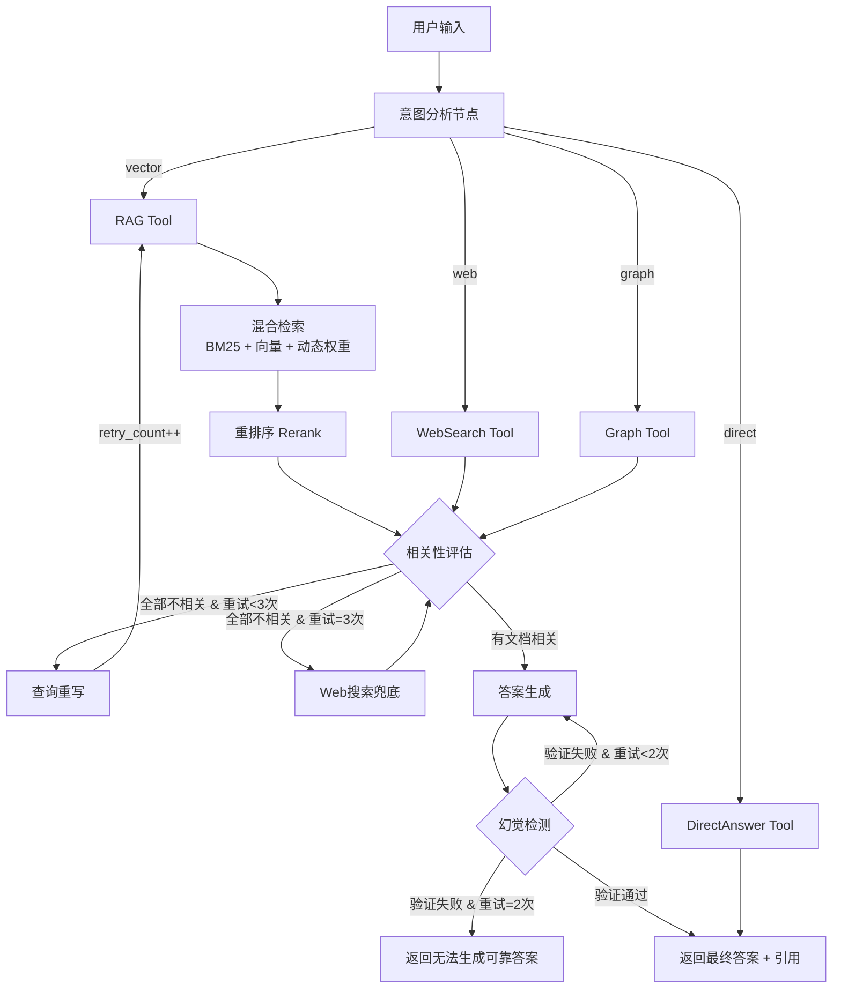

以下是 **Agentic RAG 智能知识问答系统** 的完整需求文档。系统基于 LangChain + LangGraph 构建，核心特征是 **“规划-执行-评估-修正”** 的自主循环。

---

# Agentic RAG 智能知识问答系统 —— 需求规格说明书

## 一、项目概述

### 1.1 项目背景

传统 RAG 系统采用线性流水线（检索 → 生成），在面对复杂查询时存在检索僵化、无法自我纠错、无法动态调整策略等根本性缺陷。Agentic RAG 将 AI Agent 与 RAG 深度融合，使系统具备**自主规划检索策略、自适应查询优化、多步推理、工具调用与自我修正**的能力。

### 1.2 项目目标

构建一个生产级的 Agentic RAG 系统，核心能力包括：

1. **自主决策**：Agent 根据问题类型自主选择检索策略与工具
2. **自我反思**：系统能评估检索结果质量，主动修正
3. **多工具协同**：支持向量检索、关键词检索、网络搜索、知识图谱等多源工具调用
4. **闭环优化**：建立“检索 → 评估 → 修正 → 再检索”的完整闭环

### 1.3 技术栈

| 组件 | 技术选型 | 说明 |
| :--- | :--- | :--- |
| 编程语言 | Python 3.11+ | 生态成熟，LangChain/LangGraph 原生支持 |
| 编排框架 | LangGraph | 有状态图编排，支持循环、分支与检查点 |
| LLM | DeepSeek / Qwen / OpenAI | 推理引擎，驱动 Agent 决策 |
| 向量数据库 | Milvus / Qdrant / Chroma | 语义检索底座 |
| 关键词检索 | Elasticsearch / BM25 | 精确匹配检索 |
| 重排序模型 | BGE-reranker-v2-m3 | Cross-Encoder 精排 |
| Web 框架 | FastAPI | 提供 RESTful API |

## 二、重点需求条目总览

### 核心功能模块

| 编号 | 需求条目 | 优先级 |
| :--- | :--- | :--- |
| **FR-01** | 用户输入接收与状态初始化 | P0 |
| **FR-02** | 意图分析与查询路由 | P0 |
| **FR-03** | 多工具调用框架（Tool Calling） | P0 |
| **FR-04** | RAG Tool — 混合检索（Hybrid Search） | P0 |
| **FR-05** | RAG Tool — 重排序（Rerank） | P0 |
| **FR-06** | Web Search Tool — 网络搜索兜底 | P1 |
| **FR-07** | 检索结果相关性评估（Grader） | P0 |
| **FR-08** | 查询重写与重试机制（Query Rewriting） | P0 |
| **FR-09** | 答案生成（Generator） | P0 |
| **FR-10** | 幻觉检测（Hallucination Detection） | P0 |
| **FR-11** | 多轮对话记忆（Memory） | P1 |
| **FR-12** | 状态持久化与检查点（Checkpointer） | P1 |
| **FR-13** | 答案溯源与引用（Citation） | P1 |
| **FR-14** | 可观测性与监控（Observability） | P1 |

### 非功能需求

| 编号 | 需求条目 | 优先级 |
| :--- | :--- | :--- |
| **NFR-01** | 端到端响应延迟 < 10s | P0 |
| **NFR-02** | 检索阶段延迟 < 2s | P0 |
| **NFR-03** | 系统可用性 ≥ 99.5% | P1 |
| **NFR-04** | 支持水平扩展 | P1 |
| **NFR-05** | 完整的审计日志 | P1 |

## 三、需求详情

### FR-01：用户输入接收与状态初始化

**描述**：系统接收用户自然语言输入，初始化 LangGraph 的全局状态（State）。

**详细要求**：
- 支持通过 REST API（`POST /query`）接收用户问题
- 支持流式输出（SSE）与同步输出两种模式
- 初始化 State，包含以下字段：
  - `messages`：对话历史与当前用户消息
  - `query`：当前查询文本
  - `retrieved_docs`：检索到的文档列表
  - `graded_docs`：经过相关性评估的文档
  - `retry_count`：当前重试次数（初始为 0）
  - `max_retries`：最大重试次数（可配置，默认 3）
  - `final_answer`：最终生成的答案
  - `is_hallucination`：幻觉检测结果
  - `tool_calls`：已调用的工具记录
- 每个会话（Session）分配独立的 **thread_id**，用于状态隔离

**验收标准**：
- [ ] API 能正确接收并解析用户输入
- [ ] State 初始化包含所有必需字段
- [ ] 不同会话的状态相互隔离

### FR-02：意图分析与查询路由

**描述**：Agent 在检索前对用户问题进行意图分类，根据分类结果路由到不同的处理路径。

**详细要求**：
- Agent 作为推理引擎，分析用户问题的类型
- 支持以下意图分类（至少）：
  - `direct`：可直接回答（如常识问答、计算）
  - `vector`：需从内部知识库检索（文档问答）
  - `web`：需实时网络搜索（新闻、实时信息）
  - `graph`：需知识图谱遍历（实体关系查询）
- 支持 **动态路由**：根据分类结果调用对应的 Tool
- 路由决策过程需记录到 State 的 `tool_calls` 中，便于审计

**验收标准**：
- [ ] 意图分类准确率 ≥ 85%（基于测试集评估）
- [ ] 路由决策能在 < 500ms 内完成
- [ ] 支持通过配置文件新增/修改意图类别

### FR-03：多工具调用框架（Tool Calling）

**描述**：Agent 具备调用多种工具的能力，工具间可独立迭代与组合。

**详细要求**：
- 实现统一的 **Tool 抽象接口**，包含：
  - `name`：工具名称
  - `description`：工具功能描述（供 LLM 理解）
  - `execute(input)`：执行方法
- 预置工具（至少）：
  - `RAGTool`：内部知识库检索（见 FR-04、FR-05）
  - `WebSearchTool`：网络搜索（见 FR-06）
  - `DirectAnswerTool`：直接回答
- Agent 可**自主决定**调用哪个工具、何时调用、调用多少次
- 支持 **工具组合**：复杂问题可依次调用多个工具
- 每个工具的调用结果需记录到 State

**验收标准**：
- [ ] 所有工具实现统一接口
- [ ] Agent 能根据意图自主选择工具
- [ ] 支持工具调用链（Tool A 的输出作为 Tool B 的输入）

### FR-04：RAG Tool — 混合检索（Hybrid Search）

**描述**：RAG Tool 的核心检索能力，同时支持向量语义检索与 BM25 关键词检索，并按动态权重融合结果。

**详细要求**：
- **双路并行检索**：
  - 向量检索：基于 Embedding 模型的语义相似度搜索
  - BM25 检索：基于倒排索引的精确关键词匹配
- **动态权重分配**：
  - 根据查询类型自动调整向量与 BM25 的权重配比
  - 短查询（<3词）偏向 BM25（如 3:7）
  - 长查询（>5词）偏向向量（如 7:3）
  - 事实性查询（含编号、日期）大幅偏向 BM25（如 2:8）
  - 概念性查询大幅偏向向量（如 8:2）
- **结果融合**：使用 **RRF（倒数排名融合）** 算法合并两路结果
- 初检索取 Top-K（K 可配置，默认 50）

**验收标准**：
- [ ] 向量检索与 BM25 检索均能独立工作
- [ ] 动态权重分配逻辑可配置
- [ ] RRF 融合结果正确
- [ ] 混合检索命中率（Hit Rate）较纯向量检索提升 ≥ 15%

### FR-05：RAG Tool — 重排序（Rerank）

**描述**：使用 Cross-Encoder 模型对混合检索的候选文档进行二次精排。

**详细要求**：
- 使用 **Cross-Encoder 模型**（如 BGE-reranker-v2-m3）对候选文档逐一打分
- 输入格式：`[CLS] Query [SEP] Document [EOS]`，进行全注意力计算
- 对 Top-K（如 50）候选文档重新排序，截断为 Top-N（N 可配置，默认 5）
- Rerank 延迟需控制在 < 1s（处理 50 条文档）
- Rerank 结果需记录相关性分数到 State

**验收标准**：
- [ ] Rerank 模型能正常加载并推理
- [ ] Rerank 后 Top-5 的命中率较 Rerank 前提升 ≥ 10%
- [ ] Rerank 延迟 < 1s（50 条文档）

### FR-06：Web Search Tool — 网络搜索兜底

**描述**：当内部知识库检索无相关结果时，Agent 可调用 Web Search Tool 获取实时信息。

**详细要求**：
- 集成第三方搜索 API（如 Tavily、Serper、Bing Search）
- 搜索结果的格式需与 RAG 检索结果对齐（包含标题、摘要、来源链接）
- Web Search 的结果也需经过 **相关性评估**（FR-07）才能进入生成阶段
- 支持配置搜索结果的返回数量（默认 5）

**验收标准**：
- [ ] Web Search API 集成成功
- [ ] 搜索结果格式与 RAG 检索结果一致
- [ ] 仅在内部检索无结果或 Agent 主动决策时触发

### FR-07：检索结果相关性评估（Grader）

**描述**：在检索完成后、生成答案前，对检索到的文档进行相关性打分，作为“检索质量闸门”。

**详细要求**：
- 使用 LLM 对每个检索文档进行二分类评估：`relevant` / `not relevant`
- 评估依据：文档内容是否与用户问题直接相关
- 评估结果写入 State 的 `graded_docs` 字段
- 根据评估结果触发不同的后续动作：
  - **有文档相关**：进入生成阶段（FR-09）
  - **全部不相关且重试次数 < max_retries**：进入查询重写（FR-08）
  - **全部不相关且重试次数已达上限**：触发 Web Search 兜底（FR-06）或直接拒答
- 相关性评估的 Prompt 需可配置和调优

**验收标准**：
- [ ] Grader 能正确判断文档相关性
- [ ] 根据评估结果正确路由到后续节点
- [ ] 支持配置评估的置信度阈值

### FR-08：查询重写与重试机制（Query Rewriting）

**描述**：当检索结果全部不相关时，Agent 自动改写查询并重新检索，形成 **“检索 → 评估 → 修正 → 再检索”** 的闭环。

**详细要求**：
- **查询重写**：LLM 分析失败原因，将原查询改写成更具针对性的表述
- **重试计数**：每次重试 `retry_count` 加 1
- **最大重试次数**：可配置（默认 3 次）
- **重试策略**：
  - 第 1 次重试：同义词扩展、表述改写
  - 第 2 次重试：拆解为多个子查询
  - 第 3 次重试：HyDE（生成假设性答案后再检索）
- 每次重试后重新执行 FR-04 → FR-05 → FR-07
- 重试记录需写入 State，支持审计

**验收标准**：
- [ ] 查询重写逻辑正确执行
- [ ] 重试次数限制生效
- [ ] 重试后检索命中率有明显提升

### FR-09：答案生成（Generator）

**描述**：基于通过相关性评估的文档，LLM 生成最终答案。

**详细要求**：
- Prompt 模板包含：**角色设定 + 检索上下文 + 用户问题**
- 强制要求：**“仅根据以下上下文作答，若上下文中无相关信息，请明确告知用户”**
- 支持流式输出（Streaming）
- 生成内容需包含**引用标记**（如 `[doc1]`），指向具体的来源文档
- 生成结果写入 State 的 `final_answer` 字段

**验收标准**：
- [ ] 生成的答案基于检索上下文
- [ ] 无相关信息时能正确拒答
- [ ] 支持流式输出

### FR-10：幻觉检测（Hallucination Detection）

**描述**：在答案生成后，对答案进行事实一致性检查，验证每个论断是否都有检索文档支撑。

**详细要求**：
- 使用 LLM 进行 **忠实度（Faithfulness）** 评估
- 评估方法：
  1. 将答案拆解为若干独立论断（Claim）
  2. 逐一检查每个论断是否可从检索文档中推导出来
  3. 统计可支撑的论断比例
- 评估结果写入 State 的 `is_hallucination` 字段
- **验证通过**：返回最终答案
- **验证失败**：以更严格的 Prompt 重新生成（最多重试 2 次），若仍失败则返回“无法生成可靠答案”

**验收标准**：
- [ ] 幻觉检测逻辑正确执行
- [ ] 检测到幻觉时能触发重新生成
- [ ] 幻觉检测准确率 ≥ 80%

### FR-11：多轮对话记忆（Memory）

**描述**：系统支持多轮对话，能记住历史上下文。

**详细要求**：
- 使用 LangGraph 的 `MessagesState` 管理对话历史
- 支持 **滑动窗口记忆**：保留最近 N 轮对话（N 可配置）
- 支持 **摘要记忆**：对历史对话生成摘要，压缩上下文
- 每个会话通过 `thread_id` 隔离记忆
- 记忆内容需持久化存储（Redis 或数据库）

**验收标准**：
- [ ] 多轮对话上下文正确传递
- [ ] 滑动窗口和摘要记忆机制生效
- [ ] 会话隔离正确

### FR-12：状态持久化与检查点（Checkpointer）

**描述**：在每个关键节点后自动保存 State 快照，支持中断恢复与流程回溯。

**详细要求**：
- 集成 LangGraph 的 `Checkpointer` 机制
- 在每个节点执行后自动保存 State
- 支持 **断点续跑**：系统异常重启后可从最近的检查点恢复
- 支持 **时间旅行**：可回溯到任意历史状态进行调试
- 检查点存储使用 Redis 或 PostgreSQL

**验收标准**：
- [ ] 检查点在每个节点后自动保存
- [ ] 系统异常后能从检查点恢复
- [ ] 支持回溯到历史状态

### FR-13：答案溯源与引用（Citation）

**描述**：生成的答案需标注信息来源，确保可追溯。

**详细要求**：
- 生成答案时，每个论断需关联到具体的源文档
- 引用格式：`[docN]`，N 对应检索结果列表中的序号
- 返回结果中需包含 **引用详情**：
  - 文档名称
  - 页码
  - 原文片段
- 前端需支持引用的高亮展示和跳转

**验收标准**：
- [ ] 答案中包含引用标记
- [ ] 返回结果包含完整的引用详情
- [ ] 引用可追溯到源文档

### FR-14：可观测性与监控（Observability）

**描述**：系统运行全链路可观测，支持问题排查与性能调优。

**详细要求**：
- **链路追踪**：记录每个请求的完整执行路径（意图分析 → 检索 → Rerank → 评估 → 生成）
- **指标采集**：
  - 各节点延迟（P50、P95、P99）
  - 检索命中率（Hit Rate）
  - 幻觉检测通过率
  - 重试触发率
- **日志记录**：结构化日志，包含 `thread_id`、`node_name`、`duration`、`success/fail` 等字段
- **告警配置**：当检索命中率低于阈值或延迟超过阈值时触发告警

**验收标准**：
- [ ] 全链路追踪数据可查询
- [ ] 核心指标有可视化 Dashboard
- [ ] 告警规则配置生效

## 四、完整流程拓扑图

**流程说明**：

1. **用户输入** → 系统接收并初始化 State
2. **意图分析** → Agent 分类问题类型，路由到对应 Tool
3. **RAG Tool** → 混合检索（BM25 + 向量，动态权重）→ Rerank 精排
4. **相关性评估（Grader）** → 检索质量的“闸门”
   - 相关 → 进入生成
   - 不相关且未达重试上限 → 查询重写，返回步骤 3
   - 不相关且已达重试上限 → Web 搜索兜底或拒答
5. **答案生成** → 基于相关文档生成答案，带引用标记
6. **幻觉检测** → 验证答案事实一致性
   - 通过 → 返回答案
   - 失败 → 重新生成（最多 2 次）
7. **返回结果** → 答案 + 引用详情

## 五、非功能需求详解

### NFR-01：性能要求

| 指标 | 目标值 | 测量方式 |
| :--- | :--- | :--- |
| 端到端响应延迟（P95） | < 10s | APM 监控 |
| 检索阶段延迟（P95） | < 2s | APM 监控 |
| Rerank 延迟（P95） | < 1s | APM 监控 |
| 意图分析延迟（P95） | < 500ms | APM 监控 |
| 并发吞吐量 | ≥ 50 QPS | 压力测试 |

### NFR-02：可用性要求

- 系统可用性 ≥ 99.5%（月化）
- 支持优雅降级：当 LLM 服务不可用时，返回检索结果而非报错
- 支持熔断机制：单次请求重试超过阈值后快速失败

### NFR-03：扩展性要求

- 向量数据库支持水平扩展（分片 + 副本）
- LangGraph 工作流节点支持动态注册
- Tool 支持插件化热加载

### NFR-04：安全要求

- 支持 API Key 认证
- 支持基于角色的访问控制（RBAC）
- 敏感信息（如 API Key）通过环境变量或密钥管理服务配置
- 审计日志保留 ≥ 90 天

### NFR-05：部署要求

- 支持 Docker 容器化部署
- 支持 Kubernetes 编排
- 提供一键部署脚本（含所有依赖服务）

## 六、附录：知识点覆盖映射

| 知识点 | 对应需求 |
| :--- | :--- |
| Agentic RAG 定义与演进 | 项目概述 |
| ReAct 循环（思考-行动-观察） | FR-02, FR-03, FR-07, FR-08 |
| LangGraph StateGraph / MessageGraph | FR-01, FR-11 |
| 混合检索（BM25 + 向量） | FR-04 |
| 动态权重分配 | FR-04 |
| Rerank（重排序） | FR-05 |
| Self-RAG / 自我反思 | FR-07, FR-10 |
| CRAG / 自我修正 | FR-07, FR-08 |
| 查询重写（Query Rewriting） | FR-08 |
| 幻觉检测（Hallucination Detection） | FR-10 |
| Checkpointer / 状态持久化 | FR-12 |
| 多 Agent 协作 | FR-03（多工具协同） |
| 答案溯源与引用 | FR-13 |
| RAG 系统效果评估 | FR-07, FR-10, FR-14 |

---

